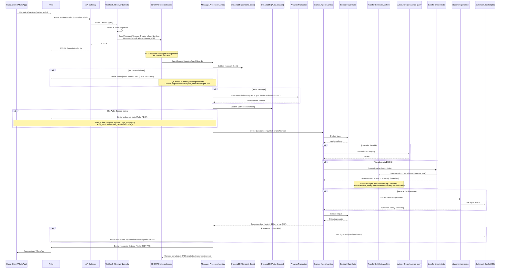
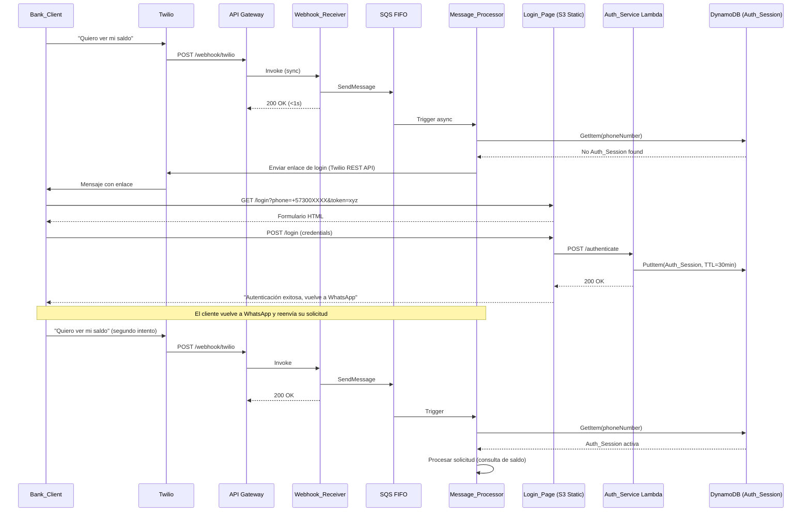
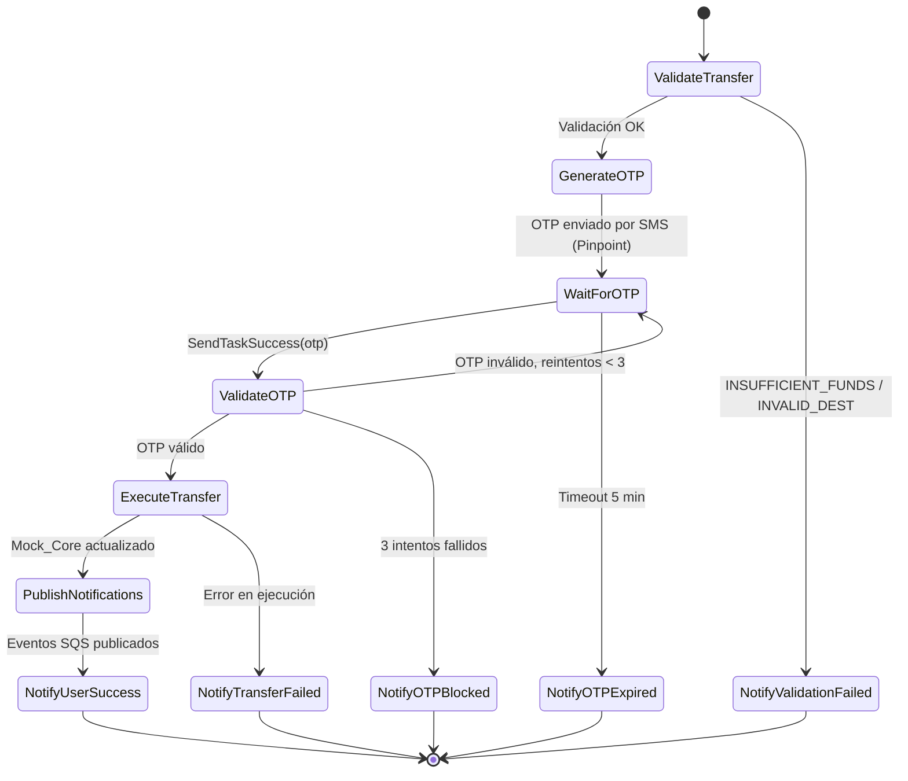
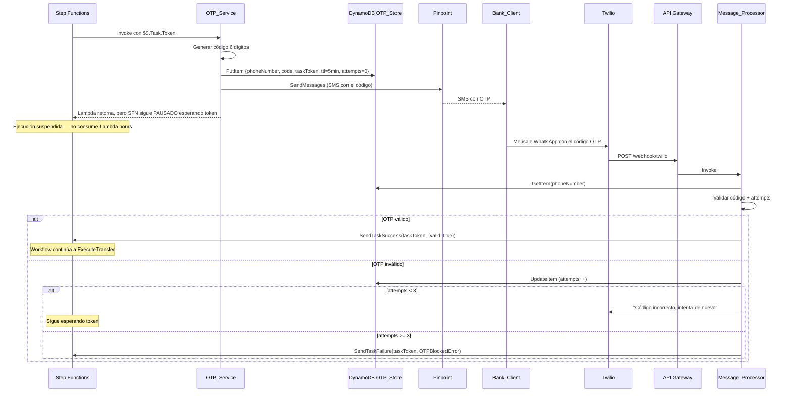
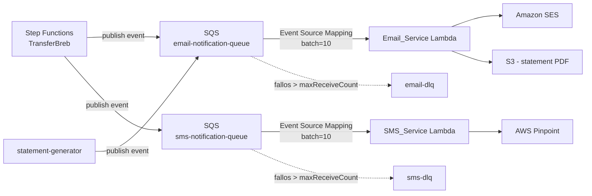

# Technical Design Document

## Overview

BTG ConnectAI MVP Lite es un asistente bancario conversacional serverless que conecta WhatsApp con Amazon Bedrock Agent para ejecutar servicios bancarios en español natural. El sistema soporta entrada multimodal (texto y audio), flujo de consentimiento regulatorio, autenticación vía enlace web, y tres servicios bancarios: consulta de saldos, transferencias BRE-B y generación de extractos PDF.

### Decisiones Arquitectónicas Clave

| Decisión | Elección | Razón |
| -------- | -------- | ----- |
| Runtime (todas las Lambdas) | Python 3.13 | Decisión de equipo: stack 100% Python. Strands SDK nativo, boto3, aws-lambda-powertools |
| IaC | CloudFormation puro (YAML) | Mismo patrón que el repo `infra` (networking). Nested stacks, deploy via GitHub Actions + OIDC. Sin CDK ni SAM |
| Empaquetado Lambda | ZIP a S3 + Lambda Layers | CloudFormation `Code: {S3Bucket, S3Key}`. Dependencias pip en Layers compartidos |
| AI Engine | Strands Agent SDK + Amazon Bedrock Agent Core (Claude Haiku 3.5) | Framework open-source AWS sobre Bedrock; control de orquestación, herramientas y memoria de sesión |
| Canal WhatsApp | Twilio (WhatsApp Sandbox) | Onboarding rápido sin aprobación Meta, webhooks REST simples |
| Entrada HTTP | Amazon API Gateway (HTTP API) | Endpoint público expuesto a Twilio; bajo costo, sin servidor |
| Patrón Webhook | Async via SQS FIFO (Webhook_Receiver → queue → Message_Processor) | Receiver responde 200 a Twilio en <1s independientemente del trabajo real; elimina timeouts y retries de Twilio; absorbe spikes; escalabilidad independiente |
| Audio | Amazon Transcribe | Soporte nativo OGG/Opus, español colombiano (es-CO); sin presión de tiempo gracias al async |
| Deduplicación | SQS FIFO `MessageDeduplicationId = MessageSid` | Dedup nativa en ventana de 5 min sin código custom; elimina la tabla Dedup |
| Orden de mensajes | SQS FIFO `MessageGroupId = phoneNumber` | Garantiza que mensajes del mismo cliente se procesen en orden, sin afectar concurrencia entre clientes distintos |
| Autenticación | Lambda + DynamoDB (mock vía enlace web) | Simula flujo real con mínima infraestructura |
| OTP Transaccional | AWS Pinpoint (SMS) | Segundo factor para autorizar transferencias; canal SMS independiente de WhatsApp |
| Email | Amazon SES | Notificaciones formales post-operación; non-blocking respecto al flujo de WhatsApp |
| Extractos | S3 + envío como documento adjunto Twilio | Entrega directa al Bank_Client vía Twilio Media |
| Observabilidad | Lambda Powertools + CloudWatch | Structured logging JSON, métricas nativas |
| Seguridad | IAM roles + AWS managed keys + Secrets Manager | Zero cost, credenciales Twilio nunca en código |

### Flujo de Datos Principal (Happy Path Completo)



### Flujo de Autenticación (Detalle)



## Architecture

### Diagrama de Componentes


### Principios Arquitectónicos

1. **Estrategia de red híbrida (VPC solo donde aporta)**: VPC no es seguridad por defecto en serverless — el control de acceso real es IAM. Por eso solo las Lambdas del **dominio bancario** (`balance_query`, `transfer_breb_validate`, `transfer_breb_execute`, `statement_generator`) corren en subnets privadas de `IA-Builder-sandbox-networking`. Son las que en EXT-1 se conectarán al core privado. El resto (canal, orquestación, IA, notificaciones, auth) corre **fuera de VPC** en la red managed de Lambda. **No hay NAT Gateway** (`EnableNatGateway=false`).
2. **Cero salida a internet para el dominio bancario**: Las Lambdas en VPC NO tienen ruta `0.0.0.0/0` — alcanzan servicios AWS solo vía **VPC Endpoints** (Gateway gratis para S3/DynamoDB; Interface para SQS). Esto elimina cualquier ruta de exfiltración: aunque una Lambda bancaria se comprometa, no puede sacar datos a internet. Security Group sin ingress de red, egress 443 solo hacia los endpoints. CloudWatch Logs no requiere endpoint (la plataforma de Lambda los envía, no la ENI).
3. **Runtime único Python 3.13**: Todas las Lambdas (Webhook_Receiver, Message_Processor, Action Groups, OTP_Service, notificadores, Strands_Agent) corren en Python 3.13. Stack 100% Python por decisión de equipo. boto3 para AWS, `aws-lambda-powertools` para logging/tracing, `twilio` SDK para mensajería.
4. **Twilio como canal**: Twilio Sandbox recibe y envía mensajes WhatsApp. API Gateway expone el webhook público. Credenciales Twilio en Secrets Manager.
4a. **Async Webhook Pattern**: Separación estricta `Webhook_Receiver` (sync, latencia <1s, solo valida firma y encola) + `Message_Processor` (async, SQS-triggered, hace todo el trabajo pesado). Twilio nunca espera transcripción ni invocación de Bedrock; recibe 200 OK inmediato. Spike de tráfico es absorbido por la cola, no por throttling de Lambda.
4b. **SQS FIFO para mensajes entrantes**: `inbound-messages-queue.fifo` con `MessageGroupId=phoneNumber` (garantiza orden por cliente) y `MessageDeduplicationId=MessageSid` (dedup automática de retries de Twilio en ventana de 5 min — elimina necesidad de tabla Dedup custom). `batchSize=1` porque cada mensaje es una interacción crítica.
5. **Strands + Bedrock Agent Core**: El Conversational_Agent usa Strands Agent SDK (Python) sobre Bedrock Agent Core (Claude Haiku 3.5). Strands maneja orquestación de herramientas y memoria de sesión.
6. **Step Functions para transacciones distribuidas**: El flujo de transferencia BRE-B (validar → OTP → esperar callback → ejecutar → notificar) corre como state machine de AWS Step Functions usando el patrón `waitForTaskToken`. Esto resuelve el problema de "esperar input asíncrono del cliente" sin bloquear Lambdas y provee manejo nativo de timeouts, reintentos y compensación.
7. **Event-Driven Async Notifications**: Email y SMS de confirmación se publican como eventos a SQS (`email-notification-queue`, `sms-notification-queue`). Las Lambdas consumidoras (`Email_Service`, `SMS_Service`) procesan en batch. El flujo principal no espera respuesta del envío — fire-and-forget total. Esto desacopla productores de consumidores y permite reintentos automáticos con DLQ.
8. **OTP con Task Token**: El OTP_Service no "espera" al usuario. Step Functions pausa la ejecución con `waitForTaskToken`, almacenando el token en DynamoDB junto al OTP. Cuando el cliente responde con el código, el Message_Processor lo valida y llama `SendTaskSuccess`/`SendTaskFailure` para resumir el workflow.
9. **Consent-First**: Ningún servicio se ejecuta sin consentimiento previo registrado en Consent_Store.
10. **Auth-Before-Action**: Operaciones bancarias requieren Auth_Session activa (TTL 30min).
11. **Mock Data Inline**: Datos bancarios sintéticos hardcodeados en las Lambdas de Action Groups para el demo.
12. **Encryption at Rest by Default**: AWS managed keys en DynamoDB y S3 — zero cost, zero management.


## Components and Interfaces

### 1. Webhook_Receiver Lambda

**Responsabilidad:** Punto de entrada SÍNCRONO del sistema. Su única misión es responder a Twilio en menos de un segundo. No hace negocio — valida la firma, parsea el payload y lo encola en SQS FIFO. Toda la lógica pesada se delega al Message_Processor de forma asíncrona.

**Runtime:** Python 3.13
**Memory:** 256 MB
**Timeout:** 10 seconds (en práctica resuelve en <1s)
**Trigger:** Amazon API Gateway (HTTP API — POST /webhook/twilio)
**Provisioned Concurrency:** Recomendado en producción (no requerido para hackathon)

#### Lógica del Webhook_Receiver

```python
import json
import os
import uuid
from datetime import datetime, timezone
from urllib.parse import parse_qs

import boto3
from aws_lambda_powertools import Logger
from twilio.request_validator import RequestValidator

logger = Logger(service="webhook-receiver")
sqs = boto3.client("sqs")

INBOUND_QUEUE_URL = os.environ["INBOUND_QUEUE_URL"]
TWILIO_AUTH_TOKEN = _load_twilio_auth_token()  # desde Secrets Manager, cacheado en cold start


@logger.inject_lambda_context
def handler(event: dict, context) -> dict:
    correlation_id = str(uuid.uuid4())
    logger.append_keys(correlation_id=correlation_id)

    # 1. Validar firma X-Twilio-Signature (defensa contra requests no autorizados)
    signature = event["headers"].get("x-twilio-signature", "")
    url = f"https://{event['requestContext']['domainName']}{event['rawPath']}"
    params = {k: v[0] for k, v in parse_qs(event.get("body", "")).items()}

    validator = RequestValidator(TWILIO_AUTH_TOKEN)
    if not validator.validate(url, params, signature):
        logger.warning("Invalid Twilio signature, rejecting")
        return {"statusCode": 403, "body": ""}

    # 2. Encolar en SQS FIFO — dedup automática por MessageSid
    sqs.send_message(
        QueueUrl=INBOUND_QUEUE_URL,
        MessageBody=json.dumps({
            **params,
            "correlationId": correlation_id,
            "receivedAt": datetime.now(timezone.utc).isoformat(),
        }),
        MessageGroupId=params["From"],              # Orden por cliente
        MessageDeduplicationId=params["MessageSid"],  # Dedup gratis 5 min
    )

    # 3. 200 OK inmediato — Twilio happy
    return {"statusCode": 200, "body": ""}
```

#### IAM Role del Webhook_Receiver

- `sqs:SendMessage` sobre `inbound-messages-queue.fifo`
- `secretsmanager:GetSecretValue` sobre el secreto con `TWILIO_AUTH_TOKEN` (para validar firma)
- `logs:*` para CloudWatch Logs

> Notar que el Receiver NO necesita acceso a DynamoDB, Bedrock, Transcribe, S3, ni a Twilio REST API. Es deliberadamente minimalista para minimizar la superficie de ataque y el cold start.

---

### 2. Message_Processor Lambda

**Responsabilidad:** Hace TODO el trabajo pesado de procesar un mensaje entrante: valida consentimiento, transcribe audio, valida sesión de autenticación, maneja callbacks de OTP, invoca al Strands_Agent y envía la respuesta al cliente vía Twilio REST API. Se ejecuta de forma asíncrona triggered por SQS — sin presión de tiempo del lado de Twilio.

**Runtime:** Python 3.13
**Memory:** 512 MB
**Timeout:** 120 seconds (suficiente para transcripción + Strands Agent + envío respuesta)
**Trigger:** SQS Event Source Mapping sobre `inbound-messages-queue.fifo`
**Batch Size:** 1 (cada mensaje es interacción crítica del usuario, no se batchea)
**Visibility Timeout (en la cola):** 130s (apenas mayor que el timeout del Lambda para permitir reintento limpio)

#### Interface de Entrada (SQS Event)

```python
from typing import TypedDict, NotRequired

# Payload que Twilio envía como form-urlencoded al webhook,
# re-empaquetado como JSON por el Webhook_Receiver al encolar en SQS
class TwilioWebhookPayload(TypedDict):
    MessageSid: str                       # ID único del mensaje (usado para dedup)
    From: str                             # "whatsapp:+57300XXXXXXX"
    To: str                               # "whatsapp:+14155XXXXXXX" (número Twilio)
    Body: str                             # Texto del mensaje (vacío si es media)
    NumMedia: str                         # "0" | "1" | ...
    MediaUrl0: NotRequired[str]           # URL del audio/imagen si NumMedia > 0
    MediaContentType0: NotRequired[str]   # "audio/ogg" | "image/jpeg" | ...
    ButtonPayload: NotRequired[str]       # Payload del botón de respuesta rápida
    ProfileName: NotRequired[str]         # Nombre de perfil de WhatsApp del cliente
    correlationId: str                    # Inyectado por el Webhook_Receiver
```

#### Lógica Principal

```python
import json
from aws_lambda_powertools import Logger
from aws_lambda_powertools.utilities.batch import BatchProcessor, EventType, process_partial_response

logger = Logger(service="message-processor")
processor = BatchProcessor(event_type=EventType.SQS)


def record_handler(record) -> None:
    """Procesa un único mensaje SQS. Si lanza excepción, Powertools lo reporta
    como batchItemFailure para que SQS lo reintente individualmente."""
    payload: TwilioWebhookPayload = json.loads(record["body"])
    logger.append_keys(correlation_id=payload["correlationId"])

    phone_number = payload["From"].replace("whatsapp:", "")  # E.164

    # 1. OTP callback prioritario — si hay OTP pendiente, no llamamos al agente
    pending_otp = get_pending_otp(phone_number)
    if pending_otp:
        handle_otp_callback(phone_number, payload.get("Body", ""), pending_otp)
        return

    # 2. Verificar consentimiento
    consent = get_consent(phone_number)
    if not consent or not consent.get("accepted"):
        handle_consent_flow(payload, consent, phone_number)
        return

    # 3. Determinar tipo de mensaje y extraer texto
    if payload.get("ButtonPayload"):
        input_text = payload["ButtonPayload"]
    elif payload.get("NumMedia", "0") != "0" and payload.get("MediaContentType0", "").startswith("audio/"):
        input_text = transcribe_audio(payload["MediaUrl0"], phone_number)
        if not input_text:
            send_twilio_message(phone_number, ERROR_MESSAGES["transcription_failed"])
            return
    elif payload.get("Body", "").strip():
        input_text = payload["Body"].strip()
    else:
        send_twilio_message(phone_number, ERROR_MESSAGES["unsupported_format"])
        return

    # 4. Verificar Auth_Session
    auth_session = get_auth_session(phone_number)
    if not auth_session or is_expired(auth_session):
        store_pending_request(phone_number, input_text)
        send_login_link(phone_number)
        return

    # 5. Invocar Strands_Agent
    session_id = derive_session_id(phone_number)
    response = invoke_strands_agent(session_id, input_text, phone_number)

    # 6. Si la respuesta incluye un PDF (extracto), enviarlo como media adjunta
    statement_info = extract_statement_info(response)
    if statement_info:
        send_twilio_document(phone_number, statement_info["s3_bucket"], statement_info["s3_key"])

    # 7. Enviar respuesta de texto (split si > 1600 chars)
    text_response = remove_statement_metadata(response)
    if text_response.strip():
        send_twilio_message(phone_number, text_response)


@logger.inject_lambda_context
def handler(event: dict, context):
    # batchSize=1, pero process_partial_response soporta cualquier tamaño con reportBatchItemFailures
    return process_partial_response(
        event=event,
        record_handler=record_handler,
        processor=processor,
        context=context,
    )
```

#### Flujo de Consentimiento

```python
def handle_consent_flow(payload: TwilioWebhookPayload, consent: dict | None, phone_number: str) -> None:
    # Respuesta a botón de T&C (Twilio envía el payload del botón en ButtonPayload)
    if payload.get("ButtonPayload") == "accept_tc":
        store_consent(phone_number, "accepted")
        send_welcome_message(phone_number)
        return

    if payload.get("ButtonPayload") == "reject_tc":
        store_consent(phone_number, "rejected")
        send_twilio_message(phone_number, ERROR_MESSAGES["consent_required"])
        return

    # Primer mensaje sin consentimiento — enviar T&C con botones de acción rápida (Twilio)
    send_terms_and_conditions_message(phone_number)


def send_terms_and_conditions_message(phone_number: str) -> None:
    # Twilio soporta botones de respuesta rápida via Content Templates
    twilio_client.messages.create(
        from_=f"whatsapp:{TWILIO_NUMBER}",
        to=f"whatsapp:{phone_number}",
        content_sid=TWILIO_TC_TEMPLATE_SID,
        content_variables=json.dumps({"phoneNumber": phone_number}),
    )
```

#### Transcripción de Audio

```python
def transcribe_audio(media_url: str, phone_number: str) -> str | None:
    try:
        # 1. Descargar audio desde Twilio Media URL (requiere auth Twilio)
        audio_bytes = download_twilio_media(media_url)

        # 2. Subir a S3 temporal para Transcribe
        s3_key = f"audio-temp/{uuid.uuid4()}.ogg"
        s3.put_object(Bucket=AUDIO_TEMP_BUCKET, Key=s3_key, Body=audio_bytes, ContentType="audio/ogg")

        # 3. Iniciar transcripción
        job_name = f"btg-connectai-{uuid.uuid4()}"
        transcribe.start_transcription_job(
            TranscriptionJobName=job_name,
            LanguageCode="es-CO",
            MediaFormat="ogg",
            Media={"MediaFileUri": f"s3://{AUDIO_TEMP_BUCKET}/{s3_key}"},
            OutputBucketName=AUDIO_TEMP_BUCKET,
            OutputKey=f"transcriptions/{job_name}.json",
        )

        # 4. Polling hasta completar (sin presión de tiempo gracias al async; max 30s)
        transcript = wait_for_transcription(job_name, timeout_seconds=30)

        # 5. Limpiar archivos temporales
        cleanup_temp_files(s3_key, f"transcriptions/{job_name}.json")
        return transcript
    except Exception:
        logger.exception("Audio transcription failed")
        return None
```

#### Envío de Enlace de Login

```python
def send_login_link(phone_number: str) -> None:
    callback_token = generate_callback_token(phone_number)
    login_url = f"{LOGIN_PAGE_URL}?phone={quote(phone_number)}&token={callback_token}"

    twilio_client.messages.create(
        from_=f"whatsapp:{TWILIO_NUMBER}",
        to=f"whatsapp:{phone_number}",
        body=(
            "🔐 Para ejecutar operaciones bancarias necesitas autenticarte.\n\n"
            f"Inicia sesión aquí: {login_url}\n\nEl enlace es válido por 10 minutos."
        ),
    )
```

> **Deduplicación**: ya NO existe función custom. SQS FIFO descarta duplicados por `MessageDeduplicationId = MessageSid` en ventana de 5 minutos. Ver decisiones arquitectónicas.

#### Invocación del Strands_Agent Lambda

```python
def invoke_strands_agent(session_id: str, input_text: str, phone_number: str) -> str:
    response = lambda_client.invoke(
        FunctionName=STRANDS_AGENT_LAMBDA_ARN,
        InvocationType="RequestResponse",
        Payload=json.dumps({
            "sessionId": session_id,
            "inputText": input_text,
            "phoneNumber": phone_number,
        }).encode("utf-8"),
    )
    result = json.loads(response["Payload"].read())
    return result["response"]
```

#### Envío de Respuesta vía Twilio (con split)

```python
MAX_TWILIO_MESSAGE_LENGTH = 1600


def send_twilio_message(phone_number: str, text: str) -> None:
    for chunk in split_message(text, MAX_TWILIO_MESSAGE_LENGTH):
        twilio_client.messages.create(
            from_=f"whatsapp:{TWILIO_NUMBER}",
            to=f"whatsapp:{phone_number}",
            body=chunk,
        )


def split_message(text: str, max_length: int) -> list[str]:
    if len(text) <= max_length:
        return [text]

    chunks: list[str] = []
    remaining = text
    while remaining:
        if len(remaining) <= max_length:
            chunks.append(remaining)
            break
        # Buscar último salto de línea o espacio antes del límite
        split_index = remaining.rfind("\n", 0, max_length)
        if split_index == -1 or split_index < max_length * 0.5:
            split_index = remaining.rfind(" ", 0, max_length)
        if split_index == -1:
            split_index = max_length
        chunks.append(remaining[:split_index])
        remaining = remaining[split_index:].lstrip()

    return chunks
```

#### Envío de Documento PDF vía Twilio (Extracto Bancario)

```python
def send_twilio_document(phone_number: str, s3_bucket: str, s3_key: str) -> None:
    # 1. Generar presigned URL temporal de S3 (Twilio necesita URL pública para descargar el media)
    presigned_url = s3.generate_presigned_url(
        "get_object",
        Params={"Bucket": s3_bucket, "Key": s3_key},
        ExpiresIn=300,  # 5 minutos — suficiente para que Twilio descargue
    )

    # 2. Enviar mensaje con media adjunto via Twilio
    twilio_client.messages.create(
        from_=f"whatsapp:{TWILIO_NUMBER}",
        to=f"whatsapp:{phone_number}",
        body="📄 Aquí tienes tu extracto bancario.",
        media_url=[presigned_url],
    )
```


### 3. Auth_Service Lambda

**Responsabilidad:** Backend de autenticación mock. Valida credenciales contra usuarios de prueba hardcodeados y crea Auth_Session en DynamoDB. Simula un flujo de autenticación vía enlace web.

**Runtime:** Python 3.13  
**Memory:** 128 MB  
**Timeout:** 10 seconds  
**Trigger:** API Gateway (HTTP API) o Function URL

#### Interface

```python
from typing import TypedDict, NotRequired

# POST /authenticate
class AuthenticateRequest(TypedDict):
    username: str
    password: str
    phoneNumber: str      # E.164 — vincula sesión al teléfono
    callbackToken: str    # Token para validar origen legítimo

class AuthenticateResponse(TypedDict):
    success: bool
    message: str
    sessionId: NotRequired[str]   # Solo si success=True
    expiresAt: NotRequired[str]   # ISO 8601 — TTL de la sesión
```

#### Usuarios de Prueba Hardcodeados

```python
TEST_USERS = [
    {"username": "carlos.rodriguez", "password": "Btg2024*Test",
     "phone_number": "+573001234567", "name": "Carlos Rodríguez", "document_id": "1234567890"},
    {"username": "maria.lopez", "password": "Btg2024*Demo",
     "phone_number": "+573009876543", "name": "María López", "document_id": "0987654321"},
    {"username": "juan.garcia", "password": "Btg2024*Hack",
     "phone_number": "+573005551234", "name": "Juan García", "document_id": "1122334455"},
]
```

#### Lógica de Autenticación

```python
import uuid
from datetime import datetime, timedelta, timezone


def authenticate(request: AuthenticateRequest) -> AuthenticateResponse:
    # 1. Validar callback token
    if not is_valid_callback_token(request["callbackToken"], request["phoneNumber"]):
        return {"success": False, "message": "Token inválido"}

    # 2. Buscar usuario
    user = next(
        (u for u in TEST_USERS
         if u["username"] == request["username"] and u["password"] == request["password"]),
        None,
    )
    if not user:
        return {"success": False, "message": "Credenciales incorrectas"}

    # 3. Validar que el teléfono coincide con el usuario
    if user["phone_number"] != request["phoneNumber"]:
        return {"success": False, "message": "Credenciales incorrectas"}

    # 4. Crear Auth_Session en DynamoDB
    session_id = str(uuid.uuid4())
    expires_at = datetime.now(timezone.utc) + timedelta(minutes=30)  # 30 min TTL
    ttl = int(expires_at.timestamp())

    auth_table.put_item(Item={
        "pk": request["phoneNumber"],
        "sessionId": session_id,
        "username": user["username"],
        "name": user["name"],
        "documentId": user["document_id"],
        "createdAt": datetime.now(timezone.utc).isoformat(),
        "expiresAt": expires_at.isoformat(),
        "ttl": ttl,
    })

    return {
        "success": True,
        "message": "Autenticación exitosa",
        "sessionId": session_id,
        "expiresAt": expires_at.isoformat(),
    }
```

### 4. Login_Page (S3 Static Site)

**Responsabilidad:** Página web simple con formulario de login. Hosted en S3 como sitio estático con CloudFront (o directamente S3 website hosting para MVP).

**Tecnología:** HTML + CSS + JavaScript vanilla (sin framework) — esto corre en el **navegador del cliente**, no es una Lambda, por lo que se mantiene en JavaScript

#### Estructura

```text
login-page/
├── index.html      # Formulario de login
├── styles.css      # Estilos BTG Pactual branding
├── app.js          # Lógica de submit + llamada a Auth_Service
└── assets/
    └── logo.png    # Logo BTG Pactual
```

#### Flujo de la Login_Page

```javascript
// app.js (client-side, corre en el navegador — se mantiene en JavaScript)
async function handleLogin(event) {
  event.preventDefault();

  const username = document.getElementById("username").value;
  const password = document.getElementById("password").value;
  const params = new URLSearchParams(window.location.search);
  const phoneNumber = params.get("phone");
  const callbackToken = params.get("token");

  const response = await fetch(AUTH_SERVICE_URL, {
    method: "POST",
    headers: { "Content-Type": "application/json" },
    body: JSON.stringify({ username, password, phoneNumber, callbackToken }),
  });

  const result = await response.json();

  if (result.success) {
    showSuccess("✅ Autenticación exitosa. Puedes volver a WhatsApp.");
  } else {
    showError(result.message);
  }
}
```

### 5. Action_Group Lambda: balance-query

**Responsabilidad:** Consultar saldos de Fondos de Inversión y Cuenta Corriente del Mock_Core.

**Runtime:** Python 3.13  
**Memory:** 128 MB  
**Timeout:** 15 seconds  
**Trigger:** Bedrock Agent Action Group invocation

#### Interface de Entrada/Salida (Strands tool → Lambda invoke)

Las Action Group Lambdas son invocadas por las tools del Strands_Agent vía `boto3 lambda.invoke` con un payload JSON simple (no usan el formato de Bedrock Agents managed):

```python
# Evento que recibe la Lambda (enviado por la tool del Strands Agent)
class BalanceQueryEvent(TypedDict):
    phoneNumber: str
    productType: NotRequired[str]   # "fondo_inversion" | "cuenta_corriente"

# Respuesta de la Lambda
class ActionGroupResponse(TypedDict):
    success: bool
    data: NotRequired[dict]         # payload específico de la acción
    error: NotRequired[str]         # código de error si success=False
    message: NotRequired[str]
```

### 6. Action_Group Lambda: transfer-breb (validate + execute)

**Responsabilidad:** Validar y ejecutar transferencias BRE-B contra el Mock_Core. Estas funciones son invocadas por los estados `ValidateTransfer` y `ExecuteTransfer` del `TransferBrebStateMachine` (ver sección Step Functions), NO directamente por el Strands Agent (que solo dispara el state machine via `transfer-breb-initiator`).

**Runtime:** Python 3.13  
**Memory:** 128 MB  
**Timeout:** 15 seconds  
**Trigger:** Step Functions task (`ValidateTransfer`, `ExecuteTransfer`)

#### Lógica de Transferencia

```python
import uuid
from datetime import datetime, timezone


class InsufficientFundsError(Exception):
    """Error de dominio — capturado por el Catch del state machine."""


class InvalidDestinationError(Exception):
    """Error de dominio — capturado por el Catch del state machine."""


def execute_transfer(params: dict) -> dict:
    source_account = params["sourceAccount"]
    destination_account = params["destinationAccount"]
    amount = params["amount"]
    concept = params.get("concept", "")
    phone_number = params["phoneNumber"]

    # 1. Validar cuenta origen existe y pertenece al cliente
    source_acct = find_account_by_number(phone_number, source_account)
    if not source_acct:
        raise InvalidDestinationError("Cuenta origen no encontrada")

    # 2. Validar saldo suficiente
    if source_acct["available_balance"] < amount:
        raise InsufficientFundsError("Fondos insuficientes")

    # 3. Validar cuenta destino existe
    dest_acct = find_account_by_number(None, destination_account)
    if not dest_acct:
        raise InvalidDestinationError("Cuenta destino no encontrada")

    # 4. Ejecutar transferencia (mock — actualizar saldos)
    source_acct["available_balance"] -= amount
    source_acct["total_balance"] -= amount
    dest_acct["available_balance"] += amount
    dest_acct["total_balance"] += amount

    # 5. Generar comprobante
    receipt = {
        "transactionId": f"TRX-{int(datetime.now(timezone.utc).timestamp())}-{uuid.uuid4().hex[:6]}",
        "sourceAccount": mask_account_number(source_account),
        "destinationAccount": mask_account_number(destination_account),
        "amount": amount,
        "currency": "COP",
        "concept": concept,
        "executedAt": datetime.now(timezone.utc).isoformat(),
        "status": "COMPLETED",
    }
    return {"success": True, "receipt": receipt}
```

### 7. Action_Group Lambda: statement-generator

**Responsabilidad:** Generar extractos bancarios en PDF, almacenarlos en S3, publicar evento `statement_delivery` a `email-notification-queue`, y retornar la referencia (S3 key) para que el Message_Processor descargue y envíe el PDF vía Twilio.

**Runtime:** Python 3.13  
**Memory:** 256 MB  
**Timeout:** 30 seconds  
**Trigger:** Strands Agent tool invocation (Lambda invoke via boto3)

#### Lógica de Generación

```python
from datetime import datetime, timezone


def generate_statement(params: dict) -> dict:
    phone_number = params["phoneNumber"]
    account_id = params["accountId"]
    cutoff_date = params["cutoffDate"]

    # 1. Validar fecha de corte (debe ser pasada)
    cutoff = datetime.fromisoformat(cutoff_date)
    if cutoff >= datetime.now(timezone.utc):
        return {"success": False, "error": "INVALID_DATE",
                "message": "La fecha de corte debe ser una fecha pasada"}

    # 2. Obtener datos del cliente y transacciones
    client = find_client_by_phone(phone_number)
    transactions = get_transactions_until_date(account_id, cutoff_date)

    # 3. Generar PDF (usando reportlab o fpdf2)
    pdf_bytes = generate_pdf({
        "client_name": client["name"],
        "account_number": mask_account_number(account_id),
        "period": {"start": get_start_of_month(cutoff_date), "end": cutoff_date},
        "transactions": transactions,
        "final_balance": calculate_balance(transactions),
    })

    # 4. Subir a S3
    s3_key = f"statements/{phone_number}/{account_id}/{cutoff_date}-{uuid.uuid4()}.pdf"
    s3.put_object(Bucket=STATEMENT_BUCKET, Key=s3_key, Body=pdf_bytes, ContentType="application/pdf")

    # 5. Publicar evento a email-notification-queue (fire-and-forget)
    sqs.send_message(
        QueueUrl=EMAIL_NOTIFICATION_QUEUE_URL,
        MessageBody=json.dumps({
            "type": "statement_delivery",
            "correlationId": params.get("correlationId"),
            "to": client["email"],
            "payload": {
                "s3Bucket": STATEMENT_BUCKET, "s3Key": s3_key,
                "fileName": f"extracto_{account_id}_{cutoff_date}.pdf",
                "clientName": client["name"],
            },
        }),
    )

    # 6. Retornar referencia S3 para que el Message_Processor envíe el PDF vía Twilio
    return {
        "success": True,
        "s3Bucket": STATEMENT_BUCKET,
        "s3Key": s3_key,
        "fileName": f"extracto_{account_id}_{cutoff_date}.pdf",
    }
```


### 8. Strands_Agent Lambda (Conversational_Agent)

**Responsabilidad:** Interpretar intenciones en español (texto o audio transcrito), mantener contexto conversacional, decidir cuándo invocar herramientas (balance-query, transfer-breb, statement-generator), y formular respuestas naturales. Implementado como Lambda Python 3.13 usando Strands Agent SDK sobre Amazon Bedrock.

**Runtime:** Python 3.13  
**Memory:** 512 MB  
**Timeout:** 60 seconds  
**Trigger:** Lambda InvokeFunction desde Message_Processor (sync)  
**Foundation Model:** Claude 3.5 Haiku via Bedrock (anthropic.claude-3-5-haiku-20241022-v1:0)  
**Session Strategy:** sessionId derivado del número de teléfono — Strands mantiene historial en memoria de sesión  
**Guardrails:** Bedrock Guardrails aplicados sobre el modelo (content filtering + topic policies)

#### Instrucciones del Agente (System Prompt)

```text
Eres el asistente virtual de BTG Pactual Colombia. Tu nombre es ConnectAI.

SERVICIOS DISPONIBLES:
1. Consulta de saldos (Fondos de Inversión y Cuenta Corriente)
2. Transferencias BRE-B (entre cuentas)
3. Generación de extractos bancarios (PDF)

REGLAS:
1. Responde SIEMPRE en español colombiano natural y amigable.
2. Solo puedes ayudar con los 3 servicios listados arriba e información general de productos BTG Pactual.
3. Si el cliente pregunta algo fuera del dominio bancario, declina amablemente y lista los servicios disponibles.
4. Cuando presentes datos financieros (saldos, montos), SIEMPRE incluye el disclaimer: "📋 Esta información es referencial. Para registros oficiales, consulta los portales del banco."
5. Si no entiendes la solicitud, haz UNA pregunta de aclaración. Si después de 2 intentos no logras entender, ofrece el menú de servicios.
6. Interpreta expresiones coloquiales colombianas: "plata"=dinero, "luca"=mil pesos, "extracto"=estado de cuenta, "pásame plata"=transferencia, "cuánto tengo"=consulta de saldo.
7. Formatea montos en COP con separador de miles (punto) y decimales (coma): $1.234.567,89
8. Para TRANSFERENCIAS: SIEMPRE presenta un resumen con cuenta origen, cuenta destino, monto y concepto, y solicita confirmación explícita ("¿Confirmas esta transferencia?") ANTES de ejecutar.
9. Para EXTRACTOS: Solicita la fecha de corte. Si el cliente da una fecha futura, informa que debe ser una fecha pasada.
10. Cuando presentes transacciones o movimientos, muestra máximo 5 y ofrece ver más si hay adicionales.
11. Si el cliente acaba de autenticarse, salúdalo por su nombre.

FORMATO DE RESPUESTA:
- Usa emojis moderadamente para hacer la conversación amigable
- Usa listas con viñetas para presentar múltiples productos o transacciones
- Mantén las respuestas concisas (máximo 3 párrafos)
```

#### Definición de Tools del Strands Agent

Con Strands Agent SDK, las herramientas se definen con el decorador `@tool` en Python. El docstring y los type hints son lo que el modelo usa para decidir cuándo invocar cada tool — no se requieren OpenAPI schemas (eso era específico de Bedrock Agents managed).

```python
from strands import tool
import boto3
import json

lambda_client = boto3.client("lambda")


@tool
def query_balance(phone_number: str, product_type: str | None = None) -> dict:
    """Consulta los saldos del cliente en BTG Pactual.

    Args:
        phone_number: Número de teléfono del cliente en formato E.164.
        product_type: Opcional. "fondo_inversion" o "cuenta_corriente".
                      Si se omite, retorna todos los productos.

    Returns:
        dict con la lista de productos y sus saldos (availableBalance, totalBalance, cutoffDate).
    """
    resp = lambda_client.invoke(
        FunctionName="balance-query",
        Payload=json.dumps({"phoneNumber": phone_number, "productType": product_type}).encode(),
    )
    return json.loads(resp["Payload"].read())


@tool
def initiate_transfer_breb(
    source_account: str, destination_account: str, amount: float,
    concept: str, phone_number: str,
) -> dict:
    """Inicia una transferencia BRE-B. Dispara el TransferBrebStateMachine que enviará
    un OTP por SMS al cliente para autorizar. NO espera el OTP — retorna inmediatamente.

    Úsala SOLO después de que el cliente confirmó explícitamente la operación.

    Returns:
        dict con executionArn y un mensaje indicando que se envió el OTP por SMS.
    """
    resp = lambda_client.invoke(
        FunctionName="transfer-breb-initiator",
        Payload=json.dumps({
            "sourceAccount": source_account, "destinationAccount": destination_account,
            "amount": amount, "concept": concept, "phoneNumber": phone_number,
        }).encode(),
    )
    return json.loads(resp["Payload"].read())


@tool
def generate_statement(phone_number: str, account_id: str, cutoff_date: str) -> dict:
    """Genera un extracto bancario en PDF para una cuenta hasta una fecha de corte.

    Args:
        phone_number: Teléfono del cliente en E.164.
        account_id: ID de la cuenta.
        cutoff_date: Fecha de corte (ISO 8601). DEBE ser una fecha pasada.

    Returns:
        dict con {success, s3Bucket, s3Key, fileName} o error si la fecha es futura.
    """
    resp = lambda_client.invoke(
        FunctionName="statement-generator",
        Payload=json.dumps({
            "phoneNumber": phone_number, "accountId": account_id, "cutoffDate": cutoff_date,
        }).encode(),
    )
    return json.loads(resp["Payload"].read())
```

### 9. AWS Step Functions — TransferBrebStateMachine

**Responsabilidad:** Orquestar el flujo completo de transferencia BRE-B, que es una **transacción distribuida** que requiere callback asíncrono del usuario (OTP). Reemplaza el `transfer-breb` Lambda monolítico anterior por una state machine que coordina múltiples Lambdas con manejo nativo de timeouts, reintentos y compensación.

**Tipo:** Standard Workflow (vs Express) — permite `waitForTaskToken` con timeouts largos y trazabilidad por ejecución.

**Entrada:**

```json
{
  "phoneNumber": "+573001234567",
  "sourceAccount": "1009876543",
  "destinationAccount": "2009876544",
  "amount": 500000,
  "concept": "Pago arriendo",
  "sessionId": "sess-abc123",
  "correlationId": "uuid-..."
}
```

**Salida:**

```json
{
  "success": true,
  "transactionId": "TRX-...",
  "receipt": { /* TransferReceipt */ }
}
```

#### Diagrama de Estados



#### Definición ASL (Amazon States Language)

```json
{
  "Comment": "Flujo de transferencia BRE-B con autorización OTP",
  "StartAt": "ValidateTransfer",
  "States": {
    "ValidateTransfer": {
      "Type": "Task",
      "Resource": "arn:aws:lambda:::function:transfer-breb-validate",
      "ResultPath": "$.validation",
      "Next": "GenerateOTP",
      "Catch": [
        {
          "ErrorEquals": ["InsufficientFundsError", "InvalidDestinationError"],
          "ResultPath": "$.error",
          "Next": "NotifyValidationFailed"
        }
      ]
    },
    "GenerateOTP": {
      "Type": "Task",
      "Resource": "arn:aws:states:::lambda:invoke.waitForTaskToken",
      "Parameters": {
        "FunctionName": "otp-service",
        "Payload": {
          "operation": "generate-and-wait",
          "phoneNumber.$": "$.phoneNumber",
          "transferAmount.$": "$.amount",
          "taskToken.$": "$$.Task.Token"
        }
      },
      "HeartbeatSeconds": 300,
      "ResultPath": "$.otpResult",
      "Next": "ValidateOTP",
      "Catch": [
        {
          "ErrorEquals": ["States.Timeout"],
          "Next": "NotifyOTPExpired"
        },
        {
          "ErrorEquals": ["OTPBlockedError"],
          "Next": "NotifyOTPBlocked"
        }
      ]
    },
    "ValidateOTP": {
      "Type": "Choice",
      "Choices": [
        {
          "Variable": "$.otpResult.valid",
          "BooleanEquals": true,
          "Next": "ExecuteTransfer"
        }
      ],
      "Default": "NotifyOTPExpired"
    },
    "ExecuteTransfer": {
      "Type": "Task",
      "Resource": "arn:aws:lambda:::function:transfer-breb-execute",
      "ResultPath": "$.receipt",
      "Next": "PublishNotifications",
      "Catch": [
        {
          "ErrorEquals": ["States.ALL"],
          "Next": "NotifyTransferFailed"
        }
      ]
    },
    "PublishNotifications": {
      "Type": "Parallel",
      "ResultPath": "$.notifications",
      "Branches": [
        {
          "StartAt": "PublishEmailEvent",
          "States": {
            "PublishEmailEvent": {
              "Type": "Task",
              "Resource": "arn:aws:states:::sqs:sendMessage",
              "Parameters": {
                "QueueUrl": "${EmailNotificationQueueUrl}",
                "MessageBody": {
                  "type": "transfer_confirmation",
                  "receipt.$": "$.receipt",
                  "correlationId.$": "$.correlationId"
                }
              },
              "End": true
            }
          }
        },
        {
          "StartAt": "PublishSmsEvent",
          "States": {
            "PublishSmsEvent": {
              "Type": "Task",
              "Resource": "arn:aws:states:::sqs:sendMessage",
              "Parameters": {
                "QueueUrl": "${SmsNotificationQueueUrl}",
                "MessageBody": {
                  "type": "transfer_confirmation",
                  "phoneNumber.$": "$.phoneNumber",
                  "amount.$": "$.amount",
                  "correlationId.$": "$.correlationId"
                }
              },
              "End": true
            }
          }
        }
      ],
      "Next": "NotifyUserSuccess"
    },
    "NotifyUserSuccess": {
      "Type": "Task",
      "Resource": "arn:aws:lambda:::function:message-handler-notify",
      "Parameters": {
        "phoneNumber.$": "$.phoneNumber",
        "messageType": "transfer_success",
        "receipt.$": "$.receipt"
      },
      "End": true
    },
    "NotifyValidationFailed": {
      "Type": "Task",
      "Resource": "arn:aws:lambda:::function:message-handler-notify",
      "Parameters": {
        "phoneNumber.$": "$.phoneNumber",
        "messageType": "validation_failed",
        "error.$": "$.error"
      },
      "End": true
    },
    "NotifyOTPExpired": {
      "Type": "Task",
      "Resource": "arn:aws:lambda:::function:message-handler-notify",
      "Parameters": {
        "phoneNumber.$": "$.phoneNumber",
        "messageType": "otp_expired"
      },
      "End": true
    },
    "NotifyOTPBlocked": {
      "Type": "Task",
      "Resource": "arn:aws:lambda:::function:message-handler-notify",
      "Parameters": {
        "phoneNumber.$": "$.phoneNumber",
        "messageType": "otp_blocked"
      },
      "End": true
    },
    "NotifyTransferFailed": {
      "Type": "Task",
      "Resource": "arn:aws:lambda:::function:message-handler-notify",
      "Parameters": {
        "phoneNumber.$": "$.phoneNumber",
        "messageType": "transfer_failed"
      },
      "End": true
    }
  }
}
```

#### Patrón Task Token — Cómo funciona el callback del OTP

Este es el corazón del state machine. Resuelve el problema crítico: **¿cómo "esperar" a que el usuario tipee el OTP sin bloquear una Lambda?**



**Key insight:** La Lambda OTP_Service termina rápido (solo envía el SMS), pero Step Functions queda esperando hasta que Message_Processor invoque `SendTaskSuccess` o `SendTaskFailure` con el token guardado. Cero costo de Lambda mientras se espera.

#### Tabla DynamoDB extendida — OTP_Store con TaskToken

| Attribute | Type | Description |
| --------- | ---- | ----------- |
| `pk` | String (PK) | phoneNumber (E.164) |
| `code` | String | Código OTP de 6 dígitos |
| `taskToken` | String | Token de Step Functions para resumir el workflow |
| `executionArn` | String | ARN de la ejecución de Step Functions (para auditoría) |
| `attempts` | Number | Intentos fallidos (max 3) |
| `transferContext` | Map | Datos de la transferencia (monto, destino) para mostrar al validar |
| `createdAt` | String | ISO 8601 |
| `ttl` | Number | Unix epoch + 300s (5 min) |

### 10. Notificaciones Asíncronas con SQS

**Responsabilidad:** Desacoplar el envío de notificaciones (email, SMS de confirmación) del flujo principal. Las Lambdas productoras solo publican eventos a una cola; las consumidoras los procesan independientemente con reintentos automáticos.

#### Arquitectura



#### Configuración de las colas

**email-notification-queue:**

| Setting | Valor | Razón |
| ------- | ----- | ----- |
| Visibility Timeout | 60s | Cubre Email_Service timeout (15s) + buffer |
| Message Retention | 4 días | Tiempo razonable de retención si el consumer está caído |
| maxReceiveCount | 3 | Después de 3 fallos consecutivos → DLQ |
| Receive Wait Time | 20s | Long polling — reduce empty receives |
| Encryption | SSE-SQS | AWS managed key |
| DLQ | email-dlq | Para inspección manual de fallos |

**sms-notification-queue:** Misma configuración con DLQ `sms-dlq`.

#### Esquema de eventos (contrato productor ↔ consumidor)

```python
from typing import TypedDict, Literal

# Evento publicado a email-notification-queue
class EmailNotificationEvent(TypedDict):
    type: Literal["transfer_confirmation", "statement_delivery"]
    correlationId: str   # Para tracing
    to: str              # Email del cliente
    payload: dict        # receipt+clientName | s3Bucket+s3Key+fileName+clientName+period

# Evento publicado a sms-notification-queue
class SmsNotificationEvent(TypedDict):
    type: Literal["transfer_confirmation"]
    correlationId: str
    phoneNumber: str          # E.164
    amount: float
    destinationAccount: str   # Ya enmascarado
```

#### Event Source Mapping (CloudFormation)

```yaml
EmailServiceEventSourceMapping:
  Type: AWS::Lambda::EventSourceMapping
  Properties:
    EventSourceArn: !GetAtt EmailNotificationQueue.Arn
    FunctionName: !Ref EmailServiceFunction
    BatchSize: 10
    MaximumBatchingWindowInSeconds: 5
    FunctionResponseTypes:
      - ReportBatchItemFailures   # Solo reintenta los mensajes fallidos del batch
```

#### Productores publican via boto3

```python
# Desde statement-generator Lambda después de generar el PDF
sqs.send_message(
    QueueUrl=EMAIL_NOTIFICATION_QUEUE_URL,
    MessageBody=json.dumps({
        "type": "statement_delivery",
        "correlationId": correlation_id,
        "to": client_email,
        "payload": {
            "s3Bucket": STATEMENT_BUCKET, "s3Key": s3_key, "fileName": file_name,
            "clientName": client["name"],
            "period": {"start": period_start, "end": cutoff_date},
        },
    }),
    MessageAttributes={"EventType": {"DataType": "String", "StringValue": "statement_delivery"}},
)
# Lambda termina inmediatamente — no espera al envío del email
```

#### Beneficios del patrón

- **Resiliencia**: SES caído → mensajes se acumulan en SQS, se procesan cuando se recupere
- **Escalabilidad independiente**: Email_Service puede escalar a 1000 invocaciones concurrentes sin afectar el flujo principal
- **Reintentos automáticos**: SQS reintenta hasta `maxReceiveCount`, luego envía a DLQ
- **Batch processing**: 10 emails por invocación reduce costo
- **Observabilidad**: Métrica `ApproximateAgeOfOldestMessage` por cola alerta si los consumidores están atrasados

### 11. Bedrock Guardrails

**Responsabilidad:** Filtrar contenido inapropiado, restringir respuestas al dominio bancario, bloquear asesoría financiera personalizada y prevenir prompt injection.

#### Configuración

El Guardrail se define como recurso CloudFormation `AWS::Bedrock::Guardrail` y se referencia desde el Strands Agent al invocar el modelo (parámetro `guardrailIdentifier`/`guardrailVersion` en el `converse`/`invoke_model`):

```yaml
BtgConnectAiGuardrail:
  Type: AWS::Bedrock::Guardrail
  Properties:
    Name: btg-connectai-guardrail
    Description: Guardrail para asistente bancario BTG Pactual Colombia
    BlockedInputMessaging: "Lo siento, no puedo procesar esa solicitud. Solo puedo ayudarte con: consulta de saldos, transferencias BRE-B y generación de extractos bancarios de BTG Pactual."
    BlockedOutputsMessaging: "Lo siento, no puedo proporcionar esa información. ¿Puedo ayudarte con consulta de saldos, transferencias o extractos bancarios?"
    ContentPolicyConfig:
      FiltersConfig:
        - Type: SEXUAL
          InputStrength: HIGH
          OutputStrength: HIGH
        - Type: VIOLENCE
          InputStrength: HIGH
          OutputStrength: HIGH
        - Type: HATE
          InputStrength: HIGH
          OutputStrength: HIGH
        - Type: INSULTS
          InputStrength: MEDIUM
          OutputStrength: HIGH
        - Type: MISCONDUCT
          InputStrength: HIGH
          OutputStrength: HIGH
        - Type: PROMPT_ATTACK
          InputStrength: HIGH
          OutputStrength: NONE
    TopicPolicyConfig:
      TopicsConfig:
        - Name: investment-advice
          Type: DENY
          Definition: "Recomendaciones específicas de inversión, compra o venta de activos financieros, sugerencias sobre portafolio"
          Examples:
            - "¿Debería invertir en acciones de X?"
            - "¿Es buen momento para comprar dólares?"
            - "Recomiéndame un CDT"
            - "¿Qué fondo me conviene más?"
        - Name: non-banking-topics
          Type: DENY
          Definition: "Temas no relacionados con servicios bancarios de BTG Pactual como política, deportes, entretenimiento, salud, cocina"
          Examples:
            - "¿Quién ganó el partido ayer?"
            - "¿Qué opinas del presidente?"
            - "Dame una receta de cocina"
            - "¿Cómo está el clima?"
        - Name: competitor-info
          Type: DENY
          Definition: "Información sobre productos o servicios de otros bancos o entidades financieras competidoras"
          Examples:
            - "¿Qué tasas ofrece Bancolombia?"
            - "Compara BTG con Davivienda"
            - "¿Es mejor un CDT en Nequi?"
```


### 12. Observability Stack

El Dashboard y las Alarms se definen como recursos CloudFormation (`AWS::CloudWatch::Dashboard`, `AWS::CloudWatch::Alarm`) en el template `observability.yaml`. El Dashboard incluye widgets de invocations/errors/latency p50/p90 para cada Lambda (Webhook_Receiver, Message_Processor, Auth_Service, Strands_Agent, OTP_Service, Email_Service, SMS_Service, balance-query, transfer-breb-validate, transfer-breb-execute, statement-generator, message-handler-notify), más métricas de Step Functions y SQS.

#### CloudWatch Alarms (CloudFormation)

```yaml
# Patrón de alarma error-rate por Lambda (math expression errors/invocations*100 > 10%)
MessageProcessorErrorRateAlarm:
  Type: AWS::CloudWatch::Alarm
  Properties:
    AlarmName: btg-connectai-message-processor-error-rate
    AlarmDescription: "Error rate > 10% en ventana de 5 min"
    Threshold: 10
    ComparisonOperator: GreaterThanThreshold
    EvaluationPeriods: 1
    AlarmActions:
      - !Ref AlarmsTopic
    Metrics:
      - Id: error_rate
        Expression: "(errors / invocations) * 100"
        Label: ErrorRatePercent
      - Id: errors
        ReturnData: false
        MetricStat:
          Metric:
            Namespace: AWS/Lambda
            MetricName: Errors
            Dimensions:
              - Name: FunctionName
                Value: !Ref MessageProcessorFunction
          Period: 300
          Stat: Sum
      - Id: invocations
        ReturnData: false
        MetricStat:
          Metric:
            Namespace: AWS/Lambda
            MetricName: Invocations
            Dimensions:
              - Name: FunctionName
                Value: !Ref MessageProcessorFunction
          Period: 300
          Stat: Sum
```

> Se replica este patrón de alarma para cada Lambda. Adicionalmente:
> - **Webhook_Receiver latency p99 > 1000ms** (rompe SLO de respuesta async a Twilio)
> - **Step Functions `ExecutionsFailed` > 5 en 5min** sobre TransferBrebStateMachine
> - **SQS DLQ `ApproximateNumberOfMessagesVisible` > 0** en inbound-messages-dlq, email-dlq, sms-dlq
> - **SQS `ApproximateAgeOfOldestMessage` > 60s** en inbound-messages-queue (Processor saturado)

### 13. Infrastructure as Code (CloudFormation)

El IaC sigue el mismo patrón del repo `infra` (donde está el networking): templates anidados en `cloudformation/templates/`, stack raíz en `cloudformation/stacks/sandbox/`, deploy via GitHub Actions con OIDC y `aws cloudformation deploy`. NO se usa CDK ni SAM.

#### Estructura de repositorio

```text
cloudformation/
├── templates/
│   └── connectai/
│       ├── data.yaml                 # DynamoDB: Consent_Store, Auth_Session, OTP_Store
│       ├── storage.yaml              # S3: Statement, Audio_Temp, Login_Page
│       ├── queues.yaml               # SQS FIFO inbound + email + sms + DLQs
│       ├── secrets.yaml              # Secrets Manager (Twilio creds)
│       ├── iam.yaml                  # IAM roles de todas las Lambdas
│       ├── lambdas-ingestion.yaml    # webhook-receiver, message-processor + EventSourceMapping
│       ├── lambdas-actions.yaml      # balance-query, transfer-breb-validate/execute/initiator, statement-generator
│       ├── lambdas-notify.yaml       # otp-service, email-service, sms-service, message-handler-notify
│       ├── lambda-ai-agent.yaml      # strands agent
│       ├── guardrails.yaml           # AWS::Bedrock::Guardrail
│       ├── state-machine.yaml        # AWS::StepFunctions::StateMachine (carga ASL)
│       ├── api-gateway.yaml          # AWS::ApiGatewayV2 (HTTP API) + ruta /webhook/twilio
│       └── observability.yaml        # Dashboard + Alarms + SNS topic
├── stacks/
│   └── sandbox/
│       └── connectai.yaml            # Stack raíz: nested stacks + parámetros + Fn::ImportValue networking
├── state-machines/
│   └── transfer-breb.asl.json        # Definición Amazon States Language
└── .github/workflows/
    └── cfn-deploy.yml                # Deploy via OIDC (mismo patrón que infra)

src/                                  # Código fuente de las Lambdas (Python 3.13)
├── lambdas/
│   ├── webhook_receiver/
│   │   ├── handler.py                # Entry point (valida firma, encola)
│   │   ├── twilio_signature.py
│   │   ├── parser.py
│   │   └── enqueue.py
│   ├── message_processor/
│   │   ├── handler.py                # SQS handler con BatchProcessor
│   │   ├── consent.py
│   │   ├── auth.py
│   │   ├── transcription.py
│   │   ├── otp_callback.py
│   │   └── messaging.py
│   ├── ai_agent/
│   │   ├── handler.py                # Strands Agent
│   │   ├── agent.py
│   │   ├── tools.py                  # @tool definitions
│   │   └── prompts.py
│   ├── auth_service/
│   │   ├── handler.py
│   │   └── users.py
│   ├── balance_query/
│   │   ├── handler.py
│   │   └── mock_data.py
│   ├── transfer_breb/
│   │   ├── initiator.py              # Tool → StartExecution
│   │   ├── validate.py               # Step Functions task
│   │   ├── execute.py                # Step Functions task
│   │   └── mock_data.py
│   ├── statement_generator/
│   │   ├── handler.py
│   │   ├── pdf_generator.py          # reportlab / fpdf2
│   │   └── mock_data.py
│   ├── otp_service/
│   │   └── handler.py
│   ├── email_service/
│   │   └── handler.py                # SQS-triggered
│   ├── sms_service/
│   │   └── handler.py                # SQS-triggered
│   └── message_handler_notify/
│       └── handler.py                # Llamada por Step Functions
├── shared/                           # Empaquetado como Lambda Layer
│   ├── logger.py                     # Powertools logger config
│   ├── masking.py
│   ├── formatting.py
│   ├── constants.py
│   └── types.py
├── login-page/                       # Sitio estático (browser JS)
│   ├── index.html
│   ├── styles.css
│   └── app.js
├── tests/
│   ├── unit/                         # pytest
│   └── property/                     # hypothesis
├── requirements.txt                  # Dependencias runtime (twilio, aws-lambda-powertools, strands-agents)
└── requirements-dev.txt              # pytest, hypothesis, moto, boto3-stubs
```

#### Empaquetado de Lambdas

Las Lambdas Python se empaquetan como ZIP y se suben a S3 antes del deploy. El pipeline (`cfn-deploy.yml`) hace:

1. `pip install -r src/shared/requirements.txt -t layer/python/` y zip → Lambda Layer compartido (twilio, aws-lambda-powertools, código `shared/`)
2. Por cada Lambda: zip del código → `s3://<bucket>/lambdas/<nombre>-<git-sha>.zip`
3. `aws cloudformation deploy` con `--parameter-overrides LambdaCodeKey=<sha>` para que los templates referencien el ZIP correcto
4. Cada `AWS::Lambda::Function` usa `Code: {S3Bucket, S3Key}` y `Layers: [!Ref SharedLayer]`

#### IAM Roles (Least Privilege) — CloudFormation

```yaml
# Webhook_Receiver Role — minimalista, FUERA de VPC (basic execution role)
WebhookReceiverRole:
  Type: AWS::IAM::Role
  Properties:
    AssumeRolePolicyDocument:
      Version: "2012-10-17"
      Statement:
        - Effect: Allow
          Principal: { Service: lambda.amazonaws.com }
          Action: sts:AssumeRole
    ManagedPolicyArns:
      - arn:aws:iam::aws:policy/service-role/AWSLambdaBasicExecutionRole
    Policies:
      - PolicyName: webhook-receiver-policy
        PolicyDocument:
          Version: "2012-10-17"
          Statement:
            - Effect: Allow
              Action: sqs:SendMessage
              Resource: !GetAtt InboundMessagesQueue.Arn
            - Effect: Allow
              Action: secretsmanager:GetSecretValue
              Resource: !Ref TwilioSecretArn

# Message_Processor Role — el trabajo pesado, FUERA de VPC (necesita llamar a Twilio)
MessageProcessorRole:
  Type: AWS::IAM::Role
  Properties:
    AssumeRolePolicyDocument:
      Version: "2012-10-17"
      Statement:
        - Effect: Allow
          Principal: { Service: lambda.amazonaws.com }
          Action: sts:AssumeRole
    ManagedPolicyArns:
      - arn:aws:iam::aws:policy/service-role/AWSLambdaBasicExecutionRole
    Policies:
      - PolicyName: message-processor-policy
        PolicyDocument:
          Version: "2012-10-17"
          Statement:
            - Effect: Allow
              Action: [sqs:ReceiveMessage, sqs:DeleteMessage, sqs:ChangeMessageVisibility, sqs:GetQueueAttributes]
              Resource: !GetAtt InboundMessagesQueue.Arn
            - Effect: Allow
              Action: [dynamodb:PutItem, dynamodb:GetItem]
              Resource: !GetAtt ConsentTable.Arn
            - Effect: Allow
              Action: dynamodb:GetItem
              Resource: !GetAtt AuthSessionTable.Arn
            - Effect: Allow
              Action: [dynamodb:GetItem, dynamodb:UpdateItem, dynamodb:DeleteItem]
              Resource: !GetAtt OtpStoreTable.Arn
            - Effect: Allow
              Action: lambda:InvokeFunction
              Resource: !GetAtt StrandsAgentFunction.Arn
            - Effect: Allow
              Action: [states:SendTaskSuccess, states:SendTaskFailure]
              Resource: !Ref TransferBrebStateMachineArn
            - Effect: Allow
              Action: [transcribe:StartTranscriptionJob, transcribe:GetTranscriptionJob]
              Resource: "*"
            - Effect: Allow
              Action: [s3:PutObject, s3:GetObject, s3:DeleteObject]
              Resource: !Sub "${AudioTempBucket.Arn}/*"
            - Effect: Allow
              Action: s3:GetObject
              Resource: !Sub "${StatementBucket.Arn}/*"
            - Effect: Allow
              Action: secretsmanager:GetSecretValue
              Resource: !Ref TwilioSecretArn
```

> Roles análogos (CloudFormation `AWS::IAM::Role`) para el resto de Lambdas. La diferencia clave es el managed policy de ejecución según la ubicación de red:
>
> - **Fuera de VPC** → `AWSLambdaBasicExecutionRole`: `Auth_Service` (DynamoDB Auth_Session PutItem), `otp-service` (DynamoDB OTP_Store + Pinpoint), `email-service` (SES + S3 GetObject + SQS consume), `sms-service` (Pinpoint + SQS consume), `strands-agent` (Bedrock InvokeModel + ApplyGuardrail + Lambda InvokeFunction de las tools), `transfer-breb-initiator` (Step Functions StartExecution), `message-handler-notify` (Secrets Twilio)
> - **Dentro de VPC** → `AWSLambdaVPCAccessExecutionRole` (dominio bancario, subnets privadas): `balance-query` (solo Logs, mock inline), `transfer-breb-validate/execute` (solo Logs, mock inline), `statement-generator` (S3 PutObject vía Gateway Endpoint + SQS SendMessage a email-queue vía Interface Endpoint)
> - El rol del **state machine** (no es Lambda): Lambda InvokeFunction de las tasks + SQS SendMessage a las colas de notificación.

## Data Models

> **Nota sobre deduplicación de mensajes entrantes:** Se eliminó la tabla `Dedup` custom. La deduplicación ahora la maneja **SQS FIFO** nativamente con `MessageDeduplicationId = MessageSid` en ventana de 5 minutos. Esto reduce código, latencia y costo de DynamoDB.

### DynamoDB Table: Consent_Store

| Attribute | Type | Description |
|-----------|------|-------------|
| `pk` | String (Partition Key) | Número telefónico del Bank_Client (E.164) |
| `status` | String | `"accepted"` \| `"rejected"` |
| `acceptedAt` | String | ISO 8601 timestamp de aceptación |
| `tcVersion` | String | Versión de los T&C aceptados (e.g., "1.0") |
| `updatedAt` | String | ISO 8601 timestamp de última actualización |

**Table Settings:**
- Billing Mode: PAY_PER_REQUEST
- TTL: No (consentimiento no expira)
- Encryption: AWS managed key (`aws/dynamodb`)
- No GSIs

### DynamoDB Table: Auth_Session

| Attribute | Type | Description |
|-----------|------|-------------|
| `pk` | String (Partition Key) | Número telefónico del Bank_Client (E.164) |
| `sessionId` | String | UUID v4 de la sesión |
| `username` | String | Username del usuario autenticado |
| `name` | String | Nombre completo del usuario |
| `documentId` | String | Documento de identidad (para vincular con Mock_Core) |
| `createdAt` | String | ISO 8601 timestamp de creación |
| `expiresAt` | String | ISO 8601 timestamp de expiración |
| `ttl` | Number | Unix timestamp de expiración (createdAt + 1800s = 30 min) |

**Table Settings:**
- Billing Mode: PAY_PER_REQUEST
- TTL Attribute: `ttl`
- Encryption: AWS managed key (`aws/dynamodb`)
- No GSIs

### Mock_Core Data (Inline en Action Group Lambdas)

```python
from typing import TypedDict, Literal

# Estructura de datos mock compartida por las Action Group Lambdas (Layer compartido)
class MockProduct(TypedDict):
    account_id: str
    account_number: str
    product_type: Literal["fondo_inversion", "cuenta_corriente"]
    product_name: str
    currency: Literal["COP"]
    available_balance: float
    total_balance: float
    cutoff_date: str            # ISO 8601 date

class MockTransaction(TypedDict):
    transaction_id: str
    account_id: str
    date: str                   # ISO 8601 datetime
    description: str            # Max 100 chars
    amount: float
    currency: Literal["COP"]
    type: Literal["credit", "debit"]

class MockClient(TypedDict):
    phone_number: str           # E.164
    name: str
    email: str
    document_id: str
    products: list[MockProduct]
    transactions: list[MockTransaction]


MOCK_CLIENTS: list[MockClient] = [
    {
        "phone_number": "+573001234567",
        "name": "Carlos Rodríguez",
        "email": "carlos.rodriguez@example.com",
        "document_id": "1234567890",
        "products": [
            {"account_id": "ACC-001", "account_number": "2001234567",
             "product_type": "fondo_inversion", "product_name": "Fondo BTG Pactual Liquidez",
             "currency": "COP", "available_balance": 12_500_000.00, "total_balance": 12_500_000.00,
             "cutoff_date": "2024-12-15"},
            {"account_id": "ACC-002", "account_number": "1001234568",
             "product_type": "cuenta_corriente", "product_name": "Cuenta Corriente BTG",
             "currency": "COP", "available_balance": 3_750_000.50, "total_balance": 4_200_000.50,
             "cutoff_date": "2024-12-15"},
        ],
        "transactions": [
            {"transaction_id": "TRX-001", "account_id": "ACC-002", "date": "2024-12-14T10:30:00Z", "description": "Nómina Empresa XYZ", "amount": 5_000_000, "currency": "COP", "type": "credit"},
            {"transaction_id": "TRX-002", "account_id": "ACC-002", "date": "2024-12-13T15:45:00Z", "description": "Pago servicios públicos", "amount": -350_000, "currency": "COP", "type": "debit"},
            {"transaction_id": "TRX-003", "account_id": "ACC-002", "date": "2024-12-12T09:00:00Z", "description": "Transferencia a Fondo", "amount": -2_000_000, "currency": "COP", "type": "debit"},
            {"transaction_id": "TRX-004", "account_id": "ACC-001", "date": "2024-12-12T09:01:00Z", "description": "Aporte desde Cuenta Corriente", "amount": 2_000_000, "currency": "COP", "type": "credit"},
            {"transaction_id": "TRX-005", "account_id": "ACC-002", "date": "2024-12-10T14:20:00Z", "description": "Compra Rappi", "amount": -85_000, "currency": "COP", "type": "debit"},
        ],
    },
    {
        "phone_number": "+573009876543",
        "name": "María López",
        "email": "maria.lopez@example.com",
        "document_id": "0987654321",
        "products": [
            {"account_id": "ACC-003", "account_number": "2009876543",
             "product_type": "fondo_inversion", "product_name": "Fondo BTG Pactual Renta Fija",
             "currency": "COP", "available_balance": 25_000_000.00, "total_balance": 25_000_000.00,
             "cutoff_date": "2024-12-15"},
            {"account_id": "ACC-004", "account_number": "1009876544",
             "product_type": "cuenta_corriente", "product_name": "Cuenta Corriente BTG",
             "currency": "COP", "available_balance": 8_750_000.50, "total_balance": 8_750_000.50,
             "cutoff_date": "2024-12-15"},
        ],
        "transactions": [
            {"transaction_id": "TRX-006", "account_id": "ACC-004", "date": "2024-12-14T08:00:00Z", "description": "Transferencia recibida", "amount": 3_000_000, "currency": "COP", "type": "credit"},
            {"transaction_id": "TRX-007", "account_id": "ACC-004", "date": "2024-12-11T16:30:00Z", "description": "Pago tarjeta de crédito", "amount": -1_500_000, "currency": "COP", "type": "debit"},
        ],
    },
    {
        "phone_number": "+573005551234",
        "name": "Juan García",
        "email": "juan.garcia@example.com",
        "document_id": "1122334455",
        "products": [
            {"account_id": "ACC-005", "account_number": "1005551234",
             "product_type": "cuenta_corriente", "product_name": "Cuenta Corriente BTG",
             "currency": "COP", "available_balance": 1_200_000.00, "total_balance": 1_200_000.00,
             "cutoff_date": "2024-12-15"},
        ],
        "transactions": [
            {"transaction_id": "TRX-008", "account_id": "ACC-005", "date": "2024-12-13T11:00:00Z", "description": "Depósito efectivo", "amount": 500_000, "currency": "COP", "type": "credit"},
        ],
    },
]
```

### S3 Buckets

#### Audio_Temp_Bucket

- **Purpose:** Almacenamiento temporal de archivos de audio para Amazon Transcribe
- **Lifecycle:** Objetos eliminados automáticamente después de 1 día
- **Encryption:** AWS managed key (`aws/s3`)
- **Access:** Solo Message_Processor Lambda

#### Statement_Bucket

- **Purpose:** Almacenamiento temporal de PDFs de extractos bancarios antes de envío como documento adjunto
- **Lifecycle:** Objetos eliminados automáticamente después de 1 día (PDF se entrega inmediatamente como adjunto)
- **Encryption:** AWS managed key (`aws/s3`)
- **Access:** statement-generator Lambda (write) + Message_Processor Lambda (read/download)
- **Block Public Access:** Enabled (all 4 settings)

### Secrets Manager Structure

```json
{
  "secretName": "btg-connectai/mvp-lite/config",
  "secretValue": {
    "twilioAccountSid": "ACxxxxxxxxxxxxxxxxx",
    "twilioAuthToken": "xxxxxxxxxxxxxxxxxxxx",
    "twilioWhatsAppNumber": "+14155238886",
    "twilioTcTemplateSid": "HXxxxxxxxxxxxxxxxxx",
    "loginPageUrl": "https://d1234567.cloudfront.net",
    "authServiceUrl": "https://xyz123.lambda-url.us-east-1.on.aws"
  }
}
```

### Log Schema (Structured JSON via aws-lambda-powertools)

```python
from typing import TypedDict, Literal, NotRequired

class StructuredLog(TypedDict):
    level: Literal["INFO", "WARNING", "ERROR"]
    message: str
    timestamp: str
    service: str   # "webhook-receiver" | "message-processor" | "ai-agent" | "auth-service" | ...
    correlation_id: str
    function_request_id: str
    # Campos custom
    latency_ms: NotRequired[float]
    status_code: NotRequired[int]
    phone_number_masked: NotRequired[str]   # "****4567"
    message_sid: NotRequired[str]            # Twilio MessageSid
    execution_arn: NotRequired[str]          # Step Functions (transferencias)
    action: NotRequired[str]                 # "consent_check" | "auth_check" | "transcribe" | "invoke_agent" | "otp_callback" | "send_response"
    message_type: NotRequired[str]           # "text" | "audio" | "button"
    auth_event: NotRequired[str]             # "login_success" | "login_failed" | "session_expired"
```

### Data Masking Rules

| Field | Masking Rule | Example |
|-------|-------------|---------|
| Phone number | Retain last 4 digits | `+57300***4567` |
| Account number | Retain last 4 digits | `******4567` |
| Document ID | Retain last 4 digits | `******7890` |
| Username | First char + mask + last char | `c*****z` |


## Correctness Properties

*A property is a characteristic or behavior that should hold true across all valid executions of a system — essentially, a formal statement about what the system should do. Properties serve as the bridge between human-readable specifications and machine-verifiable correctness guarantees.*

### Property 1: Message Splitting Round-Trip

*For any* string of arbitrary length, splitting it into chunks of maximum 1600 characters (límite de Twilio WhatsApp) and then concatenating those chunks SHALL produce the original string (minus leading whitespace on subsequent chunks), and every individual chunk SHALL have length ≤ 1600 characters.

**Validates: Requirements 3.10**

### Property 2: SQS FIFO Deduplication (delegada al servicio)

La deduplicación de mensajes entrantes NO es código custom — la garantiza SQS FIFO. *For any* webhook reenviado por Twilio con el mismo `MessageSid`, el `Webhook_Receiver` lo publica con `MessageDeduplicationId = MessageSid`; SQS FIFO SHALL entregar el mensaje al `Message_Processor` exactamente una vez dentro de la ventana de deduplicación de 5 minutos. Esta propiedad se valida con un test de integración (no property-based unit test), enviando el mismo webhook dos veces y verificando una sola invocación del Processor.

**Validates: Requirements 3.4**

### Property 3: Session ID Determinism

*For any* valid E.164 phone number, the `derive_session_id` function SHALL always produce the same session ID for the same phone number (deterministic), and two different phone numbers SHALL produce different session IDs (injective).

**Validates: Requirements 11.1**

### Property 4: Data Masking Correctness

*For any* string representing a sensitive value (phone number, account number, or document ID) with length ≥ 4, the masking function SHALL produce an output where only the last 4 characters of the original are visible, all preceding characters are replaced with a mask character, and the masked output preserves the logical structure (e.g., phone prefix retained).

**Validates: Requirements 14.4**

### Property 5: Consent Gate — Existing Consent Skips T&C

*For any* phone number that has a consent record with status "accepted" in the Consent_Store, the consent check function SHALL return `true` (consent exists), causing the system to skip the T&C flow and proceed to message processing.

**Validates: Requirements 1.4**

### Property 6: Auth Gate — No Session Triggers Login

*For any* phone number that does NOT have an active Auth_Session in DynamoDB (either no record exists or TTL has expired), attempting to execute a banking action SHALL trigger the login flow (return indication that authentication is required).

**Validates: Requirements 5.1, 5.8**

### Property 7: Auth Gate — Active Session Allows Actions

*For any* phone number that has an Auth_Session with a TTL value in the future (not expired), the session validation function SHALL return the session as valid, allowing banking actions to proceed without re-authentication.

**Validates: Requirements 5.6, 6.1, 6.2**

### Property 8: Invalid Credentials Rejection

*For any* username/password combination that does NOT match any entry in the hardcoded test users array, the authentication function SHALL return `success: false` with an error message, and SHALL NOT create an Auth_Session in DynamoDB.

**Validates: Requirements 5.5**

### Property 9: Balance Query Correctness

*For any* phone number that exists in the Mock_Core data, querying the balance SHALL return a response where: (a) all products belonging to that client are included when no filter is specified, (b) each product contains `productType`, `productName`, `currency` (COP), `availableBalance`, `totalBalance`, and `cutoffDate` fields, and (c) all values exactly match the corresponding Mock_Core entries.

**Validates: Requirements 7.1, 7.2, 7.3**

### Property 10: Unknown Client Error

*For any* phone number that does NOT exist in the Mock_Core data, querying the balance or requesting a transfer SHALL return an error response with HTTP status 404 and a descriptive error message indicating no data was found.

**Validates: Requirements 7.4, 8.6**

### Property 11: Transfer Execution Produces Valid Receipt

*For any* valid transfer request (source account exists, belongs to client, has sufficient funds, destination account exists), executing the transfer SHALL produce a receipt containing: `transactionId` (non-empty string), `sourceAccount` (masked), `destinationAccount` (masked), `amount` (matching request), `currency` (COP), `concept`, `executedAt` (valid ISO 8601), and `status` ("COMPLETED").

**Validates: Requirements 8.3**

### Property 12: Insufficient Funds Rejection

*For any* transfer request where the `amount` exceeds the `availableBalance` of the source account in Mock_Core, the transfer function SHALL reject the operation with an error indicating insufficient funds, and the source account balance SHALL remain unchanged.

**Validates: Requirements 8.5**

### Property 13: Future Date Rejection for Statements

*For any* date that is today or in the future (relative to current system time), the statement generation function SHALL reject the request with an error indicating that the cutoff date must be a past date.

**Validates: Requirements 9.2**

### Property 14: Valid Statement Generation with S3 Reference

*For any* valid past cutoff date and existing client/account combination, the statement generation function SHALL produce a result with `success: true`, a non-empty `s3Bucket` string, a non-empty `s3Key` string matching the pattern `statements/{phoneNumber}/{accountId}/{cutoffDate}-{uuid}.pdf`, and a `fileName` string ending in `.pdf`.

**Validates: Requirements 9.3, 9.4**

### Property 15: COP Currency Formatting

*For any* non-negative number, the COP formatting function SHALL produce a string matching the pattern `$X.XXX.XXX,YY` where dots separate thousands and comma separates decimals, with exactly 2 decimal places.

**Validates: Requirements 10.5**

### Property 16: Unsupported Message Format Rejection

*For any* message with type in {"image", "video", "sticker", "document", "location"} (i.e., not "text", "audio", or "interactive"), the message type validation function SHALL classify it as unsupported and return the appropriate error message indicating only text and voice notes are accepted.

**Validates: Requirements 2.5**


## Error Handling

### Error Categories and Responses

| Error Scenario | Component | User-Facing Response | Log Action |
|---------------|-----------|---------------------|------------|
| Non-text/audio message | Message_Processor | "👋 Solo acepto mensajes de texto y notas de voz. Escríbeme o envíame un audio con tu consulta." | INFO log with message type |
| Duplicate message (Twilio retry) | SQS FIFO | None (descartado automáticamente por MessageDeduplicationId) | Visible en métrica SQS, sin invocación del Processor |
| Consent_Store unavailable | Message_Processor | "⚠️ Nuestro servicio está temporalmente no disponible. Por favor intenta de nuevo en unos minutos." | ERROR log with DDB error |
| T&C rejected | Message_Processor | "Para usar nuestros servicios es necesario aceptar los Términos y Condiciones. Cuando estés listo, envíanos un mensaje." | INFO log |
| Audio transcription failed | Message_Processor | "No pude procesar tu nota de voz. Por favor intenta enviarla de nuevo o escríbeme tu consulta como texto." | ERROR log with transcription error |
| Auth_Session expired | Message_Processor | "🔐 Tu sesión ha expirado. Necesitas autenticarte de nuevo para continuar." + login button | INFO log |
| Auth_Session not found | Message_Processor | "🔐 Para ejecutar operaciones bancarias necesitas autenticarte." + login button | INFO log |
| Invalid credentials | Auth_Service | Login_Page shows: "Credenciales incorrectas. Verifica tu usuario y contraseña." | WARN log with masked username |
| Strands Agent timeout (>60s) | Message_Processor | "⚠️ Nuestro servicio está temporalmente no disponible. Por favor intenta de nuevo en unos minutos." | ERROR log with latency; SQS reintenta el mensaje |
| Strands Agent error | Message_Processor | "Lo siento, ocurrió un error procesando tu solicitud. Por favor intenta de nuevo." | ERROR log with error details |
| Guardrails block (input) | Strands Agent | Guardrail's configured blocked input message | WARN log with block reason |
| Guardrails block (output) | Strands Agent | Guardrail's configured blocked output message | WARN log with block reason |
| Client not found in Mock_Core | Action Groups | Agent formats: "No encontré información de cuenta asociada a tu número." | INFO log with masked phone |
| Insufficient funds | transfer-breb | Agent formats: "No tienes fondos suficientes en la cuenta origen para esta transferencia." | INFO log |
| Invalid destination account | transfer-breb | Agent formats: "La cuenta destino no fue encontrada. Verifica el número e intenta de nuevo." | INFO log |
| Future cutoff date | statement-generator | Agent formats: "La fecha de corte debe ser una fecha pasada. Por favor indica una fecha anterior a hoy." | INFO log |
| PDF generation failure | statement-generator | Agent formats: "No pude generar el extracto. Por favor intenta de nuevo." | ERROR log |
| DynamoDB read failure (auth/otp) | Message_Processor | "⚠️ Servicio temporalmente no disponible." | ERROR log; SQS reintenta |
| Secrets Manager failure | All Lambdas | "Servicio temporalmente no disponible." | ERROR log with secret name |
| Twilio messages.create failure | Message_Processor | None (cannot reach user) | ERROR log; SQS reintenta el mensaje completo |

### Retry Strategy

| Operation | Retries | Backoff | Notes |
|-----------|---------|---------|-------|
| SQS SendMessage (Webhook_Receiver) | 2 | boto3 default | Si falla, Twilio reintenta el webhook; SQS FIFO descarta el duplicado |
| DynamoDB GetItem (consent/auth/otp) | 1 | 100ms | Critical path — retry once |
| Strands Agent invoke (Lambda) | 0 | N/A | Timeout at 60s, no retry (SQS reintenta el mensaje completo) |
| Amazon Transcribe | 0 | N/A | Polling con 30s max wait |
| Twilio messages.create | 2 | Exponential (100ms, 200ms) | Important for delivery |
| S3 PutObject (PDF) | 1 | 100ms | Retry once for transient errors |
| Secrets Manager GetSecret | 1 | 100ms | Cached en cold start |
| SQS message processing (Message_Processor) | 3 | Visibility timeout 130s | maxReceiveCount=3 → DLQ |

### Error Response Templates (Spanish)

```python
ERROR_MESSAGES = {
    "unsupported_format": "👋 Solo acepto mensajes de texto y notas de voz. Escríbeme o envíame un audio con tu consulta.",
    "transcription_failed": "🎙️ No pude procesar tu nota de voz. Por favor intenta enviarla de nuevo o escríbeme tu consulta como texto.",
    "service_unavailable": "⚠️ Nuestro servicio está temporalmente no disponible. Por favor intenta de nuevo en unos minutos.",
    "generic_error": "Lo siento, ocurrió un error procesando tu solicitud. Por favor intenta de nuevo.",
    "consent_required": "Para usar nuestros servicios es necesario aceptar los Términos y Condiciones. Cuando estés listo, envíanos un mensaje.",
    "auth_required": "🔐 Para ejecutar operaciones bancarias necesitas autenticarte.",
    "auth_expired": "🔐 Tu sesión ha expirado. Necesitas autenticarte de nuevo para continuar.",
    "auth_success": "✅ ¡Autenticación exitosa! Procesando tu solicitud...",
    "welcome_message": (
        "👋 ¡Bienvenido a BTG ConnectAI! Estos son los servicios disponibles:\n\n"
        "💰 *Consulta de saldos* — Fondos de Inversión y Cuenta Corriente\n"
        "💸 *Transferencias BRE-B* — Entre cuentas\n"
        "📄 *Extractos bancarios* — Generación de PDF\n\n"
        "Puedes solicitarme cualquier servicio en lenguaje natural. ¡Escríbeme o envíame una nota de voz!"
    ),
}
```

### Timeout Configuration

| Component | Timeout | Rationale |
|-----------|---------|-----------|
| Webhook_Receiver Lambda | 10s | Solo valida firma + encola; resuelve <1s |
| Message_Processor Lambda | 120s | Transcripción (30s) + Strands agent (60s) + envío Twilio |
| Auth_Service Lambda | 10s | Simple credential check + DDB write |
| balance-query Lambda | 15s | Mock data instant, buffer for cold start |
| transfer-breb-validate/execute Lambda | 15s | Mock data instant, buffer for cold start |
| statement-generator Lambda | 30s | PDF generation + S3 upload |
| Transcription polling | 30s | Max wait para Amazon Transcribe (async, sin presión) |
| Strands Agent invoke | 60s | Max wait antes de timeout |
| inbound-messages-queue visibility | 130s | Apenas > timeout del Processor (120s) |

## Testing Strategy

### Property-Based Testing (PBT)

**Library:** [hypothesis](https://hypothesis.readthedocs.io/) (Python)  
**Minimum iterations:** 100 per property (`@settings(max_examples=100)`)  
**Tag format:** `Feature: btg-connect-ai-mvp-lite, Property {number}: {title}`

Properties to implement as PBT (con hypothesis):
1. Message splitting round-trip (≤ 1600 chars)
3. Session ID determinism
4. Data masking correctness
5. Consent gate logic
6. Auth gate (no session → login)
7. Auth gate (active session → proceed)
8. Invalid credentials rejection
9. Balance query correctness
10. Unknown client error
11. Transfer receipt validity
12. Insufficient funds rejection (raises `InsufficientFundsError`)
13. Future date rejection
14. Statement generation with S3 reference
15. COP currency formatting
16. Unsupported format rejection

> Property 2 (deduplicación) NO es PBT — la garantiza SQS FIFO y se valida con test de integración.

### Unit Tests (Example-Based)

| Test | Component | What it verifies |
|------|-----------|-----------------|
| T&C interactive message format | Message_Processor | Correct WhatsApp interactive payload structure |
| Welcome message content | Message_Processor | All 3 services listed in welcome |
| Login button message format | Message_Processor | Correct interactive button payload |
| Auth_Service with each test user | Auth_Service | Each of 3 users can authenticate |
| Transfer cancellation | transfer-breb | No state change on cancel |
| Empty statement generation | statement-generator | PDF generated with "no transactions" note |
| Correlation ID generation | All Lambdas | UUID v4 format, attached to logger |
| Log structure validation | All Lambdas | JSON format with required fields |

### Integration Tests

| Test | What it verifies |
|------|-----------------|
| Full consent flow | First message → T&C → accept → welcome |
| Full auth flow | Request → login button → authenticate → process |
| Audio transcription pipeline | Audio upload → Transcribe → text extraction |
| Balance query end-to-end | Auth'd request → agent → balance-query → formatted response |
| Transfer end-to-end | Auth'd request → agent → confirm → transfer-breb → receipt |
| Statement end-to-end | Auth'd request → agent → statement-generator → PDF document attachment via WhatsApp |
| Guardrails blocking | Out-of-domain request → blocked response |
| Session memory | Multi-turn conversation with context |

### CloudFormation Template Validation

| Test | Tool | What it verifies |
|------|------|-----------------|
| Template lint | `cfn-lint` | Sintaxis y best practices de todos los templates YAML |
| VpcConfig solo en dominio bancario | pytest sobre template | `balance-query`, `transfer-breb-validate/execute`, `statement-generator` tienen `VpcConfig` a subnets privadas; el resto NO tiene VpcConfig |
| Sin NAT Gateway | pytest sobre template | No existe `AWS::EC2::NatGateway`; subnets privadas sin ruta 0.0.0.0/0; VPC Endpoints presentes (S3, DynamoDB, SQS) |
| DynamoDB encryption | pytest sobre template | AWS managed keys configuradas |
| S3 Block Public Access | pytest sobre template | Los 4 settings habilitados en cada bucket |
| IAM policy scoping | `cfn-nag` / `checkov` | Least privilege por Lambda, sin wildcards peligrosos |
| CloudWatch alarms | pytest sobre template | Threshold 10% error, ventana 5min |
| Lambda runtime | pytest sobre template | Todas las Lambdas usan `python3.13` |
| SQS FIFO dedup | pytest sobre template | inbound-queue es `.fifo` con dedup por MessageDeduplicationId |

### Test Execution

```bash
# Unit + Property tests (pytest + hypothesis)
pytest src/tests/unit src/tests/property -v

# Validación de templates CloudFormation
cfn-lint cloudformation/templates/connectai/*.yaml cloudformation/stacks/sandbox/*.yaml
checkov -d cloudformation/   # security scanning (IAM, encryption, public access)

# Validar definición del state machine
aws stepfunctions validate-state-machine-definition \
  --definition file://cloudformation/state-machines/transfer-breb.asl.json

# Integration tests (requiere stack desplegado en sandbox)
pytest src/tests/integration -v --stack-name BTGConnectAI-sandbox
```
