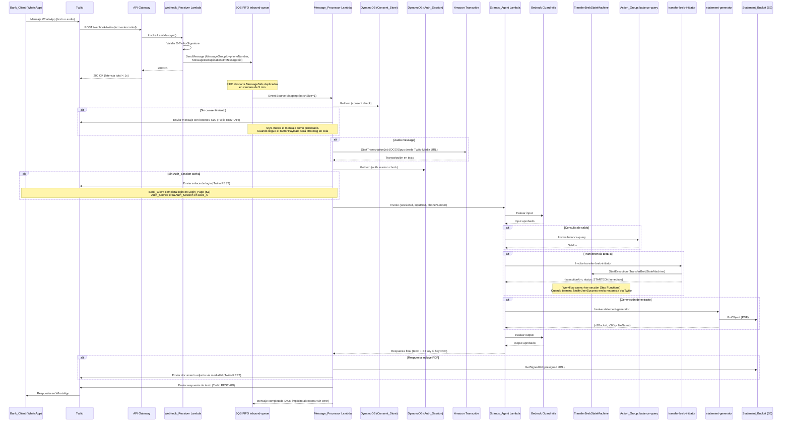
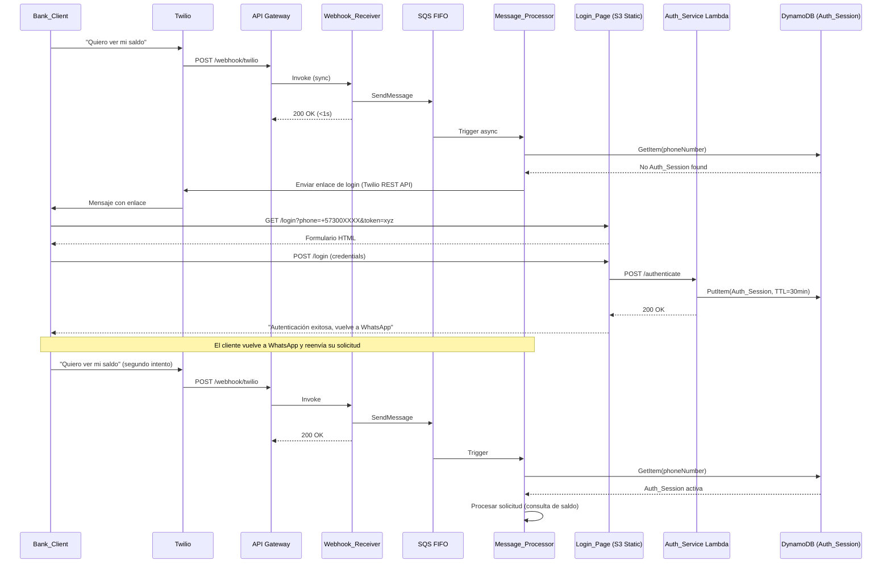
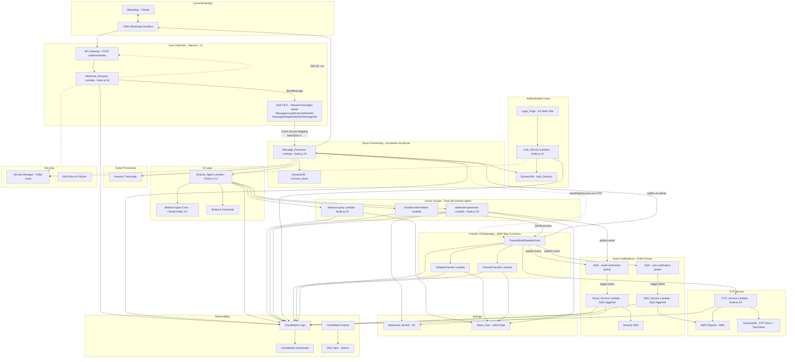
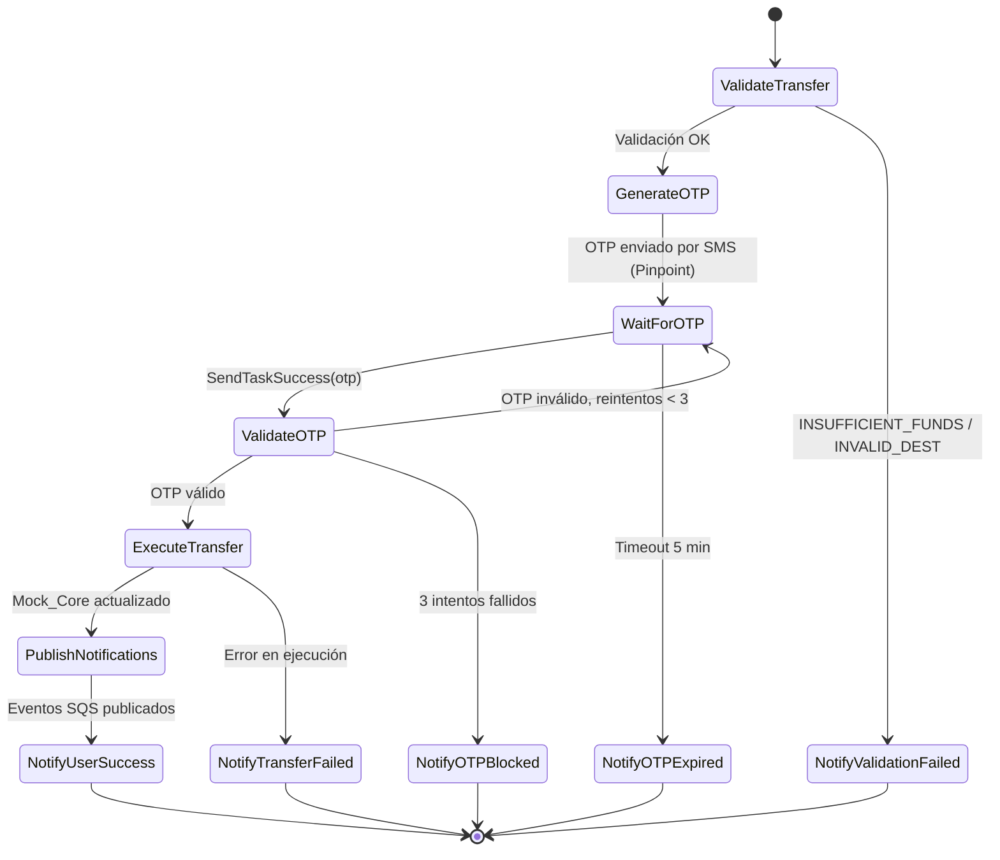
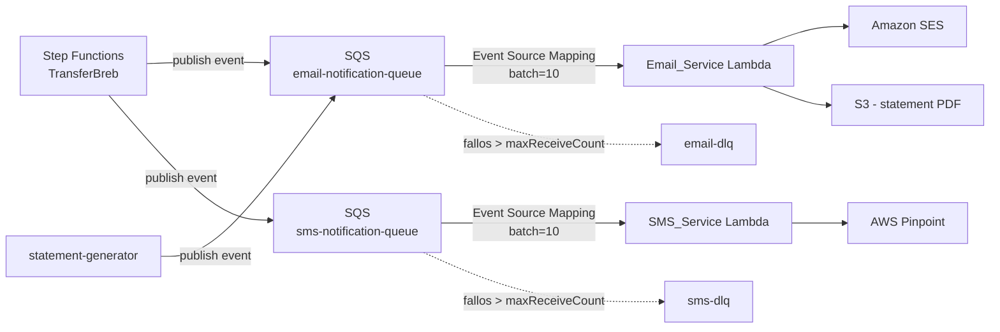

# Technical Design Document

## Overview

BTG ConnectAI MVP Lite es un asistente bancario conversacional serverless que conecta WhatsApp con Amazon Bedrock Agent para ejecutar servicios bancarios en español natural. El sistema soporta entrada multimodal (texto y audio), flujo de consentimiento regulatorio, autenticación vía enlace web, y tres servicios bancarios: consulta de saldos, transferencias BRE-B y generación de extractos PDF.

### Decisiones Arquitectónicas Clave

| Decisión | Elección | Razón |
| -------- | -------- | ----- |
| Runtime (negocio) | TypeScript (Node.js 24.x) | Tipado fuerte, cold start rápido, Powertools nativo |
| Runtime (IA) | Python 3.12 | Strands Agent SDK disponible y maduro en Python |
| IaC | AWS CDK (TypeScript) | Mismo lenguaje que Lambdas de negocio, L2 constructs |
| AI Engine | Strands Agent SDK + Amazon Bedrock Agent Core (Claude Haiku 3.5) | Framework open-source AWS sobre Bedrock; control de orquestación, herramientas y memoria de sesión |
| Canal WhatsApp | Twilio (WhatsApp Sandbox) | Onboarding rápido sin aprobación Meta, webhooks REST simples |
| Entrada HTTP | Amazon API Gateway (HTTP API) | Endpoint público expuesto a Twilio; bajo costo, sin servidor |
| Patrón Webhook | Async via SQS FIFO (Webhook_Receiver → queue → Message_Processor) | Receiver responde 200 a Twilio en <1s independientemente del trabajo real; elimina timeouts y retries de Twilio; absorbe spikes; escalabilidad independiente |
| Audio | Amazon Transcribe | Soporte nativo OGG/Opus, español colombiano (es-CO); sin presión de tiempo gracias al async |
| Deduplicación | SQS FIFO `MessageDeduplicationId = MessageSid` | Dedup nativa en ventana de 5 min sin código custom; elimina la tabla Dedup |
| Orden de mensajes | SQS FIFO `MessageGroupId = phoneNumber` | Garantiza que mensajes del mismo cliente se procesen en orden, sin afectar concurrencia entre clientes distintos |
| Autenticación | Lambda + DynamoDB (mock vía enlace web) | Simula flujo real con mínima infraestructura |
| OTP Transaccional | AWS Pinpoint (SMS) | Segundo factor para autorizar transferencias; canal SMS independiente de WhatsApp |
| Email | Amazon SES | Notificaciones formales post-operación; non-blocking respecto al flujo de WhatsApp |
| Extractos | S3 + envío como documento adjunto Twilio | Entrega directa al Bank_Client vía Twilio Media |
| Observabilidad | Lambda Powertools + CloudWatch | Structured logging JSON, métricas nativas |
| Seguridad | IAM roles + AWS managed keys + Secrets Manager | Zero cost, credenciales Twilio nunca en código |

### Flujo de Datos Principal (Happy Path Completo)



### Flujo de Autenticación (Detalle)



## Architecture

### Diagrama de Componentes



### Principios Arquitectónicos

1. **VPC-first security**: Todas las Lambdas adjuntadas a las subnets privadas (10.0.11.0/24, 10.0.12.0/24) de la VPC `IA-Builder-sandbox-networking`. Ningún componente de cómputo expuesto directamente a internet. Tráfico saliente a través del NAT Gateway en PublicSubnet1.
2. **Lambda Security Group**: Sin ingress de red (el trigger llega por invocación AWS). Egress TCP 443 a 0.0.0.0/0 únicamente. IDs de VPC y subnets importados del stack `IA-Builder-sandbox-networking` vía `Fn.importValue`.
3. **Runtime mixto**: Node.js 24.x para Lambdas de negocio (Message_Handler, Action Groups, OTP_Service, Email_Service); Python 3.12 exclusivamente para Strands_Agent (IA).
4. **Twilio como canal**: Twilio Sandbox recibe y envía mensajes WhatsApp. API Gateway expone el webhook público. Credenciales Twilio en Secrets Manager.
4a. **Async Webhook Pattern**: Separación estricta `Webhook_Receiver` (sync, latencia <1s, solo valida firma y encola) + `Message_Processor` (async, SQS-triggered, hace todo el trabajo pesado). Twilio nunca espera transcripción ni invocación de Bedrock; recibe 200 OK inmediato. Spike de tráfico es absorbido por la cola, no por throttling de Lambda.
4b. **SQS FIFO para mensajes entrantes**: `inbound-messages-queue.fifo` con `MessageGroupId=phoneNumber` (garantiza orden por cliente) y `MessageDeduplicationId=MessageSid` (dedup automática de retries de Twilio en ventana de 5 min — elimina necesidad de tabla Dedup custom). `batchSize=1` porque cada mensaje es una interacción crítica.
5. **Strands + Bedrock Agent Core**: El Conversational_Agent usa Strands Agent SDK (Python) sobre Bedrock Agent Core (Claude Haiku 3.5). Strands maneja orquestación de herramientas y memoria de sesión.
6. **Step Functions para transacciones distribuidas**: El flujo de transferencia BRE-B (validar → OTP → esperar callback → ejecutar → notificar) corre como state machine de AWS Step Functions usando el patrón `waitForTaskToken`. Esto resuelve el problema de "esperar input asíncrono del cliente" sin bloquear Lambdas y provee manejo nativo de timeouts, reintentos y compensación.
7. **Event-Driven Async Notifications**: Email y SMS de confirmación se publican como eventos a SQS (`email-notification-queue`, `sms-notification-queue`). Las Lambdas consumidoras (`Email_Service`, `SMS_Service`) procesan en batch. El flujo principal no espera respuesta del envío — fire-and-forget total. Esto desacopla productores de consumidores y permite reintentos automáticos con DLQ.
8. **OTP con Task Token**: El OTP_Service no "espera" al usuario. Step Functions pausa la ejecución con `waitForTaskToken`, almacenando el token en DynamoDB junto al OTP. Cuando el cliente responde con el código, el Message_Handler lo valida y llama `SendTaskSuccess`/`SendTaskFailure` para resumir el workflow.
9. **Consent-First**: Ningún servicio se ejecuta sin consentimiento previo registrado en Consent_Store.
10. **Auth-Before-Action**: Operaciones bancarias requieren Auth_Session activa (TTL 30min).
11. **Mock Data Inline**: Datos bancarios sintéticos hardcodeados en las Lambdas de Action Groups para el demo.
12. **Encryption at Rest by Default**: AWS managed keys en DynamoDB y S3 — zero cost, zero management.


## Components and Interfaces

### 1. Webhook_Receiver Lambda

**Responsabilidad:** Punto de entrada SÍNCRONO del sistema. Su única misión es responder a Twilio en menos de un segundo. No hace negocio — valida la firma, parsea el payload y lo encola en SQS FIFO. Toda la lógica pesada se delega al Message_Processor de forma asíncrona.

**Runtime:** Node.js 24.x (TypeScript)
**Memory:** 256 MB
**Timeout:** 10 seconds (en práctica resuelve en <1s)
**Trigger:** Amazon API Gateway (HTTP API — POST /webhook/twilio)
**Provisioned Concurrency:** Recomendado en producción (no requerido para hackathon)

#### Lógica del Webhook_Receiver

```typescript
import { validateRequest } from "twilio";

export const handler = async (event: APIGatewayProxyEventV2): Promise<APIGatewayProxyResultV2> => {
  const correlationId = uuidv4();
  logger.appendKeys({ correlationId });

  // 1. Validar firma X-Twilio-Signature (defensa contra requests no autorizados)
  const signature = event.headers["x-twilio-signature"];
  const url = `https://${event.requestContext.domainName}${event.rawPath}`;
  const params = parseFormUrlencoded(event.body!);

  if (!validateRequest(TWILIO_AUTH_TOKEN, signature!, url, params)) {
    logger.warn("Invalid Twilio signature, rejecting");
    return { statusCode: 403, body: "" };
  }

  // 2. Encolar en SQS FIFO — dedup automática por MessageSid
  await sqsClient.send(new SendMessageCommand({
    QueueUrl: INBOUND_MESSAGES_QUEUE_URL,
    MessageBody: JSON.stringify({ ...params, correlationId, receivedAt: new Date().toISOString() }),
    MessageGroupId: params.From,                    // Orden por cliente
    MessageDeduplicationId: params.MessageSid,      // Dedup gratis 5 min
  }));

  // 3. 200 OK inmediato — Twilio happy
  return { statusCode: 200, body: "" };
};
```

#### IAM Role del Webhook_Receiver

- `sqs:SendMessage` sobre `inbound-messages-queue.fifo`
- `secretsmanager:GetSecretValue` sobre el secreto con `TWILIO_AUTH_TOKEN` (para validar firma)
- `logs:*` para CloudWatch Logs

> Notar que el Receiver NO necesita acceso a DynamoDB, Bedrock, Transcribe, S3, ni a Twilio REST API. Es deliberadamente minimalista para minimizar la superficie de ataque y el cold start.

---

### 2. Message_Processor Lambda

**Responsabilidad:** Hace TODO el trabajo pesado de procesar un mensaje entrante: valida consentimiento, transcribe audio, valida sesión de autenticación, maneja callbacks de OTP, invoca al Strands_Agent y envía la respuesta al cliente vía Twilio REST API. Se ejecuta de forma asíncrona triggered por SQS — sin presión de tiempo del lado de Twilio.

**Runtime:** Node.js 24.x (TypeScript)
**Memory:** 512 MB
**Timeout:** 120 seconds (suficiente para transcripción + Strands Agent + envío respuesta)
**Trigger:** SQS Event Source Mapping sobre `inbound-messages-queue.fifo`
**Batch Size:** 1 (cada mensaje es interacción crítica del usuario, no se batchea)
**Visibility Timeout (en la cola):** 130s (apenas mayor que el timeout del Lambda para permitir reintento limpio)

#### Interface de Entrada (SQS Event)

```typescript
// Payload que Twilio envía como form-urlencoded al webhook
interface TwilioWebhookPayload {
  MessageSid: string;        // ID único del mensaje (usado para dedup)
  From: string;              // "whatsapp:+57300XXXXXXX"
  To: string;                // "whatsapp:+14155XXXXXXX" (número Twilio)
  Body: string;              // Texto del mensaje (vacío si es media)
  NumMedia: string;          // "0" | "1" | ...
  MediaUrl0?: string;        // URL del audio/imagen si NumMedia > 0
  MediaContentType0?: string; // "audio/ogg" | "image/jpeg" | ...
  ButtonPayload?: string;    // Payload del botón de respuesta rápida
  ProfileName?: string;      // Nombre de perfil de WhatsApp del cliente
}
```

#### Lógica Principal

```typescript
import { SQSEvent, SQSBatchResponse, SQSBatchItemFailure } from "aws-lambda";

// El Processor recibe un SQSEvent (con batchSize=1, será un solo record por invocación)
async function handler(event: SQSEvent): Promise<SQSBatchResponse> {
  const batchItemFailures: SQSBatchItemFailure[] = [];

  for (const record of event.Records) {
    try {
      const payload = JSON.parse(record.body) as TwilioWebhookPayload & { correlationId: string };
      logger.appendKeys({ correlationId: payload.correlationId });

      const phoneNumber = payload.From.replace("whatsapp:", ""); // E.164

      // 1. OTP callback prioritario — si hay OTP pendiente, no llamamos al agente
      const pendingOTP = await getPendingOTP(phoneNumber);
      if (pendingOTP) {
        await handleOTPCallback(phoneNumber, payload.Body, pendingOTP);
        continue;
      }

      // 2. Verificar consentimiento
      const consent = await getConsent(phoneNumber);
      if (!consent?.accepted) {
        await handleConsentFlow(payload, consent, phoneNumber);
        continue;
      }

      // 3. Determinar tipo de mensaje y extraer texto
      let inputText: string;
      if (payload.ButtonPayload) {
        inputText = payload.ButtonPayload;
      } else if (payload.NumMedia !== "0" && payload.MediaContentType0?.startsWith("audio/")) {
        inputText = await transcribeAudio(payload.MediaUrl0!, phoneNumber);
        if (!inputText) {
          await sendTwilioMessage(phoneNumber, ERROR_MESSAGES.transcriptionFailed);
          continue;
        }
      } else if (payload.Body?.trim()) {
        inputText = payload.Body.trim();
      } else {
        await sendTwilioMessage(phoneNumber, ERROR_MESSAGES.unsupportedFormat);
        continue;
      }

      // 4. Verificar Auth_Session
      const authSession = await getAuthSession(phoneNumber);
      if (!authSession || isExpired(authSession)) {
        await storePendingRequest(phoneNumber, inputText);
        await sendLoginLink(phoneNumber);
        continue;
      }

      // 5. Invocar Strands_Agent
      const sessionId = deriveSessionId(phoneNumber);
      const response = await invokeStrandsAgent(sessionId, inputText, phoneNumber);

      // 6. Si la respuesta incluye un PDF (extracto), enviarlo como media adjunta
      const statementInfo = extractStatementInfo(response);
      if (statementInfo) {
        await sendTwilioDocument(phoneNumber, statementInfo.s3Bucket, statementInfo.s3Key);
      }

      // 7. Enviar respuesta de texto (split si > 1600 chars)
      const textResponse = removeStatementMetadata(response);
      if (textResponse.trim()) {
        await sendTwilioMessage(phoneNumber, textResponse);
      }
    } catch (error) {
      // Reportar solo este mensaje como fallido — SQS lo reintentará individualmente
      logger.error("Failed to process message", { error, messageId: record.messageId });
      batchItemFailures.push({ itemIdentifier: record.messageId });
    }
  }

  return { batchItemFailures };

  return { statusCode: 200, body: "" };
}
```

#### Flujo de Consentimiento

```typescript
async function handleConsentFlow(
  payload: TwilioWebhookPayload,
  consent: ConsentRecord | null,
  phoneNumber: string
): Promise<void> {
  // Respuesta a botón de T&C (Twilio envía el payload del botón en ButtonPayload)
  if (payload.ButtonPayload === "accept_tc") {
    await storeConsent(phoneNumber, "accepted");
    await sendWelcomeMessage(phoneNumber);
    return;
  }

  if (payload.ButtonPayload === "reject_tc") {
    await storeConsent(phoneNumber, "rejected");
    await sendTwilioMessage(phoneNumber, ERROR_MESSAGES.consentRequired);
    return;
  }

  // Primer mensaje sin consentimiento — enviar T&C con botones de acción rápida (Twilio)
  await sendTermsAndConditionsMessage(phoneNumber);
}

async function sendTermsAndConditionsMessage(phoneNumber: string): Promise<void> {
  // Twilio soporta botones de respuesta rápida via Content Templates o mensaje con lista
  await twilioClient.messages.create({
    from: `whatsapp:${TWILIO_NUMBER}`,
    to: `whatsapp:${phoneNumber}`,
    body: "Bienvenido a BTG ConnectAI. Para usar nuestros servicios acepta los Términos y Condiciones: https://btgpactual.com.co/terminos",
    // Botones de respuesta rápida via Twilio Content API template
    contentSid: TWILIO_TC_TEMPLATE_SID,
    contentVariables: JSON.stringify({ phoneNumber }),
  });
}
```

#### Transcripción de Audio

```typescript
async function transcribeAudio(mediaUrl: string, phoneNumber: string): Promise<string | null> {
  try {
    // 1. Descargar audio desde Twilio Media URL (requiere autenticación Twilio)
    const audioBuffer = await downloadTwilioMedia(mediaUrl);

    // 2. Subir a S3 temporal para Transcribe
    const s3Key = `audio-temp/${uuidv4()}.ogg`;
    await s3Client.send(new PutObjectCommand({
      Bucket: AUDIO_TEMP_BUCKET,
      Key: s3Key,
      Body: audioBuffer,
      ContentType: "audio/ogg",
    }));

    // 3. Iniciar transcripción
    const jobName = `btg-connectai-${uuidv4()}`;
    await transcribeClient.send(new StartTranscriptionJobCommand({
      TranscriptionJobName: jobName,
      LanguageCode: "es-CO",
      MediaFormat: "ogg",
      Media: { MediaFileUri: `s3://${AUDIO_TEMP_BUCKET}/${s3Key}` },
      OutputBucketName: AUDIO_TEMP_BUCKET,
      OutputKey: `transcriptions/${jobName}.json`,
    }));

    // 4. Polling hasta completar (max 10s)
    const transcript = await waitForTranscription(jobName, 10_000);

    // 5. Limpiar archivos temporales
    await cleanupTempFiles(s3Key, `transcriptions/${jobName}.json`);

    return transcript;
  } catch (error) {
    logger.error("Audio transcription failed", { error });
    return null;
  }
}
```

#### Envío de Enlace de Login

```typescript
async function sendLoginLink(phoneNumber: string): Promise<void> {
  const callbackToken = generateCallbackToken(phoneNumber);
  const loginUrl = `${LOGIN_PAGE_URL}?phone=${encodeURIComponent(phoneNumber)}&token=${callbackToken}`;

  await twilioClient.messages.create({
    from: `whatsapp:${TWILIO_NUMBER}`,
    to: `whatsapp:${phoneNumber}`,
    body: `🔐 Para ejecutar operaciones bancarias necesitas autenticarte.\n\nInicia sesión aquí: ${loginUrl}\n\nEl enlace es válido por 10 minutos.`,
  });
}
```

#### Deduplicación

```typescript
async function checkAndStoreDeduplicate(messageId: string): Promise<boolean> {
  try {
    await dynamoClient.send(new PutItemCommand({
      TableName: DEDUP_TABLE,
      Item: {
        pk: { S: messageId },
        ttl: { N: String(Math.floor(Date.now() / 1000) + 600) }, // 10 min TTL
        createdAt: { S: new Date().toISOString() },
      },
      ConditionExpression: "attribute_not_exists(pk)",
    }));
    return false;
  } catch (error) {
    if (error instanceof ConditionalCheckFailedException) {
      return true;
    }
    throw error;
  }
}
```

#### Invocación del Strands_Agent Lambda

```typescript
async function invokeStrandsAgent(
  sessionId: string,
  inputText: string,
  phoneNumber: string
): Promise<string> {
  const response = await lambdaClient.send(new InvokeCommand({
    FunctionName: STRANDS_AGENT_LAMBDA_ARN,
    InvocationType: "RequestResponse",
    Payload: Buffer.from(JSON.stringify({ sessionId, inputText, phoneNumber })),
  }));

  const result = JSON.parse(new TextDecoder().decode(response.Payload));
  return result.response as string;
}
```

#### Envío de Respuesta vía Twilio (con split)

```typescript
const MAX_TWILIO_MESSAGE_LENGTH = 1600;

async function sendTwilioMessage(phoneNumber: string, text: string): Promise<void> {
  const chunks = splitMessage(text, MAX_TWILIO_MESSAGE_LENGTH);

  for (const chunk of chunks) {
    await twilioClient.messages.create({
      from: `whatsapp:${TWILIO_NUMBER}`,
      to: `whatsapp:${phoneNumber}`,
      body: chunk,
    });
  }
}

function splitMessage(text: string, maxLength: number): string[] {
  if (text.length <= maxLength) return [text];
  
  const chunks: string[] = [];
  let remaining = text;
  
  while (remaining.length > 0) {
    if (remaining.length <= maxLength) {
      chunks.push(remaining);
      break;
    }
    // Buscar último salto de línea o espacio antes del límite
    let splitIndex = remaining.lastIndexOf("\n", maxLength);
    if (splitIndex === -1 || splitIndex < maxLength * 0.5) {
      splitIndex = remaining.lastIndexOf(" ", maxLength);
    }
    if (splitIndex === -1) {
      splitIndex = maxLength;
    }
    chunks.push(remaining.substring(0, splitIndex));
    remaining = remaining.substring(splitIndex).trimStart();
  }
  
  return chunks;
}
```

#### Envío de Documento PDF vía Twilio (Extracto Bancario)

```typescript
async function sendTwilioDocument(
  phoneNumber: string,
  s3Bucket: string,
  s3Key: string,
  fileName: string
): Promise<void> {
  // 1. Generar presigned URL temporal de S3 (Twilio necesita una URL pública para descargar el media)
  const presignedUrl = await getSignedUrl(
    s3Client,
    new GetObjectCommand({ Bucket: s3Bucket, Key: s3Key }),
    { expiresIn: 300 } // 5 minutos — suficiente para que Twilio descargue
  );

  // 2. Enviar mensaje con media adjunto via Twilio
  await twilioClient.messages.create({
    from: `whatsapp:${TWILIO_NUMBER}`,
    to: `whatsapp:${phoneNumber}`,
    body: "📄 Aquí tienes tu extracto bancario.",
    mediaUrl: [presignedUrl],
  });
}
```


### 3. Auth_Service Lambda

**Responsabilidad:** Backend de autenticación mock. Valida credenciales contra usuarios de prueba hardcodeados y crea Auth_Session en DynamoDB. Simula un flujo de autenticación vía enlace web.

**Runtime:** Node.js 24.x (TypeScript)  
**Memory:** 128 MB  
**Timeout:** 10 seconds  
**Trigger:** API Gateway (HTTP API) o Function URL

#### Interface

```typescript
// POST /authenticate
interface AuthenticateRequest {
  username: string;
  password: string;
  phoneNumber: string;    // E.164 — vincula sesión al teléfono
  callbackToken: string;  // Token para validar origen legítimo
}

interface AuthenticateResponse {
  success: boolean;
  message: string;
  sessionId?: string;     // Solo si success=true
  expiresAt?: string;     // ISO 8601 — TTL de la sesión
}
```

#### Usuarios de Prueba Hardcodeados

```typescript
const TEST_USERS: TestUser[] = [
  {
    username: "carlos.rodriguez",
    password: "Btg2024*Test",
    phoneNumber: "+573001234567",
    name: "Carlos Rodríguez",
    documentId: "1234567890",
  },
  {
    username: "maria.lopez",
    password: "Btg2024*Demo",
    phoneNumber: "+573009876543",
    name: "María López",
    documentId: "0987654321",
  },
  {
    username: "juan.garcia",
    password: "Btg2024*Hack",
    phoneNumber: "+573005551234",
    name: "Juan García",
    documentId: "1122334455",
  },
];
```

#### Lógica de Autenticación

```typescript
async function authenticate(request: AuthenticateRequest): Promise<AuthenticateResponse> {
  // 1. Validar callback token
  if (!isValidCallbackToken(request.callbackToken, request.phoneNumber)) {
    return { success: false, message: "Token inválido" };
  }

  // 2. Buscar usuario
  const user = TEST_USERS.find(
    u => u.username === request.username && u.password === request.password
  );

  if (!user) {
    return { success: false, message: "Credenciales incorrectas" };
  }

  // 3. Validar que el teléfono coincide con el usuario
  if (user.phoneNumber !== request.phoneNumber) {
    return { success: false, message: "Credenciales incorrectas" };
  }

  // 4. Crear Auth_Session en DynamoDB
  const sessionId = uuidv4();
  const expiresAt = new Date(Date.now() + 30 * 60 * 1000); // 30 min TTL
  const ttl = Math.floor(expiresAt.getTime() / 1000);

  await dynamoClient.send(new PutItemCommand({
    TableName: AUTH_SESSION_TABLE,
    Item: {
      pk: { S: request.phoneNumber },
      sessionId: { S: sessionId },
      username: { S: user.username },
      name: { S: user.name },
      documentId: { S: user.documentId },
      createdAt: { S: new Date().toISOString() },
      expiresAt: { S: expiresAt.toISOString() },
      ttl: { N: String(ttl) },
    },
  }));

  // 5. Notificar al Gateway (via DynamoDB stream o polling)
  return {
    success: true,
    message: "Autenticación exitosa",
    sessionId,
    expiresAt: expiresAt.toISOString(),
  };
}
```

### 4. Login_Page (S3 Static Site)

**Responsabilidad:** Página web simple con formulario de login. Hosted en S3 como sitio estático con CloudFront (o directamente S3 website hosting para MVP).

**Tecnología:** HTML + CSS + JavaScript vanilla (sin framework)

#### Estructura

```
login-page/
├── index.html      # Formulario de login
├── styles.css      # Estilos BTG Pactual branding
├── app.js          # Lógica de submit + llamada a Auth_Service
└── assets/
    └── logo.png    # Logo BTG Pactual
```

#### Flujo de la Login_Page

```typescript
// app.js (client-side)
async function handleLogin(event: Event): Promise<void> {
  event.preventDefault();
  
  const username = document.getElementById("username").value;
  const password = document.getElementById("password").value;
  const params = new URLSearchParams(window.location.search);
  const phoneNumber = params.get("phone");
  const callbackToken = params.get("token");

  const response = await fetch(AUTH_SERVICE_URL, {
    method: "POST",
    headers: { "Content-Type": "application/json" },
    body: JSON.stringify({ username, password, phoneNumber, callbackToken }),
  });

  const result = await response.json();
  
  if (result.success) {
    showSuccess("✅ Autenticación exitosa. Puedes volver a WhatsApp.");
  } else {
    showError(result.message);
  }
}
```

### 5. Action_Group Lambda: balance-query

**Responsabilidad:** Consultar saldos de Fondos de Inversión y Cuenta Corriente del Mock_Core.

**Runtime:** Node.js 24.x (TypeScript)  
**Memory:** 128 MB  
**Timeout:** 15 seconds  
**Trigger:** Bedrock Agent Action Group invocation

#### Interface de Entrada/Salida (Bedrock Agent)

```typescript
interface BedrockAgentActionGroupEvent {
  messageVersion: "1.0";
  agent: { name: string; id: string; alias: string; version: string };
  inputText: string;
  sessionId: string;
  actionGroup: string;
  apiPath: string;
  httpMethod: string;
  parameters: Array<{ name: string; type: string; value: string }>;
  sessionAttributes: Record<string, string>;
  promptSessionAttributes: Record<string, string>;
}

interface BedrockAgentActionGroupResponse {
  messageVersion: "1.0";
  response: {
    actionGroup: string;
    apiPath: string;
    httpMethod: string;
    httpStatusCode: number;
    responseBody: {
      "application/json": { body: string };
    };
  };
}
```

#### API Paths

| Path | Method | Parámetros | Descripción |
|------|--------|------------|-------------|
| `/balance` | GET | `phoneNumber` (required), `productType` (optional: "fondo_inversion" \| "cuenta_corriente") | Consulta saldos |

### 6. Action_Group Lambda: transfer-breb

**Responsabilidad:** Ejecutar transferencias BRE-B entre cuentas contra el Mock_Core.

**Runtime:** Node.js 24.x (TypeScript)  
**Memory:** 128 MB  
**Timeout:** 15 seconds  
**Trigger:** Bedrock Agent Action Group invocation

#### API Paths

| Path | Method | Parámetros | Descripción |
|------|--------|------------|-------------|
| `/transfer` | POST | `sourceAccount`, `destinationAccount`, `amount`, `concept`, `phoneNumber` | Ejecutar transferencia |
| `/transfer/validate` | POST | `sourceAccount`, `destinationAccount`, `amount`, `phoneNumber` | Validar antes de confirmar |

#### Lógica de Transferencia

```typescript
async function executeTransfer(params: TransferParams): Promise<TransferResult> {
  const { sourceAccount, destinationAccount, amount, concept, phoneNumber } = params;

  // 1. Validar cuenta origen existe y pertenece al cliente
  const sourceAcct = findAccountByNumber(phoneNumber, sourceAccount);
  if (!sourceAcct) {
    return { success: false, error: "ACCOUNT_NOT_FOUND", message: "Cuenta origen no encontrada" };
  }

  // 2. Validar saldo suficiente
  if (sourceAcct.availableBalance < amount) {
    return { success: false, error: "INSUFFICIENT_FUNDS", message: "Fondos insuficientes" };
  }

  // 3. Validar cuenta destino existe
  const destAcct = findAccountByNumber(null, destinationAccount);
  if (!destAcct) {
    return { success: false, error: "DEST_NOT_FOUND", message: "Cuenta destino no encontrada" };
  }

  // 4. Ejecutar transferencia (mock — actualizar saldos en memoria)
  sourceAcct.availableBalance -= amount;
  sourceAcct.totalBalance -= amount;
  destAcct.availableBalance += amount;
  destAcct.totalBalance += amount;

  // 5. Generar comprobante
  const receipt: TransferReceipt = {
    transactionId: `TRX-${Date.now()}-${Math.random().toString(36).substr(2, 6)}`,
    sourceAccount: maskAccountNumber(sourceAccount),
    destinationAccount: maskAccountNumber(destinationAccount),
    amount,
    currency: "COP",
    concept,
    executedAt: new Date().toISOString(),
    status: "COMPLETED",
  };

  return { success: true, receipt };
}
```

### 7. Action_Group Lambda: statement-generator

**Responsabilidad:** Generar extractos bancarios en PDF, almacenarlos en S3 y retornar la referencia (S3 key) para que el Message_Handler descargue y envíe el PDF como documento adjunto vía WhatsApp.

**Runtime:** Node.js 24.x (TypeScript)  
**Memory:** 256 MB  
**Timeout:** 30 seconds  
**Trigger:** Bedrock Agent Action Group invocation

#### API Paths

| Path | Method | Parámetros | Descripción |
|------|--------|------------|-------------|
| `/statement` | POST | `phoneNumber`, `accountId`, `cutoffDate` | Generar extracto PDF |

#### Lógica de Generación

```typescript
async function generateStatement(params: StatementParams): Promise<StatementResult> {
  const { phoneNumber, accountId, cutoffDate } = params;

  // 1. Validar fecha de corte (debe ser pasada)
  const cutoff = new Date(cutoffDate);
  if (cutoff >= new Date()) {
    return { success: false, error: "INVALID_DATE", message: "La fecha de corte debe ser una fecha pasada" };
  }

  // 2. Obtener datos del cliente y transacciones
  const client = findClientByPhone(phoneNumber);
  const transactions = getTransactionsUntilDate(accountId, cutoffDate);

  // 3. Generar PDF (usando pdfkit o similar)
  const pdfBuffer = await generatePDF({
    clientName: client.name,
    accountNumber: maskAccountNumber(accountId),
    period: { start: getStartOfMonth(cutoffDate), end: cutoffDate },
    transactions,
    finalBalance: calculateBalance(transactions),
  });

  // 4. Subir a S3
  const s3Key = `statements/${phoneNumber}/${accountId}/${cutoffDate}-${uuidv4()}.pdf`;
  await s3Client.send(new PutObjectCommand({
    Bucket: STATEMENT_BUCKET,
    Key: s3Key,
    Body: pdfBuffer,
    ContentType: "application/pdf",
  }));

  // 5. Retornar referencia S3 para que el Gateway descargue y envíe como documento adjunto
  return {
    success: true,
    s3Bucket: STATEMENT_BUCKET,
    s3Key,
    fileName: `extracto_${accountId}_${cutoffDate}.pdf`,
  };
}
```


### 8. Strands_Agent Lambda (Conversational_Agent)

**Responsabilidad:** Interpretar intenciones en español (texto o audio transcrito), mantener contexto conversacional, decidir cuándo invocar herramientas (balance-query, transfer-breb, statement-generator), y formular respuestas naturales. Implementado como Lambda Python 3.12 usando Strands Agent SDK sobre Amazon Bedrock.

**Runtime:** Python 3.12  
**Memory:** 512 MB  
**Timeout:** 60 seconds  
**Trigger:** Lambda InvokeFunction desde Message_Handler (sync)  
**Foundation Model:** Claude 3.5 Haiku via Bedrock (anthropic.claude-3-5-haiku-20241022-v1:0)  
**Session Strategy:** sessionId derivado del número de teléfono — Strands mantiene historial en memoria de sesión  
**Guardrails:** Bedrock Guardrails aplicados sobre el modelo (content filtering + topic policies)

#### Instrucciones del Agente (System Prompt)

```text
Eres el asistente virtual de BTG Pactual Colombia. Tu nombre es ConnectAI.

SERVICIOS DISPONIBLES:
1. Consulta de saldos (Fondos de Inversión y Cuenta Corriente)
2. Transferencias BRE-B (entre cuentas)
3. Generación de extractos bancarios (PDF)

REGLAS:
1. Responde SIEMPRE en español colombiano natural y amigable.
2. Solo puedes ayudar con los 3 servicios listados arriba e información general de productos BTG Pactual.
3. Si el cliente pregunta algo fuera del dominio bancario, declina amablemente y lista los servicios disponibles.
4. Cuando presentes datos financieros (saldos, montos), SIEMPRE incluye el disclaimer: "📋 Esta información es referencial. Para registros oficiales, consulta los portales del banco."
5. Si no entiendes la solicitud, haz UNA pregunta de aclaración. Si después de 2 intentos no logras entender, ofrece el menú de servicios.
6. Interpreta expresiones coloquiales colombianas: "plata"=dinero, "luca"=mil pesos, "extracto"=estado de cuenta, "pásame plata"=transferencia, "cuánto tengo"=consulta de saldo.
7. Formatea montos en COP con separador de miles (punto) y decimales (coma): $1.234.567,89
8. Para TRANSFERENCIAS: SIEMPRE presenta un resumen con cuenta origen, cuenta destino, monto y concepto, y solicita confirmación explícita ("¿Confirmas esta transferencia?") ANTES de ejecutar.
9. Para EXTRACTOS: Solicita la fecha de corte. Si el cliente da una fecha futura, informa que debe ser una fecha pasada.
10. Cuando presentes transacciones o movimientos, muestra máximo 5 y ofrece ver más si hay adicionales.
11. Si el cliente acaba de autenticarse, salúdalo por su nombre.

FORMATO DE RESPUESTA:
- Usa emojis moderadamente para hacer la conversación amigable
- Usa listas con viñetas para presentar múltiples productos o transacciones
- Mantén las respuestas concisas (máximo 3 párrafos)
```

#### OpenAPI Schema — Action Group: balance-query

```yaml
openapi: "3.0.0"
info:
  title: "BTG ConnectAI Balance Query API"
  version: "1.0.0"
  description: "API para consulta de saldos de Fondos de Inversión y Cuenta Corriente"
paths:
  /balance:
    get:
      summary: "Consultar saldos del cliente"
      description: "Retorna saldos de Fondos de Inversión y/o Cuenta Corriente del cliente"
      operationId: "getBalance"
      parameters:
        - name: phoneNumber
          in: query
          required: true
          schema:
            type: string
          description: "Número de teléfono del cliente en formato E.164"
        - name: productType
          in: query
          required: false
          schema:
            type: string
            enum: ["fondo_inversion", "cuenta_corriente", "all"]
          description: "Tipo de producto. Si no se especifica, retorna todos los productos"
      responses:
        "200":
          description: "Saldos consultados exitosamente"
          content:
            application/json:
              schema:
                $ref: "#/components/schemas/BalanceResponse"
        "404":
          description: "Cliente no encontrado"
components:
  schemas:
    BalanceResponse:
      type: object
      properties:
        products:
          type: array
          items:
            $ref: "#/components/schemas/ProductBalance"
    ProductBalance:
      type: object
      properties:
        productType:
          type: string
          enum: ["fondo_inversion", "cuenta_corriente"]
        productName:
          type: string
          example: "Fondo BTG Pactual Liquidez"
        accountNumber:
          type: string
        currency:
          type: string
          example: "COP"
        availableBalance:
          type: number
        totalBalance:
          type: number
        cutoffDate:
          type: string
          format: date
```

#### OpenAPI Schema — Action Group: transfer-breb

```yaml
openapi: "3.0.0"
info:
  title: "BTG ConnectAI BRE-B Transfer API"
  version: "1.0.0"
  description: "API para transferencias BRE-B entre cuentas"
paths:
  /transfer/validate:
    post:
      summary: "Validar transferencia antes de ejecutar"
      description: "Valida que la transferencia sea posible (saldo, cuentas válidas)"
      operationId: "validateTransfer"
      requestBody:
        required: true
        content:
          application/json:
            schema:
              $ref: "#/components/schemas/TransferRequest"
      responses:
        "200":
          description: "Transferencia válida"
          content:
            application/json:
              schema:
                $ref: "#/components/schemas/ValidationResult"
        "400":
          description: "Transferencia inválida"
  /transfer:
    post:
      summary: "Ejecutar transferencia BRE-B"
      description: "Ejecuta la transferencia después de confirmación del cliente"
      operationId: "executeTransfer"
      requestBody:
        required: true
        content:
          application/json:
            schema:
              $ref: "#/components/schemas/TransferRequest"
      responses:
        "200":
          description: "Transferencia ejecutada"
          content:
            application/json:
              schema:
                $ref: "#/components/schemas/TransferReceipt"
        "400":
          description: "Error en transferencia"
components:
  schemas:
    TransferRequest:
      type: object
      required: [phoneNumber, sourceAccount, destinationAccount, amount]
      properties:
        phoneNumber:
          type: string
          description: "Teléfono del cliente en E.164"
        sourceAccount:
          type: string
          description: "Número de cuenta origen"
        destinationAccount:
          type: string
          description: "Número de cuenta destino"
        amount:
          type: number
          minimum: 1
          description: "Monto en COP"
        concept:
          type: string
          maxLength: 100
          description: "Concepto de la transferencia"
    ValidationResult:
      type: object
      properties:
        valid:
          type: boolean
        sourceAccountName:
          type: string
        destinationAccountName:
          type: string
        availableBalance:
          type: number
        error:
          type: string
    TransferReceipt:
      type: object
      properties:
        transactionId:
          type: string
        sourceAccount:
          type: string
        destinationAccount:
          type: string
        amount:
          type: number
        currency:
          type: string
        concept:
          type: string
        executedAt:
          type: string
          format: date-time
        status:
          type: string
          enum: ["COMPLETED", "FAILED"]
```

#### OpenAPI Schema — Action Group: statement-generator

```yaml
openapi: "3.0.0"
info:
  title: "BTG ConnectAI Statement Generator API"
  version: "1.0.0"
  description: "API para generación de extractos bancarios en PDF"
paths:
  /statement:
    post:
      summary: "Generar extracto bancario PDF"
      description: "Genera un extracto en PDF, lo almacena en S3 y retorna la referencia para envío como documento adjunto vía WhatsApp"
      operationId: "generateStatement"
      requestBody:
        required: true
        content:
          application/json:
            schema:
              $ref: "#/components/schemas/StatementRequest"
      responses:
        "200":
          description: "Extracto generado exitosamente"
          content:
            application/json:
              schema:
                $ref: "#/components/schemas/StatementResult"
        "400":
          description: "Fecha de corte inválida"
        "404":
          description: "Cliente o cuenta no encontrada"
components:
  schemas:
    StatementRequest:
      type: object
      required: [phoneNumber, accountId, cutoffDate]
      properties:
        phoneNumber:
          type: string
          description: "Teléfono del cliente en E.164"
        accountId:
          type: string
          description: "ID de la cuenta"
        cutoffDate:
          type: string
          format: date
          description: "Fecha de corte del extracto (debe ser fecha pasada)"
    StatementResult:
      type: object
      properties:
        success:
          type: boolean
        s3Bucket:
          type: string
          description: "Nombre del bucket S3 donde se almacenó el PDF"
        s3Key:
          type: string
          description: "Key del objeto PDF en S3"
        fileName:
          type: string
          description: "Nombre del archivo PDF para envío como documento adjunto"
        error:
          type: string
```

### 9. AWS Step Functions — TransferBrebStateMachine

**Responsabilidad:** Orquestar el flujo completo de transferencia BRE-B, que es una **transacción distribuida** que requiere callback asíncrono del usuario (OTP). Reemplaza el `transfer-breb` Lambda monolítico anterior por una state machine que coordina múltiples Lambdas con manejo nativo de timeouts, reintentos y compensación.

**Tipo:** Standard Workflow (vs Express) — permite `waitForTaskToken` con timeouts largos y trazabilidad por ejecución.

**Entrada:**

```json
{
  "phoneNumber": "+573001234567",
  "sourceAccount": "1009876543",
  "destinationAccount": "2009876544",
  "amount": 500000,
  "concept": "Pago arriendo",
  "sessionId": "sess-abc123",
  "correlationId": "uuid-..."
}
```

**Salida:**

```json
{
  "success": true,
  "transactionId": "TRX-...",
  "receipt": { /* TransferReceipt */ }
}
```

#### Diagrama de Estados



#### Definición ASL (Amazon States Language)

```json
{
  "Comment": "Flujo de transferencia BRE-B con autorización OTP",
  "StartAt": "ValidateTransfer",
  "States": {
    "ValidateTransfer": {
      "Type": "Task",
      "Resource": "arn:aws:lambda:::function:transfer-breb-validate",
      "ResultPath": "$.validation",
      "Next": "GenerateOTP",
      "Catch": [
        {
          "ErrorEquals": ["InsufficientFundsError", "InvalidDestinationError"],
          "ResultPath": "$.error",
          "Next": "NotifyValidationFailed"
        }
      ]
    },
    "GenerateOTP": {
      "Type": "Task",
      "Resource": "arn:aws:states:::lambda:invoke.waitForTaskToken",
      "Parameters": {
        "FunctionName": "otp-service",
        "Payload": {
          "operation": "generate-and-wait",
          "phoneNumber.$": "$.phoneNumber",
          "transferAmount.$": "$.amount",
          "taskToken.$": "$$.Task.Token"
        }
      },
      "HeartbeatSeconds": 300,
      "ResultPath": "$.otpResult",
      "Next": "ValidateOTP",
      "Catch": [
        {
          "ErrorEquals": ["States.Timeout"],
          "Next": "NotifyOTPExpired"
        },
        {
          "ErrorEquals": ["OTPBlockedError"],
          "Next": "NotifyOTPBlocked"
        }
      ]
    },
    "ValidateOTP": {
      "Type": "Choice",
      "Choices": [
        {
          "Variable": "$.otpResult.valid",
          "BooleanEquals": true,
          "Next": "ExecuteTransfer"
        }
      ],
      "Default": "NotifyOTPExpired"
    },
    "ExecuteTransfer": {
      "Type": "Task",
      "Resource": "arn:aws:lambda:::function:transfer-breb-execute",
      "ResultPath": "$.receipt",
      "Next": "PublishNotifications",
      "Catch": [
        {
          "ErrorEquals": ["States.ALL"],
          "Next": "NotifyTransferFailed"
        }
      ]
    },
    "PublishNotifications": {
      "Type": "Parallel",
      "ResultPath": "$.notifications",
      "Branches": [
        {
          "StartAt": "PublishEmailEvent",
          "States": {
            "PublishEmailEvent": {
              "Type": "Task",
              "Resource": "arn:aws:states:::sqs:sendMessage",
              "Parameters": {
                "QueueUrl": "${EmailNotificationQueueUrl}",
                "MessageBody": {
                  "type": "transfer_confirmation",
                  "receipt.$": "$.receipt",
                  "correlationId.$": "$.correlationId"
                }
              },
              "End": true
            }
          }
        },
        {
          "StartAt": "PublishSmsEvent",
          "States": {
            "PublishSmsEvent": {
              "Type": "Task",
              "Resource": "arn:aws:states:::sqs:sendMessage",
              "Parameters": {
                "QueueUrl": "${SmsNotificationQueueUrl}",
                "MessageBody": {
                  "type": "transfer_confirmation",
                  "phoneNumber.$": "$.phoneNumber",
                  "amount.$": "$.amount",
                  "correlationId.$": "$.correlationId"
                }
              },
              "End": true
            }
          }
        }
      ],
      "Next": "NotifyUserSuccess"
    },
    "NotifyUserSuccess": {
      "Type": "Task",
      "Resource": "arn:aws:lambda:::function:message-handler-notify",
      "Parameters": {
        "phoneNumber.$": "$.phoneNumber",
        "messageType": "transfer_success",
        "receipt.$": "$.receipt"
      },
      "End": true
    },
    "NotifyValidationFailed": {
      "Type": "Task",
      "Resource": "arn:aws:lambda:::function:message-handler-notify",
      "Parameters": {
        "phoneNumber.$": "$.phoneNumber",
        "messageType": "validation_failed",
        "error.$": "$.error"
      },
      "End": true
    },
    "NotifyOTPExpired": {
      "Type": "Task",
      "Resource": "arn:aws:lambda:::function:message-handler-notify",
      "Parameters": {
        "phoneNumber.$": "$.phoneNumber",
        "messageType": "otp_expired"
      },
      "End": true
    },
    "NotifyOTPBlocked": {
      "Type": "Task",
      "Resource": "arn:aws:lambda:::function:message-handler-notify",
      "Parameters": {
        "phoneNumber.$": "$.phoneNumber",
        "messageType": "otp_blocked"
      },
      "End": true
    },
    "NotifyTransferFailed": {
      "Type": "Task",
      "Resource": "arn:aws:lambda:::function:message-handler-notify",
      "Parameters": {
        "phoneNumber.$": "$.phoneNumber",
        "messageType": "transfer_failed"
      },
      "End": true
    }
  }
}
```

#### Patrón Task Token — Cómo funciona el callback del OTP

Este es el corazón del state machine. Resuelve el problema crítico: **¿cómo "esperar" a que el usuario tipee el OTP sin bloquear una Lambda?**


**Key insight:** La Lambda OTP_Service termina rápido (solo envía el SMS), pero Step Functions queda esperando hasta que Message_Handler invoque `SendTaskSuccess` o `SendTaskFailure` con el token guardado. Cero costo de Lambda mientras se espera.

#### Tabla DynamoDB extendida — OTP_Store con TaskToken

| Attribute | Type | Description |
| --------- | ---- | ----------- |
| `pk` | String (PK) | phoneNumber (E.164) |
| `code` | String | Código OTP de 6 dígitos |
| `taskToken` | String | Token de Step Functions para resumir el workflow |
| `executionArn` | String | ARN de la ejecución de Step Functions (para auditoría) |
| `attempts` | Number | Intentos fallidos (max 3) |
| `transferContext` | Map | Datos de la transferencia (monto, destino) para mostrar al validar |
| `createdAt` | String | ISO 8601 |
| `ttl` | Number | Unix epoch + 300s (5 min) |

### 10. Notificaciones Asíncronas con SQS

**Responsabilidad:** Desacoplar el envío de notificaciones (email, SMS de confirmación) del flujo principal. Las Lambdas productoras solo publican eventos a una cola; las consumidoras los procesan independientemente con reintentos automáticos.

#### Arquitectura



#### Configuración de las colas

**email-notification-queue:**

| Setting | Valor | Razón |
| ------- | ----- | ----- |
| Visibility Timeout | 60s | Cubre Email_Service timeout (15s) + buffer |
| Message Retention | 4 días | Tiempo razonable de retención si el consumer está caído |
| maxReceiveCount | 3 | Después de 3 fallos consecutivos → DLQ |
| Receive Wait Time | 20s | Long polling — reduce empty receives |
| Encryption | SSE-SQS | AWS managed key |
| DLQ | email-dlq | Para inspección manual de fallos |

**sms-notification-queue:** Misma configuración con DLQ `sms-dlq`.

#### Esquema de eventos (contrato productor ↔ consumidor)

```typescript
// Evento publicado a email-notification-queue
interface EmailNotificationEvent {
  type: "transfer_confirmation" | "statement_delivery";
  correlationId: string;        // Para tracing
  to: string;                   // Email del cliente
  payload:
    | {
        type: "transfer_confirmation";
        receipt: TransferReceipt;
        clientName: string;
      }
    | {
        type: "statement_delivery";
        s3Bucket: string;
        s3Key: string;
        fileName: string;
        clientName: string;
        period: { start: string; end: string };
      };
}

// Evento publicado a sms-notification-queue
interface SmsNotificationEvent {
  type: "transfer_confirmation";
  correlationId: string;
  phoneNumber: string;          // E.164
  amount: number;
  destinationAccount: string;   // Ya enmascarado
}
```

#### Event Source Mapping (CDK)

```typescript
emailService.addEventSource(new SqsEventSource(emailNotificationQueue, {
  batchSize: 10,
  maxBatchingWindow: Duration.seconds(5),
  reportBatchItemFailures: true,  // Solo reintenta los mensajes fallidos del batch, no todo el lote
}));
```

#### Productores publican via SDK

```typescript
// Desde statement-generator Lambda después de generar el PDF
await sqsClient.send(new SendMessageCommand({
  QueueUrl: EMAIL_NOTIFICATION_QUEUE_URL,
  MessageBody: JSON.stringify({
    type: "statement_delivery",
    correlationId: correlationId,
    to: clientEmail,
    payload: {
      type: "statement_delivery",
      s3Bucket: STATEMENT_BUCKET,
      s3Key: s3Key,
      fileName: fileName,
      clientName: client.name,
      period: { start: periodStart, end: cutoffDate },
    },
  }),
  MessageAttributes: {
    EventType: { DataType: "String", StringValue: "statement_delivery" },
  },
}));
// Lambda termina inmediatamente — no espera al envío del email
```

#### Beneficios del patrón

- **Resiliencia**: SES caído → mensajes se acumulan en SQS, se procesan cuando se recupere
- **Escalabilidad independiente**: Email_Service puede escalar a 1000 invocaciones concurrentes sin afectar el flujo principal
- **Reintentos automáticos**: SQS reintenta hasta `maxReceiveCount`, luego envía a DLQ
- **Batch processing**: 10 emails por invocación reduce costo
- **Observabilidad**: Métrica `ApproximateAgeOfOldestMessage` por cola alerta si los consumidores están atrasados

### 11. Bedrock Guardrails

**Responsabilidad:** Filtrar contenido inapropiado, restringir respuestas al dominio bancario, bloquear asesoría financiera personalizada y prevenir prompt injection.

#### Configuración

```typescript
const guardrailConfig = {
  name: "btg-connectai-guardrail",
  description: "Guardrail para asistente bancario BTG Pactual Colombia",
  
  contentPolicyConfig: {
    filtersConfig: [
      { type: "SEXUAL", inputStrength: "HIGH", outputStrength: "HIGH" },
      { type: "VIOLENCE", inputStrength: "HIGH", outputStrength: "HIGH" },
      { type: "HATE", inputStrength: "HIGH", outputStrength: "HIGH" },
      { type: "INSULTS", inputStrength: "MEDIUM", outputStrength: "HIGH" },
      { type: "MISCONDUCT", inputStrength: "HIGH", outputStrength: "HIGH" },
      { type: "PROMPT_ATTACK", inputStrength: "HIGH", outputStrength: "NONE" },
    ],
  },

  topicPolicyConfig: {
    topicsConfig: [
      {
        name: "investment-advice",
        definition: "Recomendaciones específicas de inversión, compra o venta de activos financieros, sugerencias sobre portafolio",
        examples: [
          "¿Debería invertir en acciones de X?",
          "¿Es buen momento para comprar dólares?",
          "Recomiéndame un CDT",
          "¿Qué fondo me conviene más?",
        ],
        type: "DENY",
      },
      {
        name: "non-banking-topics",
        definition: "Temas no relacionados con servicios bancarios de BTG Pactual como política, deportes, entretenimiento, salud, cocina",
        examples: [
          "¿Quién ganó el partido ayer?",
          "¿Qué opinas del presidente?",
          "Dame una receta de cocina",
          "¿Cómo está el clima?",
        ],
        type: "DENY",
      },
      {
        name: "competitor-info",
        definition: "Información sobre productos o servicios de otros bancos o entidades financieras competidoras",
        examples: [
          "¿Qué tasas ofrece Bancolombia?",
          "Compara BTG con Davivienda",
          "¿Es mejor un CDT en Nequi?",
        ],
        type: "DENY",
      },
    ],
  },

  blockedInputMessaging: "Lo siento, no puedo procesar esa solicitud. Solo puedo ayudarte con: consulta de saldos, transferencias BRE-B y generación de extractos bancarios de BTG Pactual.",
  blockedOutputsMessaging: "Lo siento, no puedo proporcionar esa información. ¿Puedo ayudarte con consulta de saldos, transferencias o extractos bancarios?",
};
```


### 12. Observability Stack

#### CloudWatch Dashboard

```typescript
const dashboardWidgets = [
  // Message_Handler
  { title: "Gateway - Invocations", metric: "Invocations", functionName: "Message_Handler" },
  { title: "Gateway - Errors", metric: "Errors", functionName: "Message_Handler" },
  { title: "Gateway - Duration p50/p90", metric: "Duration", functionName: "Message_Handler", stats: ["p50", "p90"] },
  // Auth_Service
  { title: "AuthService - Invocations", metric: "Invocations", functionName: "Auth_Service" },
  { title: "AuthService - Errors", metric: "Errors", functionName: "Auth_Service" },
  // balance-query
  { title: "BalanceQuery - Invocations", metric: "Invocations", functionName: "balance-query" },
  { title: "BalanceQuery - Errors", metric: "Errors", functionName: "balance-query" },
  { title: "BalanceQuery - Duration p50/p90", metric: "Duration", functionName: "balance-query", stats: ["p50", "p90"] },
  // transfer-breb
  { title: "TransferBREB - Invocations", metric: "Invocations", functionName: "transfer-breb" },
  { title: "TransferBREB - Errors", metric: "Errors", functionName: "transfer-breb" },
  // statement-generator
  { title: "StatementGen - Invocations", metric: "Invocations", functionName: "statement-generator" },
  { title: "StatementGen - Errors", metric: "Errors", functionName: "statement-generator" },
  { title: "StatementGen - Duration p50/p90", metric: "Duration", functionName: "statement-generator", stats: ["p50", "p90"] },
];
```

#### CloudWatch Alarms

```typescript
// Error rate alarm per Lambda (>10% en 5 min)
const createErrorRateAlarm = (functionName: string) => ({
  alarmName: `btg-connectai-${functionName}-error-rate`,
  metric: mathExpression("errors / invocations * 100"),
  threshold: 10,
  evaluationPeriods: 1,
  period: 300, // 5 minutes
  comparisonOperator: "GreaterThanThreshold",
  alarmActions: [snsAlarmTopic.topicArn],
});

// Alarmas para cada Lambda
const alarms = [
  createErrorRateAlarm("Message_Handler"),
  createErrorRateAlarm("Auth_Service"),
  createErrorRateAlarm("balance-query"),
  createErrorRateAlarm("transfer-breb"),
  createErrorRateAlarm("statement-generator"),
];
```

### 13. Infrastructure as Code (CDK Stack Structure)

```
infra/
├── bin/
│   └── app.ts                        # CDK App entry point
├── lib/
│   ├── stacks/
│   │   └── btg-connectai-stack.ts    # Main stack (all resources)
│   ├── constructs/
│   │   ├── message-handler.ts        # Message Handler Lambda + API Gateway integration
│   │   ├── auth-service.ts           # Auth_Service Lambda + Function URL
│   │   ├── login-page.ts             # S3 static site + deployment
│   │   ├── balance-query.ts          # Action Group Lambda
│   │   ├── transfer-breb.ts          # Action Group Lambda
│   │   ├── statement-generator.ts    # Action Group Lambda + S3 bucket
│   │   ├── bedrock-agent.ts          # Bedrock Agent + Guardrails
│   │   ├── dynamodb-tables.ts        # Dedup + Consent_Store + Auth_Session
│   │   ├── audio-processing.ts       # S3 temp bucket for Transcribe
│   │   ├── observability.ts          # Dashboard + Alarms + SNS
│   │   └── security.ts              # IAM roles + Secrets Manager
│   └── config/
│       └── environment.ts            # Environment-specific config
├── cdk.json
└── tsconfig.json

src/
├── lambdas/
│   ├── whatsapp-gateway/
│   │   ├── index.ts                  # Handler
│   │   ├── consent.ts                # Consent flow logic
│   │   ├── auth.ts                   # Auth session check
│   │   ├── transcription.ts          # Audio transcription
│   │   ├── dedup.ts                  # Deduplication logic
│   │   ├── messaging.ts             # WhatsApp message sending (text + documents)
│   │   └── types.ts                  # TypeScript interfaces
│   ├── auth-service/
│   │   ├── index.ts                  # Handler
│   │   ├── users.ts                  # Hardcoded test users
│   │   └── types.ts
│   ├── balance-query/
│   │   ├── index.ts                  # Handler
│   │   ├── mock-data.ts             # Mock_Core data
│   │   └── types.ts
│   ├── transfer-breb/
│   │   ├── index.ts                  # Handler
│   │   ├── mock-data.ts             # Mock_Core data
│   │   └── types.ts
│   └── statement-generator/
│       ├── index.ts                  # Handler
│       ├── pdf-generator.ts          # PDF creation logic
│       ├── mock-data.ts             # Mock_Core data
│       └── types.ts
├── shared/
│   ├── logger.ts                     # Powertools logger config
│   ├── masking.ts                    # Data masking utilities
│   ├── types.ts                      # Shared types
│   └── constants.ts                  # Shared constants
├── login-page/
│   ├── index.html
│   ├── styles.css
│   └── app.js
└── tests/
    ├── unit/
    │   ├── dedup.test.ts
    │   ├── split-message.test.ts
    │   ├── masking.test.ts
    │   ├── consent.test.ts
    │   ├── auth.test.ts
    │   ├── balance-query.test.ts
    │   ├── transfer-breb.test.ts
    │   └── statement-generator.test.ts
    └── property/
        ├── split-message.property.test.ts
        ├── masking.property.test.ts
        ├── dedup.property.test.ts
        ├── session-id.property.test.ts
        ├── balance-query.property.test.ts
        ├── transfer-breb.property.test.ts
        └── statement-date.property.test.ts
```

#### IAM Roles (Least Privilege)

```typescript
// Webhook_Receiver Lambda Role — minimalista por diseño
const webhookReceiverRole = {
  policies: [
    // Encolar mensajes entrantes en SQS FIFO
    { effect: "Allow", actions: ["sqs:SendMessage"], resources: [inboundMessagesQueue.queueArn] },
    // Secrets Manager (solo para leer TWILIO_AUTH_TOKEN y validar firma)
    { effect: "Allow", actions: ["secretsmanager:GetSecretValue"], resources: [twilioSecretArn] },
    // CloudWatch Logs
    { effect: "Allow", actions: ["logs:CreateLogGroup", "logs:CreateLogStream", "logs:PutLogEvents"], resources: ["*"] },
  ],
};

// Message_Processor Lambda Role — donde está el trabajo pesado
const messageProcessorRole = {
  policies: [
    // SQS: consumir mensajes de la cola inbound (managed por Event Source Mapping pero documentamos el permiso)
    { effect: "Allow", actions: ["sqs:ReceiveMessage", "sqs:DeleteMessage", "sqs:ChangeMessageVisibility", "sqs:GetQueueAttributes"], resources: [inboundMessagesQueue.queueArn] },
    // DynamoDB: consent_store (read + write), auth_session (read), OTP_Store (read + update + delete para callback)
    { effect: "Allow", actions: ["dynamodb:PutItem", "dynamodb:GetItem"], resources: [consentTable.tableArn] },
    { effect: "Allow", actions: ["dynamodb:GetItem"], resources: [authSessionTable.tableArn] },
    { effect: "Allow", actions: ["dynamodb:GetItem", "dynamodb:UpdateItem", "dynamodb:DeleteItem"], resources: [otpStoreTable.tableArn] },
    // Lambda: invocar Strands_Agent
    { effect: "Allow", actions: ["lambda:InvokeFunction"], resources: [strandsAgentLambda.functionArn] },
    // Step Functions: callback del OTP (SendTaskSuccess/Failure)
    { effect: "Allow", actions: ["states:SendTaskSuccess", "states:SendTaskFailure"], resources: [transferBrebStateMachine.stateMachineArn] },
    // Transcribe
    { effect: "Allow", actions: ["transcribe:StartTranscriptionJob", "transcribe:GetTranscriptionJob"], resources: ["*"] },
    // S3: audio temp (read/write), statement bucket (read presigned URL)
    { effect: "Allow", actions: ["s3:PutObject", "s3:GetObject", "s3:DeleteObject"], resources: [`${audioTempBucket.bucketArn}/*`] },
    { effect: "Allow", actions: ["s3:GetObject"], resources: [`${statementBucket.bucketArn}/*`] },
    // Secrets Manager (Twilio credentials para llamadas REST)
    { effect: "Allow", actions: ["secretsmanager:GetSecretValue"], resources: [twilioSecretArn] },
    // CloudWatch Logs
    { effect: "Allow", actions: ["logs:CreateLogGroup", "logs:CreateLogStream", "logs:PutLogEvents"], resources: ["*"] },
  ],
};

// Auth_Service Lambda Role
const authServiceRole = {
  policies: [
    // DynamoDB: auth_session (write)
    { effect: "Allow", actions: ["dynamodb:PutItem"], resources: [authSessionTable.tableArn] },
    // CloudWatch Logs
    { effect: "Allow", actions: ["logs:CreateLogGroup", "logs:CreateLogStream", "logs:PutLogEvents"], resources: ["*"] },
  ],
};

// balance-query Lambda Role
const balanceQueryRole = {
  policies: [
    // Solo CloudWatch Logs (datos mock inline)
    { effect: "Allow", actions: ["logs:CreateLogGroup", "logs:CreateLogStream", "logs:PutLogEvents"], resources: ["*"] },
  ],
};

// transfer-breb Lambda Role
const transferBrebRole = {
  policies: [
    // Solo CloudWatch Logs (datos mock inline)
    { effect: "Allow", actions: ["logs:CreateLogGroup", "logs:CreateLogStream", "logs:PutLogEvents"], resources: ["*"] },
  ],
};

// statement-generator Lambda Role
const statementGeneratorRole = {
  policies: [
    // S3: statement bucket (write only — Gateway handles download)
    { effect: "Allow", actions: ["s3:PutObject"], resources: [`${statementBucket.bucketArn}/*`] },
    // CloudWatch Logs
    { effect: "Allow", actions: ["logs:CreateLogGroup", "logs:CreateLogStream", "logs:PutLogEvents"], resources: ["*"] },
  ],
};

// Bedrock Agent Role
const bedrockAgentRole = {
  policies: [
    // Invoke foundation model
    { effect: "Allow", actions: ["bedrock:InvokeModel"], resources: [modelArn] },
    // Invoke Action Group Lambdas
    { effect: "Allow", actions: ["lambda:InvokeFunction"], resources: [
      balanceQueryLambda.functionArn,
      transferBrebLambda.functionArn,
      statementGeneratorLambda.functionArn,
    ]},
    // Apply Guardrails
    { effect: "Allow", actions: ["bedrock:ApplyGuardrail"], resources: [guardrailArn] },
  ],
};
```

## Data Models

> **Nota sobre deduplicación de mensajes entrantes:** Se eliminó la tabla `Dedup` custom. La deduplicación ahora la maneja **SQS FIFO** nativamente con `MessageDeduplicationId = MessageSid` en ventana de 5 minutos. Esto reduce código, latencia y costo de DynamoDB.

### DynamoDB Table: Consent_Store

| Attribute | Type | Description |
|-----------|------|-------------|
| `pk` | String (Partition Key) | Número telefónico del Bank_Client (E.164) |
| `status` | String | `"accepted"` \| `"rejected"` |
| `acceptedAt` | String | ISO 8601 timestamp de aceptación |
| `tcVersion` | String | Versión de los T&C aceptados (e.g., "1.0") |
| `updatedAt` | String | ISO 8601 timestamp de última actualización |

**Table Settings:**
- Billing Mode: PAY_PER_REQUEST
- TTL: No (consentimiento no expira)
- Encryption: AWS managed key (`aws/dynamodb`)
- No GSIs

### DynamoDB Table: Auth_Session

| Attribute | Type | Description |
|-----------|------|-------------|
| `pk` | String (Partition Key) | Número telefónico del Bank_Client (E.164) |
| `sessionId` | String | UUID v4 de la sesión |
| `username` | String | Username del usuario autenticado |
| `name` | String | Nombre completo del usuario |
| `documentId` | String | Documento de identidad (para vincular con Mock_Core) |
| `createdAt` | String | ISO 8601 timestamp de creación |
| `expiresAt` | String | ISO 8601 timestamp de expiración |
| `ttl` | Number | Unix timestamp de expiración (createdAt + 1800s = 30 min) |

**Table Settings:**
- Billing Mode: PAY_PER_REQUEST
- TTL Attribute: `ttl`
- Encryption: AWS managed key (`aws/dynamodb`)
- No GSIs

### Mock_Core Data (Inline en Action Group Lambdas)

```typescript
// Shared mock data structure across Action Groups

interface MockClient {
  phoneNumber: string;        // E.164
  name: string;
  documentId: string;
  products: MockProduct[];
  transactions: MockTransaction[];
}

interface MockProduct {
  accountId: string;
  accountNumber: string;      // Número de cuenta visible
  productType: "fondo_inversion" | "cuenta_corriente";
  productName: string;
  currency: "COP";
  availableBalance: number;
  totalBalance: number;
  cutoffDate: string;         // ISO 8601 date
}

interface MockTransaction {
  transactionId: string;
  accountId: string;
  date: string;               // ISO 8601 datetime
  description: string;        // Max 100 chars
  amount: number;
  currency: "COP";
  type: "credit" | "debit";
}

interface TransferReceipt {
  transactionId: string;
  sourceAccount: string;
  destinationAccount: string;
  amount: number;
  currency: "COP";
  concept: string;
  executedAt: string;
  status: "COMPLETED" | "FAILED";
}

// Datos mock
const MOCK_CLIENTS: MockClient[] = [
  {
    phoneNumber: "+573001234567",
    name: "Carlos Rodríguez",
    documentId: "1234567890",
    products: [
      {
        accountId: "ACC-001",
        accountNumber: "2001234567",
        productType: "fondo_inversion",
        productName: "Fondo BTG Pactual Liquidez",
        currency: "COP",
        availableBalance: 12_500_000.00,
        totalBalance: 12_500_000.00,
        cutoffDate: "2024-12-15",
      },
      {
        accountId: "ACC-002",
        accountNumber: "1001234568",
        productType: "cuenta_corriente",
        productName: "Cuenta Corriente BTG",
        currency: "COP",
        availableBalance: 3_750_000.50,
        totalBalance: 4_200_000.50,
        cutoffDate: "2024-12-15",
      },
    ],
    transactions: [
      { transactionId: "TRX-001", accountId: "ACC-002", date: "2024-12-14T10:30:00Z", description: "Nómina Empresa XYZ", amount: 5_000_000, currency: "COP", type: "credit" },
      { transactionId: "TRX-002", accountId: "ACC-002", date: "2024-12-13T15:45:00Z", description: "Pago servicios públicos", amount: -350_000, currency: "COP", type: "debit" },
      { transactionId: "TRX-003", accountId: "ACC-002", date: "2024-12-12T09:00:00Z", description: "Transferencia a Fondo", amount: -2_000_000, currency: "COP", type: "debit" },
      { transactionId: "TRX-004", accountId: "ACC-001", date: "2024-12-12T09:01:00Z", description: "Aporte desde Cuenta Corriente", amount: 2_000_000, currency: "COP", type: "credit" },
      { transactionId: "TRX-005", accountId: "ACC-002", date: "2024-12-10T14:20:00Z", description: "Compra Rappi", amount: -85_000, currency: "COP", type: "debit" },
    ],
  },
  {
    phoneNumber: "+573009876543",
    name: "María López",
    documentId: "0987654321",
    products: [
      {
        accountId: "ACC-003",
        accountNumber: "2009876543",
        productType: "fondo_inversion",
        productName: "Fondo BTG Pactual Renta Fija",
        currency: "COP",
        availableBalance: 25_000_000.00,
        totalBalance: 25_000_000.00,
        cutoffDate: "2024-12-15",
      },
      {
        accountId: "ACC-004",
        accountNumber: "1009876544",
        productType: "cuenta_corriente",
        productName: "Cuenta Corriente BTG",
        currency: "COP",
        availableBalance: 8_750_000.50,
        totalBalance: 8_750_000.50,
        cutoffDate: "2024-12-15",
      },
    ],
    transactions: [
      { transactionId: "TRX-006", accountId: "ACC-004", date: "2024-12-14T08:00:00Z", description: "Transferencia recibida", amount: 3_000_000, currency: "COP", type: "credit" },
      { transactionId: "TRX-007", accountId: "ACC-004", date: "2024-12-11T16:30:00Z", description: "Pago tarjeta de crédito", amount: -1_500_000, currency: "COP", type: "debit" },
    ],
  },
  {
    phoneNumber: "+573005551234",
    name: "Juan García",
    documentId: "1122334455",
    products: [
      {
        accountId: "ACC-005",
        accountNumber: "1005551234",
        productType: "cuenta_corriente",
        productName: "Cuenta Corriente BTG",
        currency: "COP",
        availableBalance: 1_200_000.00,
        totalBalance: 1_200_000.00,
        cutoffDate: "2024-12-15",
      },
    ],
    transactions: [
      { transactionId: "TRX-008", accountId: "ACC-005", date: "2024-12-13T11:00:00Z", description: "Depósito efectivo", amount: 500_000, currency: "COP", type: "credit" },
    ],
  },
];
```

### S3 Buckets

#### Audio_Temp_Bucket

- **Purpose:** Almacenamiento temporal de archivos de audio para Amazon Transcribe
- **Lifecycle:** Objetos eliminados automáticamente después de 1 día
- **Encryption:** AWS managed key (`aws/s3`)
- **Access:** Solo Message_Handler Lambda

#### Statement_Bucket

- **Purpose:** Almacenamiento temporal de PDFs de extractos bancarios antes de envío como documento adjunto
- **Lifecycle:** Objetos eliminados automáticamente después de 1 día (PDF se entrega inmediatamente como adjunto)
- **Encryption:** AWS managed key (`aws/s3`)
- **Access:** statement-generator Lambda (write) + Message_Handler Lambda (read/download)
- **Block Public Access:** Enabled (all 4 settings)

### Secrets Manager Structure

```json
{
  "secretName": "btg-connectai/mvp-lite/config",
  "secretValue": {
    "whatsappPhoneNumberId": "phone-number-id-xxxxx",
    "bedrockAgentId": "AGENT_ID",
    "bedrockAgentAliasId": "ALIAS_ID",
    "loginPageUrl": "https://d1234567.cloudfront.net",
    "authServiceUrl": "https://xyz123.lambda-url.us-east-1.on.aws"
  }
}
```

### Log Schema (Structured JSON via Powertools)

```typescript
interface StructuredLog {
  level: "INFO" | "WARN" | "ERROR";
  message: string;
  timestamp: string;
  service: string; // "whatsapp-gateway" | "auth-service" | "balance-query" | "transfer-breb" | "statement-generator"
  correlation_id: string;
  request_id: string;
  lambda_function: {
    name: string;
    memory_allocated: number;
    arn: string;
  };
  // Custom fields
  latency_ms?: number;
  status_code?: number;
  phone_number_masked?: string;  // "****4567"
  whatsapp_message_id?: string;
  action?: string;               // "dedup_check" | "consent_check" | "auth_check" | "transcribe" | "invoke_agent" | "send_response"
  message_type?: string;         // "text" | "audio" | "interactive"
  auth_event?: string;           // "login_success" | "login_failed" | "session_expired"
}
```

### Data Masking Rules

| Field | Masking Rule | Example |
|-------|-------------|---------|
| Phone number | Retain last 4 digits | `+57300***4567` |
| Account number | Retain last 4 digits | `******4567` |
| Document ID | Retain last 4 digits | `******7890` |
| Username | First char + mask + last char | `c*****z` |


## Correctness Properties

*A property is a characteristic or behavior that should hold true across all valid executions of a system — essentially, a formal statement about what the system should do. Properties serve as the bridge between human-readable specifications and machine-verifiable correctness guarantees.*

### Property 1: Message Splitting Round-Trip

*For any* string of arbitrary length, splitting it into chunks of maximum 4096 characters and then concatenating those chunks SHALL produce the original string (minus leading whitespace on subsequent chunks), and every individual chunk SHALL have length ≤ 4096 characters.

**Validates: Requirements 3.6**

### Property 2: Deduplication Idempotency

*For any* valid WhatsApp message ID string, calling the deduplication check function twice with the same ID SHALL return `false` (not duplicate) on the first call and `true` (duplicate) on the second call, regardless of the message ID format or content.

**Validates: Requirements 3.4**

### Property 3: Session ID Determinism

*For any* valid E.164 phone number, the `deriveSessionId` function SHALL always produce the same session ID for the same phone number (deterministic), and two different phone numbers SHALL produce different session IDs (injective).

**Validates: Requirements 11.1**

### Property 4: Data Masking Correctness

*For any* string representing a sensitive value (phone number, account number, or document ID) with length ≥ 4, the masking function SHALL produce an output where only the last 4 characters of the original are visible, all preceding characters are replaced with a mask character, and the masked output preserves the logical structure (e.g., phone prefix retained).

**Validates: Requirements 14.4**

### Property 5: Consent Gate — Existing Consent Skips T&C

*For any* phone number that has a consent record with status "accepted" in the Consent_Store, the consent check function SHALL return `true` (consent exists), causing the system to skip the T&C flow and proceed to message processing.

**Validates: Requirements 1.4**

### Property 6: Auth Gate — No Session Triggers Login

*For any* phone number that does NOT have an active Auth_Session in DynamoDB (either no record exists or TTL has expired), attempting to execute a banking action SHALL trigger the login flow (return indication that authentication is required).

**Validates: Requirements 5.1, 5.8**

### Property 7: Auth Gate — Active Session Allows Actions

*For any* phone number that has an Auth_Session with a TTL value in the future (not expired), the session validation function SHALL return the session as valid, allowing banking actions to proceed without re-authentication.

**Validates: Requirements 5.6, 6.1, 6.2**

### Property 8: Invalid Credentials Rejection

*For any* username/password combination that does NOT match any entry in the hardcoded test users array, the authentication function SHALL return `success: false` with an error message, and SHALL NOT create an Auth_Session in DynamoDB.

**Validates: Requirements 5.5**

### Property 9: Balance Query Correctness

*For any* phone number that exists in the Mock_Core data, querying the balance SHALL return a response where: (a) all products belonging to that client are included when no filter is specified, (b) each product contains `productType`, `productName`, `currency` (COP), `availableBalance`, `totalBalance`, and `cutoffDate` fields, and (c) all values exactly match the corresponding Mock_Core entries.

**Validates: Requirements 7.1, 7.2, 7.3**

### Property 10: Unknown Client Error

*For any* phone number that does NOT exist in the Mock_Core data, querying the balance or requesting a transfer SHALL return an error response with HTTP status 404 and a descriptive error message indicating no data was found.

**Validates: Requirements 7.4, 8.6**

### Property 11: Transfer Execution Produces Valid Receipt

*For any* valid transfer request (source account exists, belongs to client, has sufficient funds, destination account exists), executing the transfer SHALL produce a receipt containing: `transactionId` (non-empty string), `sourceAccount` (masked), `destinationAccount` (masked), `amount` (matching request), `currency` (COP), `concept`, `executedAt` (valid ISO 8601), and `status` ("COMPLETED").

**Validates: Requirements 8.3**

### Property 12: Insufficient Funds Rejection

*For any* transfer request where the `amount` exceeds the `availableBalance` of the source account in Mock_Core, the transfer function SHALL reject the operation with an error indicating insufficient funds, and the source account balance SHALL remain unchanged.

**Validates: Requirements 8.5**

### Property 13: Future Date Rejection for Statements

*For any* date that is today or in the future (relative to current system time), the statement generation function SHALL reject the request with an error indicating that the cutoff date must be a past date.

**Validates: Requirements 9.2**

### Property 14: Valid Statement Generation with S3 Reference

*For any* valid past cutoff date and existing client/account combination, the statement generation function SHALL produce a result with `success: true`, a non-empty `s3Bucket` string, a non-empty `s3Key` string matching the pattern `statements/{phoneNumber}/{accountId}/{cutoffDate}-{uuid}.pdf`, and a `fileName` string ending in `.pdf`.

**Validates: Requirements 9.3, 9.4**

### Property 15: COP Currency Formatting

*For any* non-negative number, the COP formatting function SHALL produce a string matching the pattern `$X.XXX.XXX,YY` where dots separate thousands and comma separates decimals, with exactly 2 decimal places.

**Validates: Requirements 10.5**

### Property 16: Unsupported Message Format Rejection

*For any* message with type in {"image", "video", "sticker", "document", "location"} (i.e., not "text", "audio", or "interactive"), the message type validation function SHALL classify it as unsupported and return the appropriate error message indicating only text and voice notes are accepted.

**Validates: Requirements 2.5**


## Error Handling

### Error Categories and Responses

| Error Scenario | Component | User-Facing Response | Log Action |
|---------------|-----------|---------------------|------------|
| Non-text/audio message | Message_Handler | "👋 Solo acepto mensajes de texto y notas de voz. Escríbeme o envíame un audio con tu consulta." | INFO log with message type |
| Duplicate message | Message_Handler | None (silently discarded) | INFO log with message ID |
| Consent_Store unavailable | Message_Handler | "⚠️ Nuestro servicio está temporalmente no disponible. Por favor intenta de nuevo en unos minutos." | ERROR log with DDB error |
| T&C rejected | Message_Handler | "Para usar nuestros servicios es necesario aceptar los Términos y Condiciones. Cuando estés listo, envíanos un mensaje." | INFO log |
| Audio transcription failed | Message_Handler | "No pude procesar tu nota de voz. Por favor intenta enviarla de nuevo o escríbeme tu consulta como texto." | ERROR log with transcription error |
| Auth_Session expired | Message_Handler | "🔐 Tu sesión ha expirado. Necesitas autenticarte de nuevo para continuar." + login button | INFO log |
| Auth_Session not found | Message_Handler | "🔐 Para ejecutar operaciones bancarias necesitas autenticarte." + login button | INFO log |
| Invalid credentials | Auth_Service | Login_Page shows: "Credenciales incorrectas. Verifica tu usuario y contraseña." | WARN log with masked username |
| Bedrock Agent timeout (>15s) | Message_Handler | "⚠️ Nuestro servicio está temporalmente no disponible. Por favor intenta de nuevo en unos minutos." | ERROR log with latency |
| Bedrock Agent error | Message_Handler | "Lo siento, ocurrió un error procesando tu solicitud. Por favor intenta de nuevo." | ERROR log with error details |
| Guardrails block (input) | Bedrock Agent | Guardrail's configured blocked input message | WARN log with block reason |
| Guardrails block (output) | Bedrock Agent | Guardrail's configured blocked output message | WARN log with block reason |
| Client not found in Mock_Core | Action Groups | Agent formats: "No encontré información de cuenta asociada a tu número." | INFO log with masked phone |
| Insufficient funds | transfer-breb | Agent formats: "No tienes fondos suficientes en la cuenta origen para esta transferencia." | INFO log |
| Invalid destination account | transfer-breb | Agent formats: "La cuenta destino no fue encontrada. Verifica el número e intenta de nuevo." | INFO log |
| Future cutoff date | statement-generator | Agent formats: "La fecha de corte debe ser una fecha pasada. Por favor indica una fecha anterior a hoy." | INFO log |
| PDF generation failure | statement-generator | Agent formats: "No pude generar el extracto. Por favor intenta de nuevo." | ERROR log |
| DynamoDB write failure (dedup) | Message_Handler | Process message anyway (dedup is best-effort) | ERROR log, continue processing |
| DynamoDB read failure (auth) | Message_Handler | "⚠️ Servicio temporalmente no disponible." | ERROR log |
| Secrets Manager failure | All Lambdas | "Servicio temporalmente no disponible." | ERROR log with secret name |
| EUMS SendMessage failure | Message_Handler | None (cannot reach user) | ERROR log with EUMS error |

### Retry Strategy

| Operation | Retries | Backoff | Notes |
|-----------|---------|---------|-------|
| DynamoDB PutItem (dedup) | 0 | N/A | Best effort — process anyway on failure |
| DynamoDB GetItem (consent/auth) | 1 | 100ms | Critical path — retry once |
| Bedrock InvokeAgent | 0 | N/A | Timeout at 15s, no retry |
| Amazon Transcribe | 0 | N/A | Polling with 10s max wait |
| EUMS SendWhatsAppMessage | 2 | Exponential (100ms, 200ms) | Important for delivery |
| S3 PutObject (PDF) | 1 | 100ms | Retry once for transient errors |
| Secrets Manager GetSecret | 1 | 100ms | Cached after first call |

### Error Response Templates (Spanish)

```typescript
const ERROR_MESSAGES = {
  unsupportedFormat: "👋 Solo acepto mensajes de texto y notas de voz. Escríbeme o envíame un audio con tu consulta.",
  transcriptionFailed: "🎙️ No pude procesar tu nota de voz. Por favor intenta enviarla de nuevo o escríbeme tu consulta como texto.",
  serviceUnavailable: "⚠️ Nuestro servicio está temporalmente no disponible. Por favor intenta de nuevo en unos minutos.",
  genericError: "Lo siento, ocurrió un error procesando tu solicitud. Por favor intenta de nuevo.",
  consentRequired: "Para usar nuestros servicios es necesario aceptar los Términos y Condiciones. Cuando estés listo, envíanos un mensaje.",
  authRequired: "🔐 Para ejecutar operaciones bancarias necesitas autenticarte.",
  authExpired: "🔐 Tu sesión ha expirado. Necesitas autenticarte de nuevo para continuar.",
  authSuccess: "✅ ¡Autenticación exitosa! Procesando tu solicitud...",
  welcomeMessage: "👋 ¡Bienvenido a BTG ConnectAI! Estos son los servicios disponibles:\n\n" +
    "💰 *Consulta de saldos* — Fondos de Inversión y Cuenta Corriente\n" +
    "💸 *Transferencias BRE-B* — Entre cuentas\n" +
    "📄 *Extractos bancarios* — Generación de PDF\n\n" +
    "Puedes solicitarme cualquier servicio en lenguaje natural. ¡Escríbeme o envíame una nota de voz!",
} as const;
```

### Timeout Configuration

| Component | Timeout | Rationale |
|-----------|---------|-----------|
| Message_Handler Lambda | 60s | Accommodates transcription (10s) + agent (15s) + EUMS send |
| Auth_Service Lambda | 10s | Simple credential check + DDB write |
| balance-query Lambda | 15s | Mock data instant, buffer for cold start |
| transfer-breb Lambda | 15s | Mock data instant, buffer for cold start |
| statement-generator Lambda | 30s | PDF generation + S3 upload |
| Transcription polling | 10s | Max wait for Amazon Transcribe |
| Bedrock Agent response | 15s | Max wait before timeout error |

## Testing Strategy

### Property-Based Testing (PBT)

**Library:** [fast-check](https://github.com/dubzzz/fast-check) (TypeScript)  
**Minimum iterations:** 100 per property  
**Tag format:** `Feature: btg-connect-ai-mvp-lite, Property {number}: {title}`

Properties to implement as PBT:
1. Message splitting round-trip
2. Deduplication idempotency
3. Session ID determinism
4. Data masking correctness
5. Consent gate logic
6. Auth gate (no session → login)
7. Auth gate (active session → proceed)
8. Invalid credentials rejection
9. Balance query correctness
10. Unknown client error
11. Transfer receipt validity
12. Insufficient funds rejection
13. Future date rejection
14. Statement generation with S3 reference
15. COP currency formatting
16. Unsupported format rejection

### Unit Tests (Example-Based)

| Test | Component | What it verifies |
|------|-----------|-----------------|
| T&C interactive message format | Message_Handler | Correct WhatsApp interactive payload structure |
| Welcome message content | Message_Handler | All 3 services listed in welcome |
| Login button message format | Message_Handler | Correct interactive button payload |
| Auth_Service with each test user | Auth_Service | Each of 3 users can authenticate |
| Transfer cancellation | transfer-breb | No state change on cancel |
| Empty statement generation | statement-generator | PDF generated with "no transactions" note |
| Correlation ID generation | All Lambdas | UUID v4 format, attached to logger |
| Log structure validation | All Lambdas | JSON format with required fields |

### Integration Tests

| Test | What it verifies |
|------|-----------------|
| Full consent flow | First message → T&C → accept → welcome |
| Full auth flow | Request → login button → authenticate → process |
| Audio transcription pipeline | Audio upload → Transcribe → text extraction |
| Balance query end-to-end | Auth'd request → agent → balance-query → formatted response |
| Transfer end-to-end | Auth'd request → agent → confirm → transfer-breb → receipt |
| Statement end-to-end | Auth'd request → agent → statement-generator → PDF document attachment via WhatsApp |
| Guardrails blocking | Out-of-domain request → blocked response |
| Session memory | Multi-turn conversation with context |

### CDK Snapshot Tests

| Test | What it verifies |
|------|-----------------|
| No VpcConfig on any Lambda | All Lambdas serverless without VPC |
| DynamoDB encryption settings | AWS managed keys configured |
| S3 bucket policies | Block public access enabled |
| IAM policy scoping | Least privilege per Lambda |
| CloudWatch alarm configuration | 10% error threshold, 5min window |
| Lambda runtime | All Lambdas use Node.js 24.x |

### Test Execution

```bash
# Unit + Property tests
npx vitest --run

# CDK snapshot tests
cd infra && npx jest --run

# Integration tests (requires deployed stack)
npx vitest --run --config vitest.integration.config.ts
```
