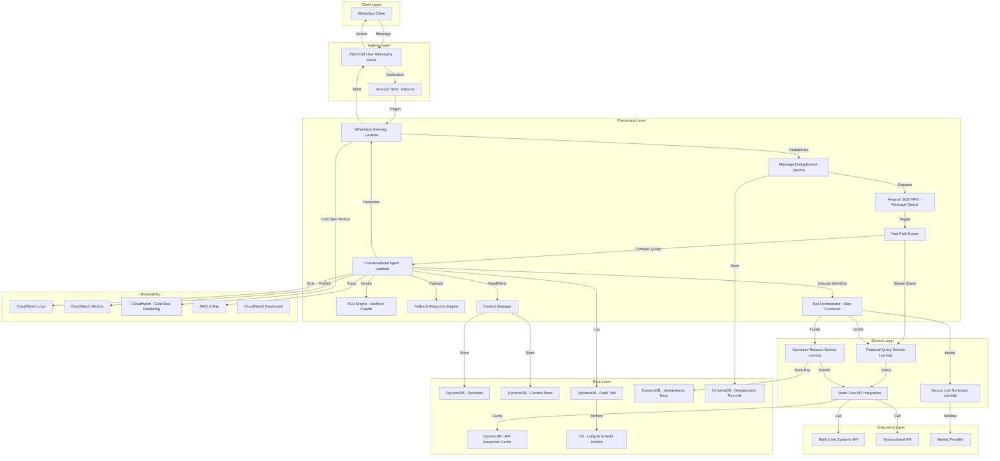
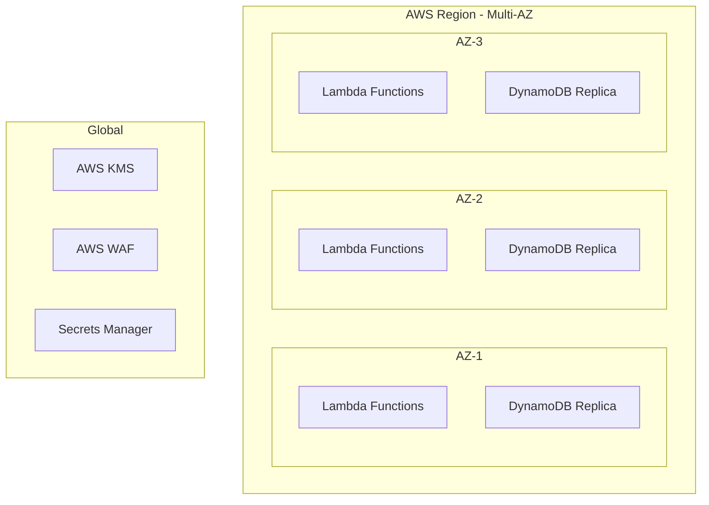
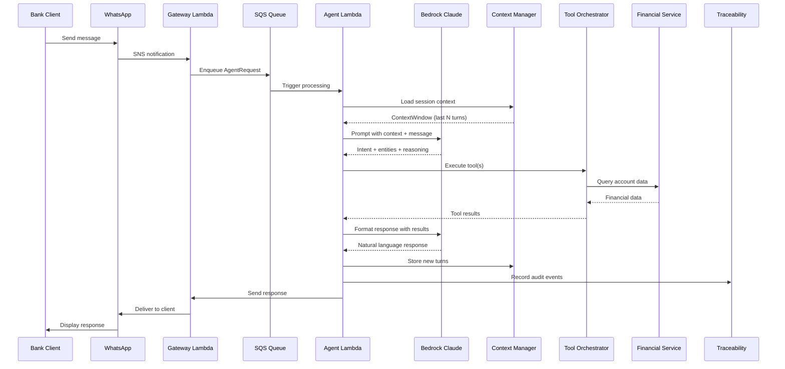

# Design Document: BTG ConnectAI

## Overview

BTG ConnectAI is an AWS-native, serverless Agentic AI system that provides conversational banking services to BTG Pactual clients through WhatsApp. The system interprets natural language requests in Spanish, maintains conversational context, orchestrates multi-step financial workflows, and generates operational requests — all while maintaining full traceability and compliance with Colombian financial regulations.

### Key Design Decisions

1. **AWS End User Messaging Social for WhatsApp**: Native AWS integration with WhatsApp Business API, avoiding third-party middleware and simplifying IAM-based security.
2. **Amazon Bedrock (Claude) for NLU**: Managed foundation model service eliminates model hosting complexity while providing high-quality Spanish language understanding and agentic reasoning.
3. **DynamoDB for Session/Context Storage**: Single-digit millisecond latency, TTL-based automatic session expiration, and serverless scaling align with conversational workload patterns.
4. **Step Functions for Workflow Orchestration**: Visual workflow definition, built-in retry/error handling, and execution history provide the auditability required for financial operations.
5. **HMAC-SHA256 Signed URLs**: Stateless, cryptographically secure link generation without database round-trips, enabling horizontal scaling of the secure link service.
6. **Event-Driven Architecture**: SNS/SQS decoupling between components enables independent scaling, failure isolation, and message durability.

### Research Findings

- AWS End User Messaging Social provides native WhatsApp integration via SNS notifications triggering Lambda functions, supporting text, interactive buttons, and list messages ([AWS Blog](https://aws.amazon.com/blogs/messaging-and-targeting/whatsapp-aws-end-user-messaging-social/)).
- Amazon Bedrock Session Management APIs (Preview) offer out-of-the-box session state management, but DynamoDB provides more control for custom context windowing and TTL-based expiration ([AWS Blog](https://aws.amazon.com/blogs/machine-learning/amazon-bedrock-launches-session-management-apis-for-generative-ai-applications-preview/)).
- DynamoDB data models for generative AI chatbots support efficient chronological message ordering within sessions using composite keys ([AWS Blog](https://aws.amazon.com/ko/blogs/database/amazon-dynamodb-data-models-for-generative-ai-chatbots)).
- HMAC-SHA256 signed URLs with expiration timestamps provide stateless, horizontally scalable secure link generation without database lookups ([Best practices reference](https://www.hooklistener.com/learn/webhook-security-fundamentals)).

Content was rephrased for compliance with licensing restrictions.

## Architecture

### High-Level Architecture



### Deployment Architecture



### Provisioned Concurrency Configuration

To mitigate Lambda cold starts and ensure consistent response times (Requirement 18):

| Lambda Function | Min Provisioned Concurrency | Peak Provisioned Concurrency | Schedule |
|----------------|----------------------------|------------------------------|----------|
| WhatsApp Gateway | 5 | 20 | Always-on (24/7) |
| Conversational Agent | 5 | 30 | Always-on (24/7) |
| Financial Query Service | 3 | 15 | Business hours + pre-peak scaling |
| Operation Request Service | 2 | 10 | Business hours |

**Pre-Scaling Strategy**: The system uses CloudWatch scheduled events combined with historical traffic pattern analysis to pre-scale provisioned concurrency 15 minutes before anticipated peak periods (month-end closings, payroll dates). During low-traffic periods (midnight to 6 AM local time), minimum provisioned instances are maintained to ensure sub-second cold start response.

**Cold Start Monitoring**: A dedicated CloudWatch metric (`ColdStartRate`) tracks the ratio of cold starts to total invocations per 15-minute window. An alarm triggers when this rate exceeds 5%, notifying the operations team to review provisioned concurrency settings.

### Key Architectural Patterns

- **Event-Driven Ingress**: WhatsApp → SNS → Lambda → SQS FIFO → Agent Lambda. The SQS FIFO buffer absorbs traffic spikes, provides exactly-once delivery guarantees, and enables message deduplication at the queue level.
- **Fast Path Bypass**: Simple, well-known queries (balance checks, last N transactions) are identified by the Fast Path Router using lightweight pattern matching and routed directly to the Financial Query Service, bypassing the full NLU + orchestration chain for sub-2-second responses.
- **Agentic Loop**: The Conversational Agent Lambda uses a ReAct (Reason + Act) pattern with Bedrock Claude, iteratively reasoning about user intent and invoking tools until the request is fulfilled.
- **Fallback Degradation**: When Bedrock is unavailable (detected via 10-second health checks), the Fallback Response Engine activates within 30 seconds, providing template-based responses for common queries while informing clients of limited mode.
- **Saga Pattern for Operations**: Multi-step financial operations use Step Functions with compensating transactions for rollback on failure. Idempotency keys ensure exactly-once processing even under at-least-once delivery semantics.
- **CQRS for Audit**: Write path goes to DynamoDB (hot storage), with DynamoDB Streams archiving to S3 (cold storage) for long-term retention.
- **Resilient External Integration**: Bank Core API calls use circuit breakers (open after 5 consecutive failures, recovery after 30s), exponential backoff with jitter for rate limits, and response caching (5-minute TTL) for non-transactional data.

## Components and Interfaces

### 1. WhatsApp Gateway

**Responsibility**: Receives inbound WhatsApp messages, validates format, normalizes payload, and delivers outbound responses.

**Technology**: AWS Lambda (Node.js/TypeScript), triggered by SNS from AWS End User Messaging Social.

**Interfaces**:
```typescript
// Inbound message from WhatsApp
interface InboundMessage {
  messageId: string;
  phoneNumber: string;
  timestamp: string;
  type: 'text' | 'interactive_reply';
  content: {
    text?: string;
    buttonReplyId?: string;
    listReplyId?: string;
  };
}

// Outbound response to WhatsApp
interface OutboundMessage {
  phoneNumber: string;
  type: 'text' | 'interactive_buttons' | 'interactive_list';
  content: {
    text?: string;
    buttons?: Array<{ id: string; title: string }>;
    listSections?: Array<{ title: string; rows: Array<{ id: string; title: string; description?: string }> }>;
  };
}

// Gateway → Agent (via SQS)
interface AgentRequest {
  requestId: string;
  correlationId: string;
  clientPhoneNumber: string;
  message: InboundMessage;
  receivedAt: string;
}
```

### 2. Conversational Agent

**Responsibility**: Core orchestration component. Interprets user intent via NLU, manages conversation flow, decides which tools to invoke, and formulates responses.

**Technology**: AWS Lambda (Python), Amazon Bedrock (Claude 3.5 Sonnet).

**Interfaces**:
```typescript
// Agent processing result
interface AgentResponse {
  requestId: string;
  correlationId: string;
  sessionId: string;
  response: OutboundMessage;
  toolInvocations: ToolInvocation[];
  nluResult: NLUResult;
  processingTimeMs: number;
}

// Tool invocation record
interface ToolInvocation {
  toolName: string;
  input: Record<string, unknown>;
  output: Record<string, unknown>;
  durationMs: number;
  status: 'success' | 'failure';
  errorMessage?: string;
}
```

### 3. NLU Engine

**Responsibility**: Interprets natural language Spanish messages, identifies intents, extracts entities, and provides confidence scores.

**Technology**: Amazon Bedrock (Claude 3.5 Sonnet) with structured output prompting.

**Interfaces**:
```typescript
interface NLUResult {
  intents: Intent[];
  entities: Entity[];
  language: string;
  rawConfidence: number;
}

interface Intent {
  name: string;
  confidence: number;
  category: 'query' | 'operation' | 'information' | 'greeting' | 'unknown';
}

interface Entity {
  type: 'account_number' | 'amount' | 'date' | 'currency' | 'product_name' | 'period';
  value: string;
  normalizedValue: string;
  startPosition: number;
  endPosition: number;
}
```

### 4. Context Manager

**Responsibility**: Maintains conversational memory, resolves references, manages session lifecycle.

**Technology**: AWS Lambda (Python), Amazon DynamoDB.

**Interfaces**:
```typescript
interface Session {
  sessionId: string;
  clientId: string;
  phoneNumber: string;
  createdAt: string;
  lastActivityAt: string;
  ttl: number; // Unix timestamp for DynamoDB TTL (30 min inactivity)
  turnCount: number;
  status: 'active' | 'expired';
}

interface ConversationTurn {
  sessionId: string;
  turnNumber: number;
  timestamp: string;
  role: 'user' | 'assistant';
  content: string;
  intent?: string;
  entities?: Entity[];
}

interface ContextWindow {
  sessionId: string;
  turns: ConversationTurn[];
  resolvedEntities: Map<string, string>; // Pronoun/reference resolution cache
}
```

### 5. Tool Orchestrator

**Responsibility**: Decomposes complex requests into ordered tool invocations, manages execution flow, handles failures, enforces configurable invocation limits with internal step exclusion.

**Technology**: AWS Step Functions (Express Workflows for sub-5s latency).

**Interfaces**:
```typescript
interface WorkflowDefinition {
  workflowId: string;
  steps: WorkflowStep[];
  maxSteps: number; // Configurable, default 10 (external steps only)
}

interface WorkflowStep {
  stepId: string;
  toolName: string;
  stepClassification: 'external' | 'internal'; // Internal steps (validation, audit, context) don't count against limit
  inputMapping: Record<string, string>; // Maps previous outputs to inputs
  retryPolicy: { maxAttempts: number; backoffRate: number };
  onFailure: 'abort' | 'skip' | 'compensate';
}

interface WorkflowExecution {
  executionId: string;
  sessionId: string;
  status: 'running' | 'completed' | 'failed' | 'paused_for_auth';
  completedSteps: number;
  totalSteps: number;
  externalStepCount: number; // Only external steps counted against limit
  internalStepCount: number; // Internal steps tracked but not limited
  results: Record<string, unknown>[];
  limitWarningIssued: boolean; // True when 80% of limit reached
}

interface ToolInvocationLimitConfig {
  maxExternalInvocations: number; // Default: 10, configurable via SSM Parameter Store
  warningThresholdPercent: number; // Default: 80
  internalStepTypes: string[]; // e.g., ['validation', 'audit_logging', 'context_resolution']
}
```

### 6. Financial Query Service

**Responsibility**: Retrieves account movements, balances, product status, and spending analysis from bank core systems.

**Technology**: AWS Lambda (Python), integrates with bank core REST APIs.

**Interfaces**:
```typescript
interface MovementQuery {
  clientId: string;
  accountId: string;
  startDate: string;
  endDate: string;
  limit?: number;
  offset?: number;
}

interface MovementResult {
  transactions: Transaction[];
  totalCount: number;
  hasMore: boolean;
  summary: {
    totalIncome: number;
    totalExpenses: number;
    netChange: number;
  };
}

interface Transaction {
  transactionId: string;
  date: string;
  description: string;
  amount: number;
  currency: string;
  runningBalance: number;
  category?: string;
}

interface SpendingAnalysis {
  period: { start: string; end: string };
  categories: Array<{ name: string; amount: number; percentage: number; transactionCount: number }>;
  totalSpending: number;
  comparisonWithPrevious?: {
    previousTotal: number;
    changePercentage: number;
    significantChanges: Array<{ category: string; changePercentage: number }>;
  };
}

interface ProductStatus {
  productId: string;
  productType: 'savings' | 'checking' | 'investment' | 'credit' | 'cd';
  name: string;
  status: 'active' | 'inactive' | 'matured' | 'closed';
  currentValue: number;
  currency: string;
  interestRate?: number;
  maturityDate?: string;
  lastUpdated: string;
}
```

### 7. Operation Request Service

**Responsibility**: Generates and submits operational requests (transfers, payments) to the bank's transactional system. Ensures exactly-once processing through idempotency key management.

**Technology**: AWS Lambda (Python), integrates with bank transactional APIs, DynamoDB for idempotency key storage.

**Interfaces**:
```typescript
interface OperationalRequest {
  requestId: string;
  idempotencyKey: string; // Unique key for exactly-once processing
  clientId: string;
  type: 'transfer' | 'payment' | 'operational_order';
  parameters: {
    sourceAccount: string;
    destinationAccount: string;
    amount: number;
    currency: string;
    description: string;
  };
  status: 'pending_confirmation' | 'submitted' | 'completed' | 'failed' | 'cancelled';
  confirmationNumber?: string;
  estimatedProcessingTime?: string;
  createdAt: string;
}

interface IdempotencyRecord {
  idempotencyKey: string; // PK
  operationRequestId: string;
  clientId: string;
  operationResult: OperationResult;
  createdAt: string;
  ttl: number; // 24 hours from creation
}

interface OperationResult {
  status: 'completed' | 'failed';
  confirmationNumber?: string;
  errorMessage?: string;
  processedAt: string;
}

interface IdempotencyCheck {
  idempotencyKey: string;
  isDuplicate: boolean;
  originalResult?: OperationResult;
}

interface BalanceValidation {
  accountId: string;
  requestedAmount: number;
  availableBalance: number;
  isValid: boolean;
  reason?: string;
}
```

### 8. Secure Link Generator

**Responsibility**: Creates time-limited, cryptographically signed URLs for authentication redirects.

**Technology**: AWS Lambda (Python), AWS KMS for key management, AWS Secrets Manager for key rotation.

**Interfaces**:
```typescript
interface SecureLinkRequest {
  sessionId: string;
  clientId: string;
  operationType: string;
  operationParameters: Record<string, unknown>;
  portalEndpoint: string;
}

interface SecureLink {
  linkId: string;
  url: string;
  expiresAt: string; // 10 minutes from creation
  signature: string; // HMAC-SHA256
  status: 'active' | 'used' | 'expired';
}
```

### 9. Traceability Service

**Responsibility**: Records all AI decisions, tool invocations, and operational actions for governance and compliance.

**Technology**: DynamoDB (hot storage, 90 days), DynamoDB Streams → Lambda → S3 (cold storage, 7 years), Amazon Athena for querying archived records.

**Interfaces**:
```typescript
interface AuditRecord {
  correlationId: string;
  sessionId: string;
  clientId: string;
  timestamp: string;
  eventType: 'interaction' | 'tool_invocation' | 'operational_request' | 'security_alert';
  payload: {
    messageContent?: string;
    intent?: string;
    confidence?: number;
    toolName?: string;
    toolInput?: Record<string, unknown>;
    toolOutput?: Record<string, unknown>;
    duration?: number;
    status?: string;
  };
  ttl: number; // 90 days for DynamoDB, then archived to S3
}

interface AuditQuery {
  clientId?: string;
  sessionId?: string;
  dateRange: { start: string; end: string };
  eventType?: string;
  limit?: number;
}
```

### 10. Fallback Response Engine

**Responsibility**: Provides template-based responses for common queries when Amazon Bedrock (NLU Engine) is unavailable, ensuring basic service continuity during degradation.

**Technology**: AWS Lambda (Python), DynamoDB for template storage, CloudWatch for health check scheduling.

**Interfaces**:
```typescript
interface FallbackTemplate {
  templateId: string;
  queryPattern: string; // Regex or keyword pattern
  queryType: 'balance' | 'last_transactions' | 'product_status' | 'greeting' | 'general';
  responseTemplate: string; // Template with {{variable}} placeholders
  requiredDataSources: string[]; // Which services to call for data
  priority: number; // For pattern matching precedence
}

interface FallbackResponse {
  templateId: string;
  renderedResponse: string;
  limitedModeDisclaimer: string; // Always included during fallback
  originalQuery: string;
  matchConfidence: number;
}

interface HealthCheckResult {
  service: 'bedrock';
  status: 'healthy' | 'unhealthy' | 'degraded';
  lastCheckAt: string;
  consecutiveFailures: number;
  responseTimeMs?: number;
}

interface FallbackState {
  isActive: boolean;
  activatedAt?: string;
  deactivatedAt?: string;
  reason: string;
  healthCheckIntervalMs: 10_000; // 10 seconds
  activationThresholdMs: 30_000; // 30 seconds max to activate
  recoveryThresholdMs: 30_000; // 30 seconds max to deactivate
}
```

### 11. Fast Path Router

**Responsibility**: Identifies simple, well-known queries using lightweight pattern matching and routes them directly to the Financial Query Service, bypassing the full NLU + orchestration chain for faster response times.

**Technology**: AWS Lambda (Python), SSM Parameter Store for configurable patterns.

**Interfaces**:
```typescript
interface FastPathPattern {
  patternId: string;
  regex: string; // Lightweight regex for keyword matching
  keywords: string[]; // Keyword list for quick matching
  queryType: 'balance_check' | 'last_n_transactions' | 'product_status_simple';
  targetService: 'financial_query_service';
  parameterExtraction: Record<string, string>; // How to extract params from message
  isActive: boolean;
}

interface FastPathRoutingDecision {
  messageId: string;
  matchedPattern?: FastPathPattern;
  confidence: number; // Must be >= 0.9 to use fast path
  route: 'fast_path' | 'standard_orchestration';
  routingTimeMs: number;
  nluInvoked: false; // Fast path NEVER invokes NLU
}

interface FastPathConfig {
  patterns: FastPathPattern[];
  confidenceThreshold: number; // Default: 0.9
  maxResponseTimeMs: number; // Target: 2000ms end-to-end
  lastUpdated: string;
}
```

### 12. Bank Core API Integration

**Responsibility**: Provides resilient integration with bank core systems, handling authentication, rate limits, circuit breaking, API versioning, and response caching.

**Technology**: AWS Lambda (Python), AWS Secrets Manager for mTLS certificates and OAuth2 credentials, DynamoDB for response caching.

**Interfaces**:
```typescript
interface BankCoreApiConfig {
  baseUrl: string;
  authMethod: 'mTLS' | 'oauth2_client_credentials';
  mTlsCertArn?: string; // Secrets Manager ARN for mTLS certificate
  oauth2Config?: {
    tokenEndpoint: string;
    clientId: string;
    clientSecretArn: string; // Secrets Manager ARN
    scopes: string[];
    tokenRotationIntervalMs: number;
  };
  currentApiVersion: string;
  supportedApiVersions: string[]; // For concurrent version support (30-day transition)
  rateLimitConfig: {
    maxRetries: 3;
    baseBackoffMs: 1000;
    maxBackoffMs: 30_000;
    jitterEnabled: true;
  };
  circuitBreakerConfig: {
    failureThreshold: 5; // Consecutive failures to open
    recoveryTimeoutMs: 30_000; // Time before half-open attempt
    halfOpenMaxAttempts: 1;
  };
  cacheConfig: {
    enabled: true;
    ttlMs: 300_000; // 5 minutes
    cacheableEndpoints: string[]; // e.g., ['/products/catalog', '/exchange-rates']
  };
}

interface BankCoreApiRequest {
  endpoint: string;
  method: 'GET' | 'POST' | 'PUT';
  headers: Record<string, string>;
  body?: Record<string, unknown>;
  apiVersion: string;
  idempotencyKey?: string;
}

interface BankCoreApiResponse {
  statusCode: number;
  body: Record<string, unknown>;
  headers: Record<string, string>;
  fromCache: boolean;
  cachedAt?: string;
  apiVersion: string;
}

interface CircuitBreakerState {
  service: string;
  state: 'closed' | 'open' | 'half_open';
  consecutiveFailures: number;
  lastFailureAt?: string;
  openedAt?: string;
  nextAttemptAt?: string;
}

interface RateLimitBackoff {
  attemptNumber: number; // 1-3
  waitTimeMs: number; // Exponential with jitter
  jitterMs: number;
  totalElapsedMs: number;
}
```

### 13. Message Deduplication Service

**Responsibility**: Detects and discards duplicate inbound WhatsApp messages before they reach the Conversational Agent, ensuring exactly-once message processing.

**Technology**: AWS Lambda (Python), SQS FIFO queues with content-based deduplication, DynamoDB for deduplication record storage.

**Interfaces**:
```typescript
interface DeduplicationRecord {
  deduplicationKey: string; // PK: WhatsApp message ID + content hash
  whatsappMessageId: string;
  contentHash: string; // SHA-256 of message content
  originalResponse?: string; // Cached response for duplicate requests
  receivedAt: string;
  processedAt?: string;
  ttl: number; // 5 minutes from receipt (covers SQS FIFO dedup window)
}

interface DeduplicationCheck {
  messageId: string;
  contentHash: string;
  isDuplicate: boolean;
  originalResponse?: string;
  duplicateCount: number; // How many times this message has been seen
}

interface DeduplicationConfig {
  windowMs: 300_000; // 5-minute deduplication window
  hashAlgorithm: 'sha256';
  keyComposition: 'whatsapp_message_id + content_hash';
  fifoQueueConfig: {
    messageGroupId: string; // Client phone number for ordering
    deduplicationScope: 'messageGroup';
  };
}
```

## Data Models

### DynamoDB Table Design

#### Sessions Table

| Attribute | Type | Key | Description |
|-----------|------|-----|-------------|
| PK | String | Partition Key | `CLIENT#{clientId}` |
| SK | String | Sort Key | `SESSION#{sessionId}` |
| phoneNumber | String | - | Client phone number |
| createdAt | String | - | ISO 8601 timestamp |
| lastActivityAt | String | - | ISO 8601 timestamp |
| turnCount | Number | - | Current turn count (max 50) |
| status | String | - | `active` or `expired` |
| ttl | Number | - | Unix timestamp (30 min from last activity) |

**GSI-1**: `phoneNumber` (PK) → enables lookup by phone number for incoming messages.

#### Context Store Table

| Attribute | Type | Key | Description |
|-----------|------|-----|-------------|
| PK | String | Partition Key | `SESSION#{sessionId}` |
| SK | String | Sort Key | `TURN#{turnNumber:04d}` |
| timestamp | String | - | ISO 8601 timestamp |
| role | String | - | `user` or `assistant` |
| content | String | - | Message content |
| intent | String | - | Identified intent |
| entities | List | - | Extracted entities |
| ttl | Number | - | Same as session TTL |

#### Audit Trail Table

| Attribute | Type | Key | Description |
|-----------|------|-----|-------------|
| PK | String | Partition Key | `SESSION#{sessionId}` |
| SK | String | Sort Key | `EVENT#{timestamp}#{eventId}` |
| correlationId | String | - | Links all records in a session |
| clientId | String | - | Bank client identifier |
| eventType | String | - | Type of audit event |
| payload | Map | - | Event-specific data |
| ttl | Number | - | 90 days (hot storage) |

**GSI-1**: `clientId` (PK), `timestamp` (SK) → enables client-centric audit queries.
**GSI-2**: `eventType` (PK), `timestamp` (SK) → enables type-filtered queries.

#### Secure Links Table

| Attribute | Type | Key | Description |
|-----------|------|-----|-------------|
| PK | String | Partition Key | `LINK#{linkId}` |
| SK | String | Sort Key | `LINK#{linkId}` |
| sessionId | String | - | Associated session |
| clientId | String | - | Bank client identifier |
| operationType | String | - | Type of operation |
| signature | String | - | HMAC-SHA256 signature |
| expiresAt | String | - | Expiration timestamp |
| status | String | - | `active`, `used`, `expired` |
| ttl | Number | - | 10 minutes from creation |

#### Idempotency Keys Table

| Attribute | Type | Key | Description |
|-----------|------|-----|-------------|
| PK | String | Partition Key | `IDEMP#{idempotencyKey}` |
| operationRequestId | String | - | Associated operation request |
| clientId | String | - | Bank client identifier |
| operationResult | Map | - | Result of the original operation |
| createdAt | String | - | ISO 8601 timestamp |
| ttl | Number | - | 24 hours from creation |

**GSI-1**: `clientId` (PK), `createdAt` (SK) → enables lookup of recent operations by client.

#### Deduplication Records Table

| Attribute | Type | Key | Description |
|-----------|------|-----|-------------|
| PK | String | Partition Key | `DEDUP#{whatsappMessageId}#{contentHash}` |
| whatsappMessageId | String | - | Original WhatsApp message ID |
| contentHash | String | - | SHA-256 hash of message content |
| originalResponse | String | - | Cached response for duplicates |
| receivedAt | String | - | ISO 8601 timestamp |
| processedAt | String | - | ISO 8601 timestamp |
| duplicateCount | Number | - | Number of duplicate detections |
| ttl | Number | - | 5 minutes from receipt |

#### API Response Cache Table

| Attribute | Type | Key | Description |
|-----------|------|-----|-------------|
| PK | String | Partition Key | `CACHE#{endpoint}#{paramHash}` |
| responseBody | Map | - | Cached API response |
| apiVersion | String | - | API version of cached response |
| cachedAt | String | - | ISO 8601 timestamp |
| ttl | Number | - | 5 minutes from cache time |

### Data Flow Diagram



## Correctness Properties

*A property is a characteristic or behavior that should hold true across all valid executions of a system — essentially, a formal statement about what the system should do. Properties serve as the bridge between human-readable specifications and machine-verifiable correctness guarantees.*

### Property 1: Outbound Message Serialization Validity

*For any* valid `OutboundMessage` (text, interactive buttons, or interactive list), serializing it to the WhatsApp Business API payload format SHALL produce a structurally valid payload that conforms to the WhatsApp message schema for that type.

**Validates: Requirements 1.3**

### Property 2: Retry Backoff Timing Correctness

*For any* sequence of delivery failures, the retry mechanism SHALL produce wait intervals following exponential backoff (each interval ≥ previous × backoff multiplier), and the total cumulative retry duration SHALL NOT exceed 5 minutes.

**Validates: Requirements 1.5**

### Property 3: Confidence-Based Intent Routing

*For any* NLU result with a confidence score in [0, 1], the Conversational Agent's routing decision SHALL match the correct threshold band: proceed when confidence > 0.85, ask clarification when confidence ∈ [0.5, 0.85), and respond with not-understood when confidence < 0.5.

**Validates: Requirements 2.2, 2.3, 2.4**

### Property 4: NLU Output Structural Validity

*For any* valid text input message, the NLU Engine SHALL return a result containing at least one intent with a confidence score in the range [0, 1] and a valid category classification.

**Validates: Requirements 2.1**

### Property 5: Context Window Bounded Storage

*For any* session with N conversation turns added (where N may exceed 50), the Context Manager SHALL store at most 50 turns, retaining the most recent turns and evicting the oldest when the limit is reached.

**Validates: Requirements 3.3**

### Property 6: Session Lifecycle Correctness

*For any* session, if the time elapsed since last activity exceeds 30 minutes, the session SHALL be marked as expired; and when a new session begins for the same client, the client identity SHALL be preserved while all conversational context from the previous session SHALL be cleared.

**Validates: Requirements 3.4, 3.5**

### Property 7: Transaction Formatting Completeness

*For any* valid `Transaction` object, the formatted conversational output SHALL contain the transaction date, description, amount (with currency), and running balance.

**Validates: Requirements 4.3**

### Property 8: Pagination Threshold Enforcement

*For any* query result set containing more than 10 transactions, the response SHALL include a summary and pagination/filtering options; for result sets with 10 or fewer transactions, full results SHALL be presented directly.

**Validates: Requirements 4.4**

### Property 9: Spending Distribution Mathematical Correctness

*For any* set of categorized transactions in a period, the spending distribution SHALL satisfy: (a) the sum of all category amounts equals the total spending amount, and (b) all category percentages sum to 100% (within floating-point tolerance).

**Validates: Requirements 5.1**

### Property 10: Top-N Category Selection Correctness

*For any* spending distribution with K categories (K ≥ 5), the top 5 categories SHALL be the 5 categories with the highest spending amounts, presented in descending order by amount, each with accurate percentage of total spending.

**Validates: Requirements 5.3**

### Property 11: Trend Comparison Threshold Detection

*For any* two spending periods with category-level data, the system SHALL flag as "significant change" only those categories where the absolute percentage change exceeds 20%, and SHALL NOT flag categories with changes ≤ 20%.

**Validates: Requirements 5.4**

### Property 12: Product Status Formatting Completeness

*For any* valid `ProductStatus` object, the formatted output SHALL contain the product's current value, status, and interest rate; and for products with a maturity date, the maturity date SHALL also be included.

**Validates: Requirements 6.4**

### Property 13: Data Staleness Detection

*For any* product status response where `lastUpdated` is more than 5 minutes before the current time, the response SHALL include a staleness indicator with the last update timestamp; for data fresher than 5 minutes, no staleness warning SHALL appear.

**Validates: Requirements 6.5**

### Property 14: Operation Summary Completeness

*For any* complete set of operational request parameters (source account, destination account, amount, currency, description), the confirmation summary SHALL contain all parameter values presented to the user.

**Validates: Requirements 7.2**

### Property 15: Balance Validation Correctness

*For any* pair of (requested amount, available balance), the validation SHALL pass if and only if the requested amount is less than or equal to the available balance, and SHALL fail with an appropriate reason otherwise.

**Validates: Requirements 7.4**

### Property 16: Secure Link Generation Structural Correctness

*For any* secure link request, the generated link SHALL contain: (a) a unique link identifier, (b) a valid HMAC-SHA256 signature computed over the link parameters, and (c) an expiration timestamp exactly 10 minutes from creation time.

**Validates: Requirements 8.1, 8.3**

### Property 17: Secure Link Context Round-Trip

*For any* operation context (type, parameters, session reference), encoding the context into a secure link and then decoding it from the link SHALL produce an operation context equivalent to the original.

**Validates: Requirements 8.2**

### Property 18: Secure Link Validation Rejects Invalid Links

*For any* secure link, validation SHALL reject the link if: (a) the current time exceeds the expiration timestamp, OR (b) any parameter in the URL has been modified after signing (signature mismatch). Valid, non-expired, untampered links SHALL pass validation.

**Validates: Requirements 8.4, 8.5**

### Property 19: Workflow Sequential Output Chaining

*For any* multi-step workflow with N steps, the Tool Orchestrator SHALL pass the output of step i as input to step i+1 according to the defined input mapping, preserving data integrity across the chain.

**Validates: Requirements 9.2**

### Property 20: Workflow Execution Status Reporting

*For any* multi-step workflow execution, after completing step K (successfully or with failure), the system SHALL emit a status report identifying the completed step and current progress; if step K fails, the report SHALL identify the failure point and offer retry/abort options.

**Validates: Requirements 9.3, 9.4**

### Property 21: Workflow Maximum Invocation Limit

*For any* workflow definition regardless of the number of defined steps, the Tool Orchestrator SHALL execute at most the configured maximum number of tool invocations (default 10) and SHALL terminate execution after reaching this limit.

**Validates: Requirements 9.5**

### Property 22: Audit Record Completeness

*For any* event recorded by the Traceability Service: (a) interaction events SHALL contain timestamp, message content, intent, and confidence score; (b) tool invocation events SHALL contain tool name, input, output, duration, and status; (c) operational request events SHALL contain request parameters, client identity, approval status, and completion status.

**Validates: Requirements 10.1, 10.2, 10.3**

### Property 23: Audit Query Filter Correctness

*For any* set of audit records and any combination of filter criteria (client ID, date range, operation type, session ID), the query result SHALL contain exactly those records that match ALL specified filter criteria and SHALL exclude all records that fail any criterion.

**Validates: Requirements 10.5**

### Property 24: Session Correlation ID Uniqueness

*For any* two distinct sessions, their correlation identifiers SHALL be different; and for any single session, all audit records generated within that session SHALL share the same correlation identifier.

**Validates: Requirements 10.6**

### Property 25: Financial Response Disclaimer Inclusion

*For any* response that contains financial data (balances, transaction amounts, product values), the response SHALL include a disclaimer stating that information is for reference purposes and official records are available through bank portals.

**Validates: Requirements 11.6**

### Property 26: Structured Log Completeness

*For any* request processed by the system, the emitted structured log entry SHALL contain the request identifier, latency measurement, status code, and component name.

**Validates: Requirements 13.1**

### Property 27: Alarm Threshold Correctness

*For any* time series of metrics over a 5-minute window: (a) if the error rate exceeds 5%, an alarm SHALL be triggered; (b) if the average response latency exceeds 5 seconds, an alarm SHALL be triggered; (c) if neither threshold is exceeded, no alarm SHALL fire.

**Validates: Requirements 13.4, 13.5**

### Property 28: Sensitive Data Masking

*For any* account number appearing in log or trace output, the masked representation SHALL show only the last 4 digits with all preceding digits replaced by mask characters; and for any balance or sensitive financial value, the data SHALL be masked or omitted from logs entirely.

**Validates: Requirements 14.4**

### Property 29: Session Token Expiration Correctness

*For any* session token issued upon identity verification, the token's expiration timestamp SHALL be at most 30 minutes from the issuance time.

**Validates: Requirements 14.5**

### Property 30: Fallback Activation and Recovery Timing

*For any* NLU Engine health check failure sequence, if the health check (performed every 10 seconds) detects unavailability, the Fallback Response Engine SHALL activate within 30 seconds of failure detection; and when the NLU Engine becomes available again, the system SHALL deactivate fallback mode and resume full agentic processing within 30 seconds of recovery detection.

**Validates: Requirements 15.1, 15.4, 15.6**

### Property 31: Fast Path Routing Correctness

*For any* inbound message, if the Fast Path Router matches a well-known simple query pattern with confidence ≥ 0.9, the message SHALL be routed directly to the Financial Query Service without invoking the NLU Engine; if the pattern match confidence is below 0.9, the message SHALL be routed through the standard orchestration chain with NLU invocation.

**Validates: Requirements 16.1, 16.2, 16.4**

### Property 32: Idempotency Exactly-Once Processing

*For any* confirmed operational request with a generated idempotency key, if the same operation is submitted N times (N ≥ 1) with the same idempotency key within 24 hours, the operation SHALL be executed exactly once and all subsequent submissions SHALL return the result of the original execution without re-processing.

**Validates: Requirements 17.1, 17.2, 17.4**

### Property 33: Cold Start Rate Alarm Threshold

*For any* time series of Lambda invocations over a 15-minute window, if the ratio of cold start invocations to total invocations exceeds 5%, an alarm SHALL be triggered; if the ratio is at or below 5%, no cold start alarm SHALL fire.

**Validates: Requirements 18.4**

### Property 34: Configurable Tool Invocation Limit with Internal Step Exclusion

*For any* workflow execution with a mix of internal steps (validation, audit logging, context resolution) and external steps (user-facing tool invocations), the Tool Orchestrator SHALL count only external steps against the configured maximum invocation limit, and SHALL terminate execution only when the external step count reaches the configured limit regardless of how many internal steps have been executed.

**Validates: Requirements 19.1, 19.3**

### Property 35: Bank Core API Rate Limit Backoff and Circuit Breaker Correctness

*For any* sequence of Bank Core API responses: (a) when an HTTP 429 rate limit response is received, retry intervals SHALL follow exponential backoff with jitter, with each interval ≥ previous interval × backoff multiplier, for a maximum of 3 retries; (b) when 5 consecutive failures occur, the circuit breaker SHALL open and reject subsequent calls immediately; (c) after 30 seconds in open state, the circuit breaker SHALL transition to half-open and allow one test request.

**Validates: Requirements 20.2, 20.5**

### Property 36: Message Duplicate Detection

*For any* inbound WhatsApp message, the Message Deduplication Service SHALL compute a deduplication key from the WhatsApp message ID combined with a content hash; if a message with the same deduplication key is received within a 5-minute window, it SHALL be classified as a duplicate and the original processing response SHALL be returned without re-processing the message.

**Validates: Requirements 21.1, 21.2, 21.4**

## Error Handling

### Error Categories and Strategies

| Category | Examples | Strategy | User Communication |
|----------|----------|----------|-------------------|
| **Transient Infrastructure** | Lambda timeout, DynamoDB throttling, network blip | Automatic retry with exponential backoff (max 3 attempts) | No user notification unless all retries fail |
| **External Service Unavailable** | Bank core API down, transactional system timeout | Circuit breaker pattern (open after 5 failures in 60s) | "El servicio no está disponible temporalmente. Por favor intente más tarde." |
| **Validation Error** | Insufficient balance, invalid account, expired link | Immediate rejection, no retry | Specific error message with suggested action |
| **NLU Ambiguity** | Low confidence, multiple possible intents | Clarification flow | Clarifying question with suggested options |
| **Workflow Failure** | Step N of M fails | Compensating transaction for completed steps, abort remaining | Progress report + failure explanation + retry/abort options |
| **Security Violation** | Tampered link, expired token, fraud detection | Immediate termination, security alert | Generic security message, no details exposed |
| **Rate Limiting** | Client exceeds message rate | Throttle with 429 response | "Ha enviado muchos mensajes. Por favor espere un momento." |

### Circuit Breaker Configuration

```typescript
interface CircuitBreakerConfig {
  failureThreshold: 5;        // Failures before opening
  successThreshold: 3;        // Successes before closing
  timeout: 60_000;            // Time in open state before half-open (ms)
  monitoredServices: ['bank-core-api', 'transactional-api', 'identity-provider'];
}

// Bank Core API specific circuit breaker (Requirement 20)
interface BankCoreCircuitBreaker {
  failureThreshold: 5;        // 5 consecutive failures to open
  recoveryTimeout: 30_000;    // 30 seconds before half-open attempt
  halfOpenMaxAttempts: 1;     // Single test request in half-open state
  rateLimitRetryConfig: {
    maxRetries: 3;            // Max retries on HTTP 429
    baseBackoffMs: 1_000;     // Initial backoff
    maxBackoffMs: 30_000;     // Maximum backoff cap
    jitterEnabled: true;      // Random jitter to prevent thundering herd
  };
}
```

### Dead Letter Queue Strategy

Failed messages that exhaust all retries are routed to component-specific DLQ (SQS Dead Letter Queues):
- **Gateway DLQ**: Undeliverable outbound messages → alarm + manual review
- **Agent DLQ**: Unprocessable inbound messages → alarm + investigation
- **Audit DLQ**: Failed audit writes → critical alarm (compliance risk)

### Graceful Degradation Matrix

| Failed Component | Available Capabilities | Disabled Capabilities |
|-----------------|----------------------|----------------------|
| Financial Query Service | Conversations, operations, secure links | Account queries, spending analysis |
| Operation Request Service | Conversations, queries, secure links | Transfer/payment generation |
| Secure Link Generator | Conversations, queries | Operations requiring auth |
| NLU Engine (Bedrock) | Fallback template responses for balance, transactions, product status (limited mode) | Complex reasoning, multi-intent parsing, agentic workflows, spending analysis |
| Context Manager | Stateless responses (no memory) | Context-aware conversations |
| Traceability Service | All user-facing features (async logging) | Audit compliance (critical alert) |
| Bank Core API | Cached responses (up to 5 min stale), conversations | Real-time account data, transactions, operations |
| Fast Path Router | Standard orchestration (all requests go through NLU) | Sub-2s simple query responses |
| Message Deduplication Service | Message processing continues (risk of duplicates) | Exactly-once message guarantee |

## Testing Strategy

### Testing Pyramid

```
         ┌─────────────┐
         │   E2E Tests  │  ← WhatsApp → System → Bank Core (staging)
         │   (5-10)     │
         ├─────────────┤
         │ Integration  │  ← Component interactions, API contracts
         │  (30-50)     │
         ├─────────────┤
         │  Property    │  ← Universal properties (100+ iterations each)
         │  (30-36)     │
         ├─────────────┤
         │    Unit      │  ← Specific examples, edge cases, error paths
         │  (100-200)   │
         └─────────────┘
```

### Property-Based Testing Configuration

**Library**: [Hypothesis](https://hypothesis.readthedocs.io/) (Python) for Lambda functions.

**Configuration**:
- Minimum 100 iterations per property test
- Max examples: 200 for critical properties (secure link, balance validation, idempotency, deduplication)
- Deadline: 5000ms per example (accommodates complex generators)
- Database: Store failing examples for regression

**Tag Format**: Each property test is tagged with:
```python
# Feature: btg-connect-ai, Property {N}: {property_text}
```

**Property Test Grouping**:

| Group | Properties | Focus |
|-------|-----------|-------|
| Message Formatting | 1, 7, 8, 12, 14 | Serialization and presentation correctness |
| Routing & Thresholds | 3, 4, 11, 13, 27, 31, 33 | Decision logic based on numeric thresholds |
| Session & Context | 5, 6, 24, 29 | State management lifecycle |
| Financial Logic | 9, 10, 15 | Mathematical correctness of financial computations |
| Secure Links | 16, 17, 18 | Cryptographic link generation and validation |
| Workflow Orchestration | 19, 20, 21, 34 | Multi-step execution correctness |
| Audit & Observability | 22, 23, 25, 26 | Record completeness and query correctness |
| Security | 2, 28 | Retry safety and data protection |
| Resilience & Fallback | 30, 35 | Degradation, health checks, circuit breakers |
| Idempotency & Deduplication | 32, 36 | Exactly-once processing guarantees |

### Unit Testing Focus

Unit tests complement property tests by covering:
- Specific NLU examples with known Spanish colloquial expressions (2.5, 2.6, 2.7)
- Fraud detection patterns (11.4, 11.5)
- Off-topic rejection examples (11.1, 11.2, 11.3)
- Default parameter application (4.2, 5.2)
- Graceful degradation scenarios (12.4)
- Error message formatting (4.5, 7.6)
- Fallback template library completeness (15.5 — verify ≥ 20 templates)
- Fast path pattern configuration loading (16.5)
- Idempotency key inclusion in confirmations (17.5)
- Provisioned concurrency configuration validation (18.1, 18.2, 18.3)
- Tool invocation limit configuration loading (19.2)
- API version header inclusion (20.3)
- Bank Core API unavailability notification after 60s (20.6)
- SQS FIFO queue deduplication configuration (21.3)
- Deduplication record TTL validation (21.5)

### Integration Testing Focus

- WhatsApp Gateway ↔ AWS End User Messaging Social (message delivery)
- Agent Lambda ↔ Amazon Bedrock (NLU invocation)
- Financial Query Service ↔ Bank Core API (data retrieval with circuit breaker)
- Operation Request Service ↔ Transactional API (request submission with idempotency)
- Traceability Service ↔ DynamoDB + S3 (audit persistence)
- Secure Link Generator ↔ KMS (key operations)
- Fast Path Router ↔ Financial Query Service (direct routing latency validation, 16.3)
- Fallback Response Engine ↔ Bedrock health check (activation/deactivation timing)
- Message Deduplication Service ↔ SQS FIFO (exactly-once delivery)
- Bank Core API Integration ↔ Bank Core Systems (mTLS/OAuth2 auth, rate limiting, versioning)
- Lambda cold start pre-scaling ↔ CloudWatch scheduled events (18.5)
- Tool invocation analytics ↔ CloudWatch Logs (19.5, 19.6)

### End-to-End Testing

- Full conversation flow: greeting → query → response (happy path)
- Multi-step workflow: transfer request → parameter collection → confirmation → secure link → completion
- Session expiration and re-engagement flow
- Concurrent user simulation (load testing with Locust or Artillery)
- Fast path flow: simple balance query → fast path routing → sub-2s response
- Fallback mode flow: Bedrock unavailable → fallback activation → template response → Bedrock recovery → full mode resume
- Idempotency flow: operation confirmation → duplicate submission → same result returned
- Deduplication flow: duplicate WhatsApp message → single processing → cached response returned
- Bank Core API resilience flow: rate limit → backoff → retry → success (or circuit open → graceful degradation)
- Cold start validation: invoke after idle period → verify response time within bounds

