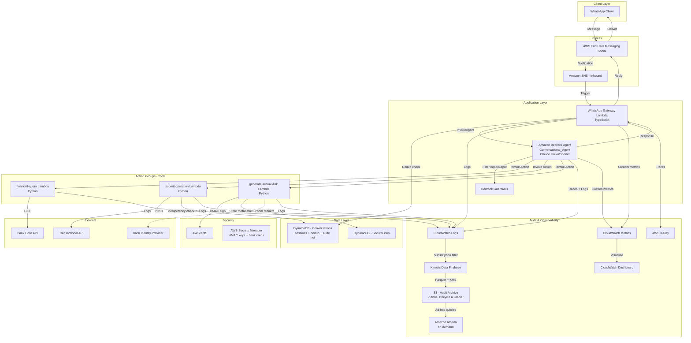
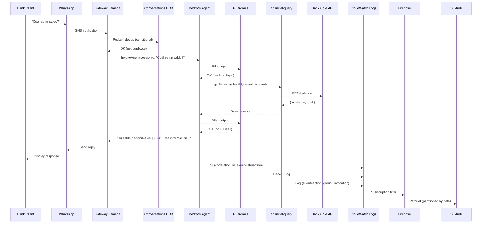

# Documento de Diseño: BTG ConnectAI (MVP)

## Visión General

BTG ConnectAI MVP es un sistema serverless de banca conversacional sobre AWS que entrega capacidades de Agentic AI a clientes de BTG Pactual a través de WhatsApp. El núcleo del sistema es un **Amazon Bedrock Agent** que interpreta español natural, mantiene memoria de sesión, decide qué tools invocar y formula respuestas — todo managed por AWS. Tres funciones Lambda actúan como Action_Groups (financial-query, submit-operation, generate-secure-link) y una Lambda adicional sirve como WhatsApp_Gateway. La auditoría se entrega vía un pipeline managed (CloudWatch Logs → Firehose → S3) sin código custom.

Este diseño es deliberadamente **mínimo viable** sin sacrificar extensibilidad. Las decisiones clave reducen la superficie de implementación de ~14 Lambdas y 7 tablas a ~4 Lambdas y 2 tablas, apoyándose en servicios managed que ya entregan las capacidades que antes se construían a mano (orquestación, memoria, NLU, fallback, traceability).

### Decisiones Clave de Diseño

1. **Amazon Bedrock Agents como núcleo**: Un solo recurso managed reemplaza NLU Engine, Context Manager, Tool Orchestrator y Fallback Engine. Bedrock Agents trae nativamente: loop ReAct, session memory, tool calling estructurado, traces, integración con Knowledge Bases (futura) y Guardrails. Esta es la decisión más impactante del diseño.
2. **Action Groups en vez de orquestación custom**: Las 3 Lambdas de tool (financial-query, submit-operation, generate-secure-link) se exponen como Action Groups del Bedrock Agent. El Agent invoca, espera, decide próximo paso. Sin Step Functions, sin lógica de orquestación propia.
3. **Deduplicación inline vía DynamoDB conditional write**: En el WhatsApp_Gateway, un `PutItem` con `ConditionExpression: attribute_not_exists(whatsapp_message_id)` y TTL de 5 minutos descarta duplicados. Sin SQS FIFO, sin Lambda dedicada de deduplicación.
4. **Idempotencia inline en submit-operation**: Atributo `idempotency_key` en la tabla `Operations` con escritura condicional. Sin servicio separado.
5. **Auditoría vía pipeline managed**: AWS Lambda Powertools emite logs estructurados → CloudWatch Logs → subscription filter a Kinesis Data Firehose → S3 con particionamiento por fecha (formato Parquet, KMS encryption). Athena disponible on-demand sin infraestructura always-on. Sin Lambda dedicada de Traceability Service.
6. **HMAC-SHA256 con KMS para Secure Links**: Stateless, sin lookups en BD para validación. Las llaves rotan vía AWS Secrets Manager managed rotation.
7. **Sin provisioned concurrency en MVP**: A volumen estimado (cientos de msg/min en pico), pay-per-use con cold starts ocasionales (~150-300ms en Lambda Node.js bien empaquetada) es aceptable. Se agrega cuando haya señal de impacto (ver Fase 2 en requirements.md).
8. **DynamoDB on-demand con single-table design**: Dos tablas — `Conversations` (sesiones + deduplicación + audit hot 90 días, todo en single-table) y `SecureLinks` (links generados con TTL 10 min). Sin pre-provisioning de capacidad.

### Decisiones que NO se cierran (extensibilidad futura)

- IAM least-privilege y KMS desde el día 1 — la base de seguridad ya está en su lugar para Fase 2.
- Logging estructurado con Powertools — agregar dashboards, alarmas o consumers nuevos (SIEM, Splunk) no requiere reescribir código de aplicación.
- Action Groups como abstracción — agregar más tools (knowledge base lookup, ticketing, etc.) es solo agregar Lambdas, sin tocar el Conversational_Agent.
- DynamoDB single-table — agregar GSIs cuando aparezcan patrones de consulta nuevos no requiere migración.
- Bedrock Agent como recurso versionable — se pueden tener múltiples aliases (`prod`, `staging`, `experimental`) y rollouts graduales con CloudWatch metrics como gate.

## Arquitectura

### Arquitectura de Alto Nivel



### Patrones Arquitectónicos Clave

- **Single-Agent Architecture**: Un solo Bedrock Agent maneja todas las interacciones. Más simple de operar, monitorear y razonar sobre comportamiento. Si en el futuro se necesita especialización (ej: agente separado para inversiones vs operaciones), Bedrock soporta multi-agent collaboration.
- **Action Groups con OpenAPI Schema**: Cada Action Group se define con un schema OpenAPI 3.0 que Bedrock usa para generar tool calls válidos. Esto da type safety entre el Agent y las Lambdas sin código glue.
- **Stateless Secure Links**: La validación del link no requiere lookup en BD — la firma HMAC-SHA256 sobre payload (operation_context + expiry) es auto-contenida. La tabla `SecureLinks` solo se usa para marcar status (`used`, `expired`) post-validación.
- **Single-Table Design en Conversations**: Una tabla DDB con composite key `(PK, SK)` maneja sesiones, dedup y audit hot. Reduce overhead de admin y aprovecha bien las queries por sesión.
- **Audit Pipeline Pasivo**: La aplicación no llama a un servicio de auditoría. Solo emite logs estructurados; el pipeline managed (CloudWatch → Firehose → S3) los archiva. Cero código custom para compliance.
- **Idempotencia por Conditional Write**: `submit-operation` hace `PutItem` con `ConditionExpression: attribute_not_exists(idempotency_key)`. Si existe, retorna el resultado guardado; si no, ejecuta la operación y persiste el resultado en el mismo item.

## Componentes e Interfaces

### 1. WhatsApp Gateway

**Responsabilidad**: Recibir mensajes entrantes vía SNS desde AWS End User Messaging Social, descartar duplicados, invocar al Bedrock Agent y entregar la respuesta de vuelta a WhatsApp.

**Tecnología**: AWS Lambda (Node.js 20, TypeScript). Sin provisioned concurrency en MVP.

**Interfaces (TypeScript)**:
```typescript
// SNS notification payload (normalized from AWS End User Messaging Social)
interface InboundMessage {
  whatsappMessageId: string;
  phoneNumber: string;
  timestamp: string;
  type: 'text' | 'interactive_reply';
  content: {
    text?: string;
    buttonReplyId?: string;
    listReplyId?: string;
  };
}

// Response back to WhatsApp Business API
interface OutboundMessage {
  phoneNumber: string;
  type: 'text' | 'interactive_buttons' | 'interactive_list';
  content: {
    text?: string;
    buttons?: Array<{ id: string; title: string }>;
    listSections?: Array<{ title: string; rows: Array<{ id: string; title: string; description?: string }> }>;
  };
}

// Invocation payload to Bedrock Agent
interface AgentInvocation {
  sessionId: string;       // Stable per phoneNumber until 30-min TTL
  correlationId: string;   // UUID per inbound message
  inputText: string;
  sessionAttributes?: Record<string, string>;
}
```

**Pseudocódigo del handler**:
```
1. Parse SNS notification → InboundMessage
2. Compute sessionId = hash(phoneNumber)
3. PutItem to Conversations table with ConditionExpression:
   PK = WHATSAPP_MSG#{whatsappMessageId}
   SK = WHATSAPP_MSG#{whatsappMessageId}
   ttl = now + 5min
   Condition: attribute_not_exists(PK)
   IF ConditionalCheckFailedException → return (duplicate, ignore)
4. InvokeAgent(BedrockAgentRuntime, sessionId, correlationId, inputText)
5. Serialize response → OutboundMessage
6. Send via AWS End User Messaging Social SendMessage API
7. Emit structured log with correlationId
```

### 2. Conversational Agent (Amazon Bedrock Agent)

**Responsabilidad**: Núcleo agentic. Interpreta español natural, mantiene memoria de sesión, decide qué Action Groups invocar, encadena pasos vía loop ReAct nativo, aplica Guardrails y formula la respuesta final.

**Tecnología**: Amazon Bedrock Agent con foundation model Claude Haiku 3.5 (por velocidad/costo) en MVP. Puede escalarse a Sonnet 3.5 para reasoning complejo configurando un model routing en el Agent.

**Configuración clave**:
- **Idle session timeout**: 30 minutos (cumple R3.3)
- **Max tokens per response**: 2048
- **Max hops per turn**: 5 (default razonable, configurable)
- **Guardrails attached**: Política de banca-only, content filtering, fraud detection, PII redaction
- **Knowledge Base**: No en MVP (puerta abierta para Fase 2 con docs internos del banco)
- **Memory**: Bedrock Agent session memory nativa (no requiere tabla DDB para conversación activa)

**Prompt template (system instructions)**:
```
Eres el asistente conversacional de BTG Pactual operando vía WhatsApp.
Solo respondes sobre temas bancarios y financieros relacionados con productos
y servicios de BTG Pactual. Manejas español colombiano formal pero cercano.

Para CADA respuesta que involucre datos financieros, agrega al final:
"Esta información es de carácter referencial. Los registros oficiales están
disponibles en los portales del banco."

Si el cliente pide algo fuera del dominio bancario, declina cortésmente y
sugiere los servicios disponibles.

Para operaciones (transferencias, pagos):
1. Recolecta los parámetros (origen, destino, monto, moneda, descripción)
2. Presenta un resumen y pide confirmación explícita
3. Solo invoca submit-operation tras confirmación
4. Si la operación requiere autenticación formal, invoca generate-secure-link

Si una operación crítica falla, informa el motivo y ofrece reintentar o abortar.
Si el contexto es ambiguo, pregunta antes de actuar.
```

### 3. Action Group: financial-query

**Responsabilidad**: Recuperar movimientos, saldos, análisis de gasto y estado de productos desde la Bank_Core_API.

**Tecnología**: AWS Lambda (Python 3.12). Llama directamente a la Bank_Core_API con el AWS SDK (HTTPX o boto3 según protocolo) — los retries con exponential backoff del SDK son suficientes para MVP. Autenticación vía OAuth2 client credentials con token cacheado en Lambda extension (refresh automático antes de expiry).

**OpenAPI Schema (resumido)**:
```yaml
openapi: 3.0.0
info:
  title: financial-query
  version: 1.0.0
paths:
  /get-account-movements:
    post:
      operationId: getAccountMovements
      requestBody:
        content:
          application/json:
            schema:
              type: object
              properties:
                clientId: { type: string }
                accountId: { type: string }
                startDate: { type: string, format: date }   # optional, default = now-30d
                endDate: { type: string, format: date }     # optional, default = now
                limit: { type: integer, default: 10 }
                offset: { type: integer, default: 0 }
      responses:
        '200':
          description: List of transactions with running balance and summary
  /get-balance:
    post:
      operationId: getBalance
      ...
  /get-spending-analysis:
    post:
      operationId: getSpendingAnalysis
      ...
  /get-product-status:
    post:
      operationId: getProductStatus
      ...
  /list-active-products:
    post:
      operationId: listActiveProducts
      ...
```

### 4. Action Group: submit-operation

**Responsabilidad**: Generar y enviar Operational_Requests (transferencias, pagos) al sistema transaccional del banco, garantizando idempotencia inline.

**Tecnología**: AWS Lambda (Python 3.12), con conditional write en DynamoDB `Conversations` para idempotencia.

**Flujo de idempotencia**:
```python
def submit_operation(client_id, operation_params):
    idempotency_key = compute_idempotency_key(client_id, operation_params)
    try:
        # Reservar la key con escritura condicional
        ddb.put_item(
            Item={
                'PK': f'OP#{client_id}',
                'SK': f'IDEMP#{idempotency_key}',
                'status': 'pending',
                'params': operation_params,
                'ttl': int(time.time()) + 86400  # 24 horas
            },
            ConditionExpression='attribute_not_exists(PK)'
        )
    except ConditionalCheckFailedException:
        # Ya existe — retornar resultado guardado
        existing = ddb.get_item(...)
        return existing['result']

    # Validar saldo antes de enviar
    balance = financial_query.get_balance(client_id, operation_params['source_account'])
    if balance.available < operation_params['amount']:
        result = {'status': 'failed', 'reason': 'insufficient_balance'}
    else:
        # Llamar a la Bank_Core_API transaccional con la idempotency_key
        result = bank_core.submit_transaction(operation_params, idempotency_key)

    # Persistir resultado
    ddb.update_item(... set status, result, confirmation_number)
    return result
```

**OpenAPI Schema (resumido)**:
```yaml
paths:
  /submit-operational-request:
    post:
      operationId: submitOperationalRequest
      requestBody:
        content:
          application/json:
            schema:
              type: object
              required: [sourceAccount, destinationAccount, amount, currency]
              properties:
                sourceAccount: { type: string }
                destinationAccount: { type: string }
                amount: { type: number }
                currency: { type: string }
                description: { type: string }
                operationType: { type: string, enum: [transfer, payment, operational_order] }
      responses:
        '200':
          description: Operation result with confirmationNumber and estimatedProcessingTime
```

### 5. Action Group: generate-secure-link

**Responsabilidad**: Generar URLs únicas firmadas con HMAC-SHA256 que redirigen al portal del banco para autenticación o validación crítica.

**Tecnología**: AWS Lambda (Python 3.12). HMAC computado dentro del Lambda con la llave recuperada de AWS Secrets Manager (cacheada in-memory por la duración de la ejecución; rotación managed por Secrets Manager con rotación automática cada 90 días).

**Estructura del link**:
```
https://portal.btgpactual.com.co/connect-ai/validate
  ?ctx={base64url(operation_context_json)}
  &exp={unix_timestamp_expiry}
  &sig={hex(HMAC-SHA256(secret, ctx + exp))}
```

**Tabla `SecureLinks` en DDB** (mínima, solo para tracking de status):
```
PK = LINK#{linkId}
SK = LINK#{linkId}
sessionId, clientId, operationType, status (active|used|expired), createdAt, ttl (10 min)
```

La validación del link en el portal del banco es stateless — solo requiere recalcular el HMAC con el secret compartido y verificar `expiry > now`. La tabla `SecureLinks` se actualiza a `status=used` post-validación (idempotente vía conditional update).

### 6. Audit Pipeline (managed, sin código custom)

**Responsabilidad**: Capturar todos los eventos del sistema (interacciones, invocaciones de Action Groups, Operational_Requests, alertas de seguridad) y archivarlos para retención de 7 años con capacidad de query ad-hoc.

**Componentes** (todos managed, configurados vía CDK):

1. **Lambda Powertools** en cada función emite logs estructurados JSON con `correlation_id`, `session_id`, `client_id` (hasheado), `event_type`, `payload`.
2. **CloudWatch Logs** centraliza por log group por Lambda.
3. **Subscription Filter** en cada log group → enruta a un **Kinesis Data Firehose** delivery stream.
4. **Firehose** transforma a Parquet (vía Glue Schema Registry) y escribe a S3 con particionamiento por fecha (`s3://btg-connect-ai-audit/year=YYYY/month=MM/day=DD/`).
5. **S3 Lifecycle Policy**: Standard 30 días → Glacier Instant Retrieval 1 año → Glacier Deep Archive hasta 7 años.
6. **KMS encryption** en logs, Firehose y S3 (CMK rotativa anual).
7. **Glue Data Catalog** con tablas particionadas referenciando el bucket S3.
8. **Athena workgroup** configurado on-demand (sin infraestructura always-on; los compliance officers pueden ejecutar queries cuando necesiten).

**Esquema canónico de evento de auditoría** (todo log estructurado lo respeta):
```json
{
  "correlation_id": "uuid",
  "session_id": "uuid",
  "client_id_hash": "sha256-hex",
  "timestamp": "ISO-8601",
  "event_type": "interaction|action_group_invocation|operational_request|security_alert",
  "component": "whatsapp-gateway|bedrock-agent|financial-query|submit-operation|generate-secure-link",
  "payload": {
    "...": "event-specific"
  },
  "duration_ms": 123,
  "status": "success|failure",
  "masked_fields": ["account_number_last4", "amount_omitted"]
}
```

## Modelos de Datos

### Tabla `Conversations` (single-table design)

Almacena 3 tipos de items diferenciados por el patrón del SK: deduplicación de mensajes entrantes, registros de idempotencia de operaciones, y resumen hot de sesión para queries operativas (la memoria conversacional activa la mantiene Bedrock Agent).

| Atributo | Tipo | Descripción |
|----------|------|-------------|
| PK | String | Partition Key — ver patrones abajo |
| SK | String | Sort Key — ver patrones abajo |
| ttl | Number | Unix timestamp para expiración nativa de DDB |
| GSI1PK | String | (opcional) Llave alternativa para consultas por cliente |
| GSI1SK | String | (opcional) Llave alternativa por fecha |

**Patrones de items**:

| Tipo de item | PK | SK | TTL | Atributos adicionales |
|--------------|----|----|-----|----------------------|
| Dedup msg | `WHATSAPP_MSG#{whatsappMessageId}` | `WHATSAPP_MSG#{whatsappMessageId}` | 5 min | `phoneNumber`, `receivedAt` |
| Idempotency operación | `OP#{clientId}` | `IDEMP#{idempotencyKey}` | 24 h | `params`, `status`, `result`, `confirmationNumber` |
| Resumen sesión | `SESSION#{sessionId}` | `META` | 30 min | `clientId`, `phoneNumber`, `correlationId`, `turnCount` |

**GSI-1** (opcional, agregar si surge la necesidad): `GSI1PK = CLIENT#{clientId}`, `GSI1SK = OP#{createdAt}` para listar operaciones recientes por cliente.

Encryption: AWS KMS CMK (rotación anual). Point-in-time recovery: habilitado.

### Tabla `SecureLinks`

| Atributo | Tipo | Descripción |
|----------|------|-------------|
| PK | String | `LINK#{linkId}` |
| SK | String | `LINK#{linkId}` |
| sessionId | String | Sesión del Bedrock Agent que generó el link |
| clientIdHash | String | Hash del clientId (no se almacena en claro) |
| operationType | String | `transfer`, `payment`, `auth_validation`, etc. |
| status | String | `active`, `used`, `expired` |
| createdAt | String | ISO 8601 |
| ttl | Number | 10 minutos desde `createdAt` |

Encryption: AWS KMS CMK. TTL nativa de DDB elimina items expirados automáticamente.

### Flujo de Datos End-to-End



## Properties de Correctitud (MVP)

*Una property es una garantía formal que el sistema debe mantener en todas las ejecuciones válidas. En el MVP nos enfocamos en las properties **críticas** — seguridad, integridad financiera y compliance — donde una violación tiene consecuencias graves. El resto se cubre con unit tests focales (ver sección de testing).*

### Property 1: Validez de la Firma del Secure Link

*Para cualquier* `operation_context` válido, el Secure Link generado SHALL contener una firma HMAC-SHA256 calculada sobre `(operation_context || expiry)` usando la llave secreta de Secrets Manager. La verificación SHALL aceptar el link si y solo si la firma recalculada coincide y `expiry > now`.

**Valida: Requisitos 8.1, 8.4**

### Property 2: Rechazo de Secure Links Manipulados o Expirados

*Para cualquier* Secure Link, la validación SHALL rechazarlo si: (a) `expiry ≤ now`, O (b) cualquier byte del `operation_context` o del `expiry` ha sido alterado tras la firma. Solo los links válidos, no expirados y sin modificar SHALL pasar.

**Valida: Requisitos 8.3, 8.5**

### Property 3: Validación de Saldo

*Para cualquier* par `(requested_amount, available_balance)`, la validación pre-envío en `submit-operation` SHALL aprobar si y solo si `requested_amount ≤ available_balance`, y SHALL rechazar con razón explícita en caso contrario.

**Valida: Requisito 7.3**

### Property 4: Idempotencia Exactly-Once en Operaciones

*Para cualquier* solicitud operativa con una `idempotency_key`, si la misma key se envía N veces (N ≥ 1) dentro de 24 horas, la operación SHALL ejecutarse contra la Bank_Core_API exactamente una vez, y todas las invocaciones subsiguientes SHALL retornar el resultado original sin re-ejecutar.

**Valida: Requisito 7.4**

### Property 5: Deduplicación de Mensajes Entrantes

*Para cualquier* mensaje entrante con `whatsapp_message_id` previamente recibido dentro de los últimos 5 minutos, el WhatsApp_Gateway SHALL descartarlo sin invocar al Conversational_Agent.

**Valida: Requisito 1.5**

### Property 6: Disclaimer Financiero en Respuestas con Datos

*Para cualquier* respuesta generada por el Conversational_Agent que contenga datos financieros (saldos, montos, valores de productos), la respuesta SHALL incluir el disclaimer indicando que la información es referencial y que los registros oficiales están en los portales del banco.

**Valida: Requisito 11.6**

### Property 7: Enmascaramiento de Data Sensible en Logs

*Para cualquier* número de cuenta que aparezca en logs o traces, la representación SHALL mostrar solo los últimos 4 dígitos con el resto enmascarado. Saldos y montos exactos SHALL omitirse del log (solo se loggea presencia, no valor).

**Valida: Requisito 14.4**

### Property 8: Expiración del Session Token

*Para cualquier* session token emitido tras verificación de identidad, su `expires_at` SHALL ser como máximo 30 minutos después del momento de emisión.

**Valida: Requisito 14.5**

### Property 9: Correlation ID Único por Sesión

*Para cualquier* par de sesiones distintas, sus `correlation_id` SHALL ser diferentes; y para cualquier sesión, todos los logs y eventos de audit emitidos dentro de ella SHALL compartir el mismo `correlation_id`.

**Valida: Requisito 10.6**

### Property 10: Completitud del Audit Record

*Para cualquier* evento emitido al Audit_Pipeline, el log estructurado SHALL contener `correlation_id`, `session_id`, `timestamp`, `event_type`, `component`, `duration_ms` y `status`. Eventos de operational_request SHALL adicionalmente contener parámetros de la solicitud (con campos sensibles enmascarados) y estado de finalización.

**Valida: Requisitos 10.1, 10.2, 10.3**

## Manejo de Errores

### Categorías y Estrategias

| Categoría | Ejemplos | Estrategia | Comunicación al Usuario |
|-----------|----------|-----------|-------------------------|
| **Transient infrastructure** | Lambda timeout, DDB throttling, network blip | Retries automáticos del AWS SDK con exponential backoff (default 3 intentos) | Sin notificación salvo que todos los retries fallen |
| **Bedrock unavailable** | Bedrock no responde o retorna error 5xx | Lambda Gateway retorna mensaje fallback gentil | "Nuestro asistente está temporalmente no disponible. Por favor intenta en unos minutos." |
| **Bank Core unavailable** | Core retorna 5xx persistente | Action Group retorna error estructurado; Bedrock Agent informa al cliente | "El servicio bancario no está disponible temporalmente. Por favor intenta más tarde." |
| **Validation error** | Saldo insuficiente, cuenta inválida, link expirado | Rechazo inmediato, sin retry | Mensaje específico con acción sugerida |
| **Guardrail violation** | Contenido off-topic o inseguro | Bedrock bloquea respuesta y emite mensaje neutro | Mensaje genérico de redirección a banca |
| **Fraud detection** | Patrón sospechoso (Guardrails o lógica del Agent) | Terminar sesión, alerta de seguridad | Mensaje neutro sin detalles |
| **Operation failure** | Bank Core rechaza la operación | Loggear razón, informar al cliente, ofrecer alternativas | Razón sanitizada + alternativa sugerida |

### Dead Letter Queues

Solo se configura DLQ donde es estrictamente necesario para no perder eventos:
- **WhatsApp_Gateway**: DLQ sobre el async invoke a Bedrock (mensajes que no se pudieron procesar) → alarma de CloudWatch
- **Audit pipeline**: Firehose con backup S3 bucket para records que no pasen transformación → alarma crítica (riesgo de compliance gap)

### Degradación Graceful

| Componente caído | Capacidades disponibles | Capacidades degradadas |
|------------------|--------------------------|-------------------------|
| Bedrock Agent | Ninguna funcional | Gateway responde con mensaje de indisponibilidad |
| financial-query | Operaciones, secure links | Consultas de cuenta/saldo/productos |
| submit-operation | Consultas, secure links | Generación de operacionales |
| generate-secure-link | Conversaciones, consultas | Operaciones que requieren autenticación |
| Bank Core API | Ninguna funcional sin core | Gateway/Agent informa indisponibilidad temporal |
| Audit pipeline | Toda la funcionalidad visible al usuario sigue trabajando (los logs se buffer en CloudWatch hasta recuperación de Firehose) | Solo se afecta el archivado a S3 — compliance issue si se prolonga (alarma crítica) |

## Estrategia de Testing (MVP)

### Pirámide Reducida

```
         ┌─────────────────────┐
         │  Property tests     │  ← 10 properties críticas (security, finance, compliance)
         │  (10)               │
         ├─────────────────────┤
         │  Unit tests focales │  ← Happy paths + errores conocidos por componente
         │  (~40-60)           │
         └─────────────────────┘
```

Sin tests E2E ni integration formales en MVP. La validación end-to-end se hace manualmente en staging contra una réplica de la Bank_Core_API.

### Property-Based Testing

**Librería**: [Hypothesis](https://hypothesis.readthedocs.io/) (Python) para las Lambdas de Action Group.

**Configuración**:
- Mínimo 100 iteraciones por property
- 200 iteraciones para las críticas: Property 1, 2, 3, 4 (firma, validación de link, balance, idempotencia)
- Deadline: 5000ms por ejemplo
- Database: Persistir contraejemplos para regresión

**Tag format**:
```python
# Feature: btg-connect-ai-mvp, Property {N}: {property_text}
```

### Foco de Unit Tests

Por componente:
- **WhatsApp_Gateway**: parseo de SNS, deduplicación inline, fallback message cuando Bedrock falla, formato de OutboundMessage por tipo.
- **financial-query**: aplicación de rangos por defecto (30 días, mes calendario), formato de salida, manejo de errores del core, enmascaramiento.
- **submit-operation**: cálculo de idempotency key, conditional write success/failure, validación de saldo, retornar resultado existente para duplicados.
- **generate-secure-link**: estructura del link, firma con KMS, expiración a 10 min, status transitions (active → used).
- **Bedrock Agent**: tests de prompt sobre frases reales colombianas, off-topic rejection, multi-intent handling, disclaimer injection. Estos se ejecutan con Bedrock real en una cuenta de dev (no se mockean).

### Validación Manual en Staging

Pre go-live:
- Conversación completa: saludo → consulta saldo → respuesta con disclaimer.
- Operación multi-step: solicitud transfer → recolección params → confirmación → secure link → completion.
- Expiración de sesión (esperar 30 min de inactividad) y verificar que la siguiente interacción inicie sesión fresca.
- Inyección de duplicados desde WhatsApp (mismo `whatsapp_message_id`) → verificar que se descarta.
- Apagar manualmente la Bank_Core_API mock → verificar mensaje degradado al cliente.
- Mensaje off-topic ("recomiéndame qué acción comprar") → verificar redirección de Guardrails.
- Mensaje con patrón sospechoso → verificar terminación de sesión y alerta en CloudWatch.
