# Flujo Completo: Transferencia BRE-B con OTP

Documentación detallada del flujo end-to-end de una transferencia BRE-B, incluyendo cada servicio AWS involucrado, la secuencia de comunicación y el detalle interno de la Step Function.

---

## Escenario

El cliente envía por WhatsApp (texto o nota de voz):

> *"Quiero transferir 10 mil pesos a la llave 1021803076"*

---

## Fase 1 — Ingesta del mensaje

El mensaje entra al sistema a través de la cadena Twilio → API Gateway → Webhook Receiver → SQS FIFO.

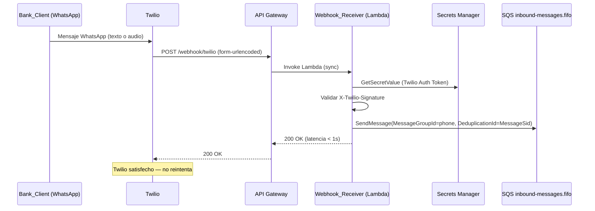

### Servicios involucrados

| # | Servicio | Red | Acción |
|---|----------|-----|--------|
| 1 | Twilio | Externo | Recibe mensaje WhatsApp, envía webhook POST |
| 2 | API Gateway (HTTP API) | Borde público AWS | Rutea POST /webhook/twilio a Lambda |
| 3 | Webhook_Receiver (Lambda) | Fuera de VPC | Valida firma X-Twilio-Signature, encola mensaje |
| 4 | Secrets Manager | Managed | Provee Twilio Auth Token para validar firma |
| 5 | SQS FIFO (inbound-messages) | Managed | Almacena mensaje, dedup por MessageSid, orden por phone |

---

## Fase 2 — Procesamiento, transcripción y AI Agent

El Message_Processor se activa por SQS, valida consent/auth, transcribe audio si aplica, e invoca al AI Agent.

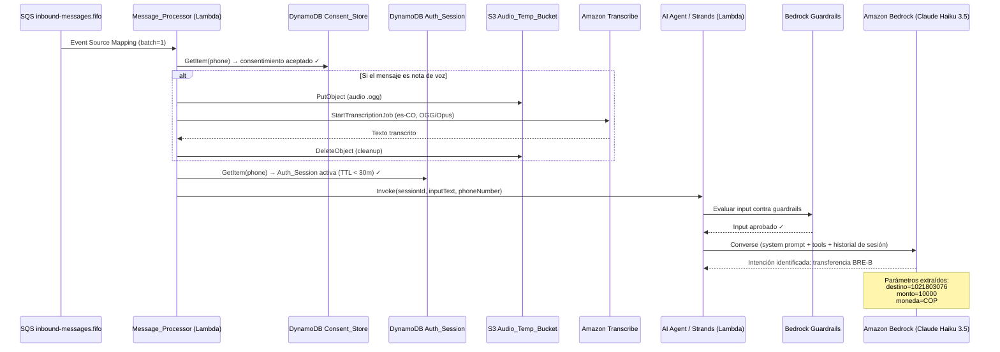

### Servicios involucrados

| # | Servicio | Red | Acción |
|---|----------|-----|--------|
| 6 | Message_Processor (Lambda) | Fuera de VPC | Orquesta procesamiento completo del mensaje |
| 7 | DynamoDB Consent_Store | Managed | Verifica T&C aceptados |
| 8 | S3 Audio_Temp_Bucket | Managed | Almacena audio temporal (solo si es voz) |
| 9 | Amazon Transcribe | Managed | Transcribe audio a texto es-CO (solo si es voz) |
| 10 | DynamoDB Auth_Session | Managed | Verifica sesión autenticada activa |
| 11 | AI Agent (Lambda, Strands SDK) | Fuera de VPC | Razonamiento conversacional con tools |
| 12 | Bedrock Guardrails | Managed | Filtrado de contenido (input/output) |
| 13 | Amazon Bedrock (Claude Haiku 3.5) | Managed | Modelo fundacional — identifica intención y extrae parámetros |

---

## Fase 3 — Confirmación explícita del usuario

El AI Agent solicita confirmación antes de ejecutar la transferencia (regla del system prompt).

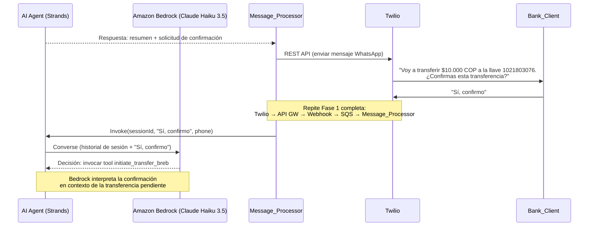

### Servicios involucrados

| # | Servicio | Acción |
|---|----------|--------|
| — | Misma cadena de Fase 1 | Ingesta del mensaje de confirmación |
| — | AI Agent + Bedrock | Interpreta confirmación, decide invocar tool |

---

## Fase 4 — Inicio del workflow (Step Functions)

El AI Agent invoca la tool `initiate_transfer_breb` que dispara la Step Function.

### Diagrama de arquitectura — AI Agent → Initiator → Step Function (desglose)

```
┌───────────────┐         ┌──────────────────────┐         ┌──────────────────────────────────────────────────────────────────┐
│               │ invoke  │                      │ Start   │                                                                  │
│   AI Agent    │────────►│  transfer_breb       │────────►│              TransferBrebStateMachine                            │
│   (Strands)   │         │  initiator (Lambda)  │Execution│              (Step Functions STANDARD)                            │
│               │◄────────│                      │◄────────│                                                                  │
│               │ response│                      │ {arn,   │  ┌─────────────────────────────────────────────────────────────┐  │
└───────────────┘ {arn,   └──────────────────────┘ RUNNING}│  │                                                             │  │
                  "OTP                                      │  │  ┌──────────────────┐                                       │  │
                  enviado"}                                 │  │  │ ValidateTransfer  │ ← Task (Lambda, VPC)                  │  │
                                                           │  │  │                  │    Valida fondos + destino             │  │
                                                           │  │  └────────┬─────────┘                                       │  │
                                                           │  │           │ OK                                               │  │
                                                           │  │           ▼                                                  │  │
                                                           │  │  ┌──────────────────┐                                       │  │
                                                           │  │  │ GenerateOTP      │ ← Task (Lambda, waitForTaskToken)      │  │
                                                           │  │  │                  │    Genera código, guarda en DynamoDB,  │  │
                                                           │  │  │                  │    envía SMS vía Pinpoint              │  │
                                                           │  │  └────────┬─────────┘                                       │  │
                                                           │  │           │                                                  │  │
                                                           │  │           ▼                                                  │  │
                                                           │  │  ┌──────────────────┐                                       │  │
                                                           │  │  │ ⏸️ PAUSADO       │    Esperando SendTaskSuccess           │  │
                                                           │  │  │ (hasta 5 min)    │    del Message_Processor               │  │
                                                           │  │  └────────┬─────────┘                                       │  │
                                                           │  │           │ OTP validado                                     │  │
                                                           │  │           ▼                                                  │  │
                                                           │  │  ┌──────────────────┐                                       │  │
                                                           │  │  │ ValidateOTP      │ ← Choice                              │  │
                                                           │  │  │                  │    ¿valid == true?                     │  │
                                                           │  │  └────────┬─────────┘                                       │  │
                                                           │  │           │ Sí                                               │  │
                                                           │  │           ▼                                                  │  │
                                                           │  │  ┌──────────────────┐                                       │  │
                                                           │  │  │ ExecuteTransfer  │ ← Task (Lambda, VPC)                  │  │
                                                           │  │  │                  │    Debita origen, acredita destino     │  │
                                                           │  │  └────────┬─────────┘                                       │  │
                                                           │  │           │ OK                                               │  │
                                                           │  │           ▼                                                  │  │
                                                           │  │  ┌──────────────────┐                                       │  │
                                                           │  │  │ Publish          │ ← Parallel                            │  │
                                                           │  │  │ Notifications    │    ├─► SQS email → Email_Service → SES│  │
                                                           │  │  │                  │    └─► SQS sms → SMS_Service → Pinpoint│ │
                                                           │  │  └────────┬─────────┘                                       │  │
                                                           │  │           │                                                  │  │
                                                           │  │           ▼                                                  │  │
                                                           │  │  ┌──────────────────┐                                       │  │
                                                           │  │  │ NotifyUser       │ ← Task (Lambda)                       │  │
                                                           │  │  │ Success          │    Envía comprobante por WhatsApp      │  │
                                                           │  │  └──────────────────┘                                       │  │
                                                           │  │                                                             │  │
                                                           │  └─────────────────────────────────────────────────────────────┘  │
                                                           │                                                                  │
                                                           │  Estados de error (cualquiera termina en notify al cliente):      │
                                                           │  • NotifyValidationFailed (fondos/destino inválido)               │
                                                           │  • NotifyOTPExpired (timeout 5 min)                               │
                                                           │  • NotifyOTPBlocked (3 intentos fallidos)                         │
                                                           │  • NotifyTransferFailed (error en ejecución)                      │
                                                           └──────────────────────────────────────────────────────────────────┘
```

### Flujo de invocación paso a paso

```
AI Agent (Strands)
    │
    │  1. El modelo decide invocar tool: initiate_transfer_breb(source, dest, amount, concept, phone)
    │
    ▼
transfer_breb_initiator (Lambda)
    │
    │  2. stepfunctions.start_execution(
    │         stateMachineArn = TransferBrebStateMachine,
    │         name = correlationId,          ← idempotencia
    │         input = {phone, source, dest, amount, concept, sessionId}
    │     )
    │
    │  3. Retorna INMEDIATAMENTE: {executionArn, status: "RUNNING"}
    │     (NO espera a que termine el workflow)
    │
    ▼
AI Agent recibe respuesta
    │
    │  4. Genera texto: "Te envié un código de verificación por SMS. Escríbelo aquí."
    │     (El agente sabe que NO debe esperar el OTP — instrucción en system prompt)
    │
    ▼
Message_Processor envía respuesta a Twilio → Bank_Client
    │
    │  5. El Message_Processor TERMINA su ejecución.
    │     La Lambda se libera. El workflow sigue corriendo independientemente.
    │
    ▼
Step Functions ejecuta los estados secuencialmente:
    │
    ├─► ValidateTransfer ──► Lambda VPC (valida fondos + destino)
    │
    ├─► GenerateOTP ──► Lambda (genera código, guarda taskToken en DynamoDB, envía SMS)
    │       │
    │       └─► ⏸️ WORKFLOW PAUSADO (waitForTaskToken, max 5 min, costo: $0)
    │
    │   ... el cliente responde el OTP por WhatsApp ...
    │   ... Message_Processor valida y llama SendTaskSuccess ...
    │
    ├─► ValidateOTP ──► Choice (¿válido?)
    │
    ├─► ExecuteTransfer ──► Lambda VPC (debita/acredita, genera receipt)
    │
    ├─► PublishNotifications ──► Parallel:
    │       ├─► SQS email-notification ──► Email_Service ──► SES
    │       └─► SQS sms-notification ──► SMS_Service ──► Pinpoint
    │
    └─► NotifyUserSuccess ──► Lambda (envía comprobante por WhatsApp vía Twilio)
```

### Punto clave: desacople temporal

```
    TIEMPO ──────────────────────────────────────────────────────────────────────►

    │◄── Message_Processor (ejecución 1) ──►│         │◄── Message_Processor (ejecución 2) ──►│
    │  Recibe msg → AI Agent → Initiator    │         │  Recibe OTP → valida → SendTaskSuccess │
    │  → responde "te envié OTP"            │         │                                        │
    │  → Lambda TERMINA                     │         │  → Lambda TERMINA                      │
    │                                       │         │                                        │
    │◄──────────── Step Functions (ejecución continua, puede durar minutos) ──────────────────►│
    │  Validate → OTP → ⏸️ PAUSA ──────────────────── ▶️ RESUME → Execute → Notify            │
    │                                       │         │                                        │
                                     Cliente recibe SMS,
                                     piensa, escribe OTP
```

El `transfer_breb_initiator` es **fire-and-forget**: dispara el workflow y retorna. No hay Lambda bloqueada esperando al usuario. Step Functions absorbe la espera a costo cero.

### Diagrama de secuencia

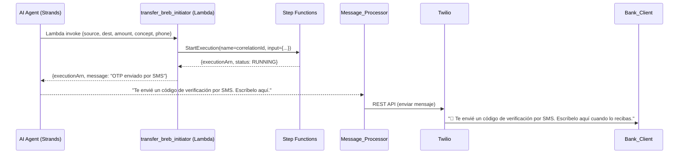

### Servicios involucrados

| # | Servicio | Red | Acción |
|---|----------|-----|--------|
| 14 | transfer_breb_initiator (Lambda) | Fuera de VPC | Dispara el workflow con StartExecution |
| 15 | AWS Step Functions | Managed | Inicia TransferBrebStateMachine (tipo STANDARD) |

---

## Fase 5 — Step Function: Detalle de estados

### Diagrama completo de la máquina de estados

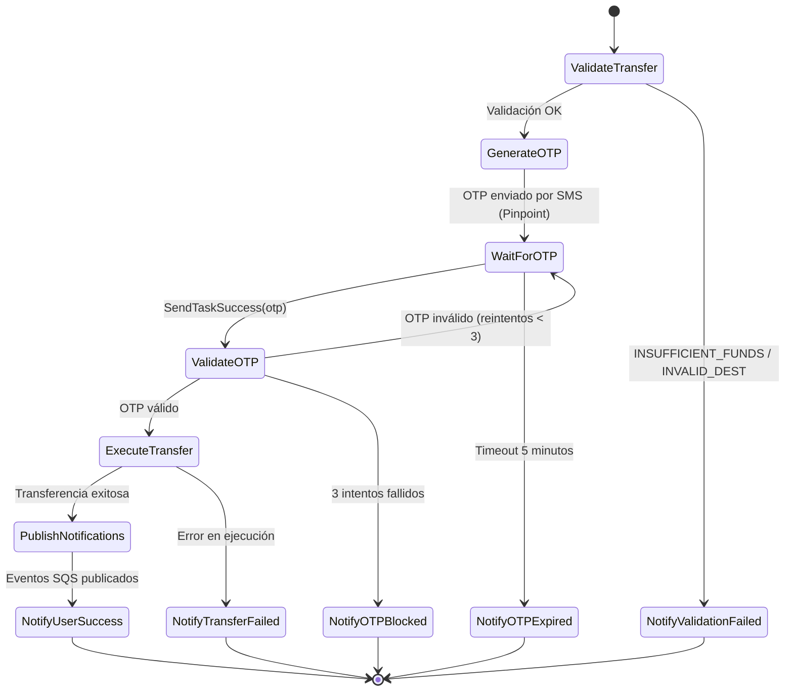

---

### Estado 1: `ValidateTransfer` (Task — Lambda en VPC)

Valida que la transferencia sea posible: cuenta origen existe, fondos suficientes, destino válido.

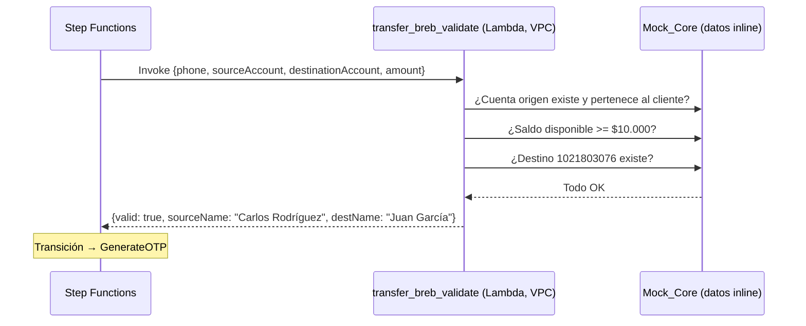

| Servicio | Red | Acción |
|----------|-----|--------|
| transfer_breb_validate (Lambda) | **VPC privada** — BankingLambdaSG | Valida contra Mock Core |
| Mock_Core | Inline (datos hardcodeados) | Simula core bancario |

**Si falla:** Transición a `NotifyValidationFailed` → notifica al cliente el error.

---

### Estado 2: `GenerateOTP` (Task — waitForTaskToken)

Genera un OTP, lo persiste con el taskToken, envía SMS. El workflow **SE PAUSA**.

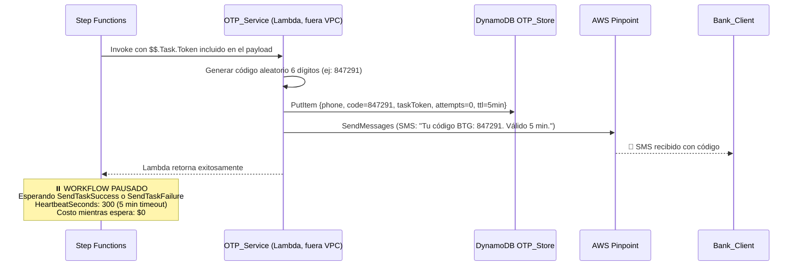

| Servicio | Red | Acción |
|----------|-----|--------|
| OTP_Service (Lambda) | Fuera de VPC | Genera OTP, persiste, envía SMS |
| DynamoDB OTP_Store | Managed | Almacena: code + taskToken + attempts + TTL 5m |
| AWS Pinpoint | Managed | Envía SMS con el código OTP |

**Estructura del registro en OTP_Store:**

| Campo | Valor |
|-------|-------|
| pk | +573001234567 |
| code | 847291 |
| taskToken | (token largo de Step Functions) |
| executionArn | arn:aws:states:... |
| attempts | 0 |
| transferContext | {amount: 10000, dest: "1021803076"} |
| createdAt | 2026-05-27T15:30:00Z |
| ttl | 1748358900 (epoch + 300s) |

---

### Interrupción: El cliente responde con el OTP

El cliente escribe el código por WhatsApp. El mensaje recorre la cadena de ingesta normal y el Message_Processor detecta que hay un OTP pendiente (prioridad sobre el AI Agent).

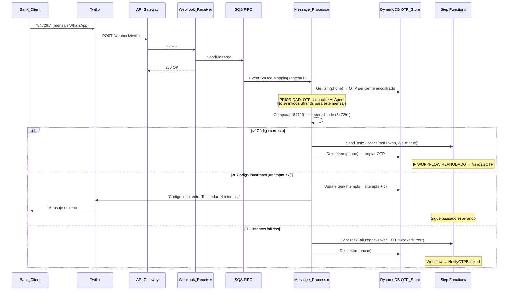

| Servicio | Acción |
|----------|--------|
| Cadena de ingesta completa | Twilio → API GW → Webhook → SQS → Message_Processor |
| DynamoDB OTP_Store | Lee OTP pendiente, valida código, actualiza attempts |
| Step Functions | Recibe SendTaskSuccess/Failure → reanuda workflow |

---

### Estado 3: `ValidateOTP` (Choice)

Evalúa el resultado del callback.

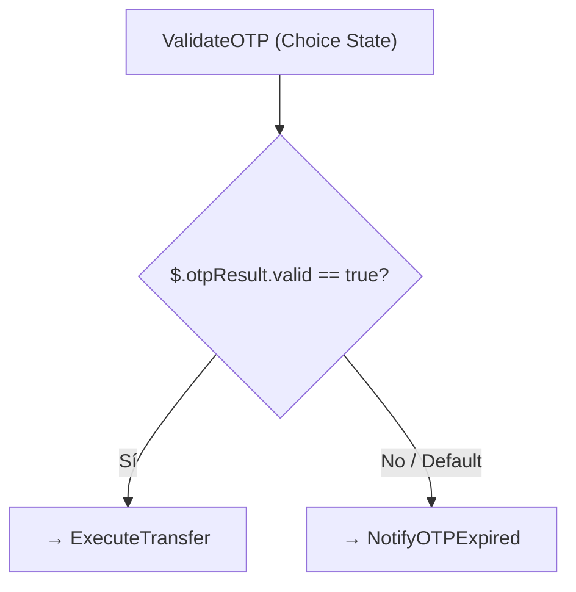

---

### Estado 4: `ExecuteTransfer` (Task — Lambda en VPC)

Ejecuta la transferencia contra el Mock Core.

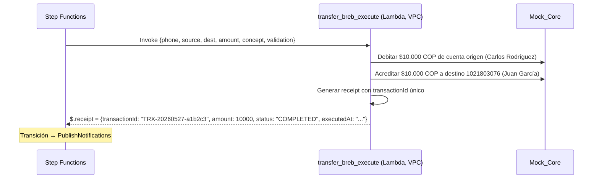

| Servicio | Red | Acción |
|----------|-----|--------|
| transfer_breb_execute (Lambda) | **VPC privada** — BankingLambdaSG | Ejecuta transferencia en Mock Core |
| Mock_Core | Inline | Actualiza saldos simulados |

**Si falla:** Transición a `NotifyTransferFailed`.

---

### Estado 5: `PublishNotifications` (Parallel)

Publica eventos de confirmación a las colas de notificaciones. Ambas ramas se ejecutan en paralelo.

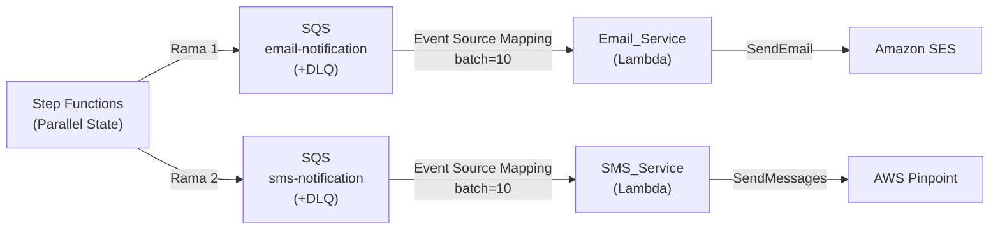

| Servicio | Acción |
|----------|--------|
| Step Functions | PUBLICA eventos a ambas colas (SQS SDK integration nativa) |
| SQS email-notification | Almacena evento `transfer_confirmation` |
| SQS sms-notification | Almacena evento `transfer_confirmation` |
| Email_Service (Lambda, fuera VPC) | CONSUME cola → envía email vía SES |
| SMS_Service (Lambda, fuera VPC) | CONSUME cola → envía SMS vía Pinpoint |
| Amazon SES | Entrega email de confirmación al cliente |
| AWS Pinpoint | Entrega SMS de confirmación al cliente |

---

### Estado 6: `NotifyUserSuccess` (Task — Lambda fuera de VPC)

Envía el comprobante final al cliente por WhatsApp.

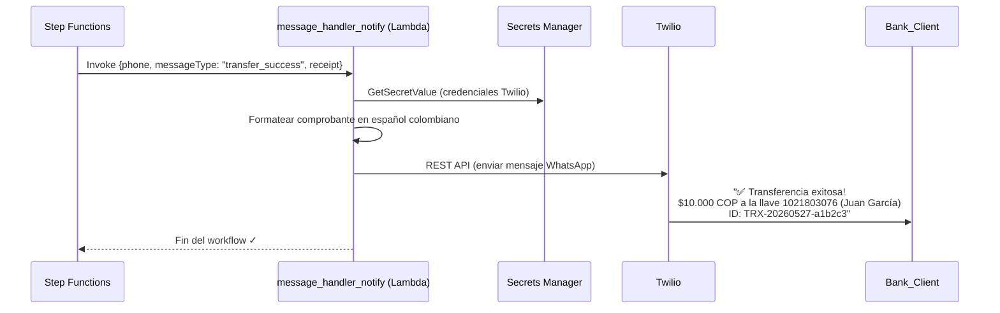

| Servicio | Red | Acción |
|----------|-----|--------|
| message_handler_notify (Lambda) | Fuera de VPC | Formatea y envía comprobante |
| Secrets Manager | Managed | Provee credenciales Twilio |
| Twilio | Externo | Entrega mensaje WhatsApp al cliente |

---

## Estados de error

Cada estado de error termina notificando al cliente vía `message_handler_notify`:

| Estado | Causa | Mensaje al cliente |
|--------|-------|-------------------|
| `NotifyValidationFailed` | Fondos insuficientes o destino inválido | "No pudimos procesar tu transferencia: [razón]" |
| `NotifyOTPExpired` | 5 minutos sin respuesta | "El código de verificación expiró. Inicia la transferencia de nuevo." |
| `NotifyOTPBlocked` | 3 intentos fallidos | "Por seguridad, bloqueamos esta operación. Contacta al banco." |
| `NotifyTransferFailed` | Error en ejecución | "Hubo un error al procesar tu transferencia. Intenta más tarde." |

---

## Resumen: Todos los servicios por fase

| Fase | Servicios AWS | Externos |
|------|--------------|----------|
| **1. Ingesta** | API Gateway, Lambda (Webhook), SQS FIFO, Secrets Manager | Twilio |
| **2. Procesamiento** | Lambda (Message_Processor), DynamoDB ×2, S3, Transcribe, Lambda (AI Agent), Bedrock, Guardrails | — |
| **3. Confirmación** | Misma cadena de ingesta | Twilio |
| **4. Inicio workflow** | Lambda (Initiator), Step Functions | — |
| **5. ValidateTransfer** | Lambda (validate, **VPC privada**) | — |
| **6. GenerateOTP** | Lambda (OTP_Service), DynamoDB OTP_Store, Pinpoint | — |
| **7. Callback OTP** | API Gateway, Lambda (Webhook), SQS, Lambda (Message_Processor), DynamoDB, Step Functions | Twilio |
| **8. ExecuteTransfer** | Lambda (execute, **VPC privada**) | — |
| **9. Notificaciones** | SQS ×2, Lambda ×2, SES, Pinpoint | — |
| **10. Comprobante** | Lambda (notify), Secrets Manager | Twilio |

**Total: 16 servicios AWS + Twilio** en un flujo de transferencia completo.

---

## Segregación de red

| Lambda | Ubicación | Justificación |
|--------|-----------|---------------|
| Webhook_Receiver | Fuera de VPC | Solo valida firma y encola — no toca datos bancarios |
| Message_Processor | Fuera de VPC | Orquesta flujo, llama APIs AWS públicas y Twilio |
| AI Agent (Strands) | Fuera de VPC | Solo Bedrock + Lambda invoke — APIs públicas |
| transfer_breb_initiator | Fuera de VPC | Solo StartExecution de Step Functions |
| OTP_Service | Fuera de VPC | DynamoDB + Pinpoint — APIs públicas |
| Email_Service / SMS_Service | Fuera de VPC | SES + Pinpoint — APIs públicas |
| message_handler_notify | Fuera de VPC | Secrets Manager + Twilio REST |
| **transfer_breb_validate** | **VPC privada** | Dominio bancario — en producción conectará al core real |
| **transfer_breb_execute** | **VPC privada** | Dominio bancario — ejecuta operaciones financieras |
| **balance_query** | **VPC privada** | Dominio bancario — consulta saldos |
| **statement_generator** | **VPC privada** | Dominio bancario — genera extractos, escribe a S3 vía VPC Endpoint |

Las Lambdas en VPC privada corren bajo `BankingLambdaSG` (ingress: ninguno, egress: TCP 443 → VPC Endpoints únicamente). **Sin ruta 0.0.0.0/0** — cero salida a internet.
